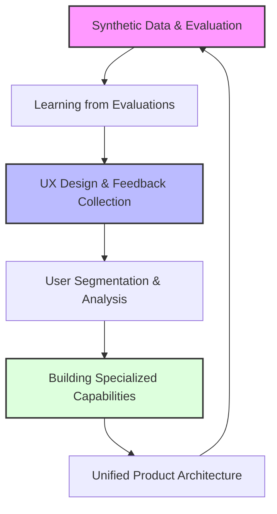

# The RAG Flywheel

## Data-Driven Product Development for AI Applications

*A systematic approach to building self-improving AI systems*

!!! abstract "About This Book"
    This book provides a structured approach to evolving Retrieval-Augmented Generation (RAG) from a technical implementation into a continuously improving product. You'll learn to combine product thinking with data science principles to create AI systems that deliver increasing value over time.
    
    Most teams focus on the latest models and algorithms while missing the fundamentals: understanding their data, measuring performance, and systematically improving based on user feedback.

## The RAG Improvement Flywheel

## Workshop Series

### [Introduction: Beyond Implementation to Improvement](workshops/chapter0.md)
Shifting from technical implementation to product-focused continuous improvement. Understanding RAG as a recommendation engine and the improvement flywheel.

### [Chapter 1: Kickstarting the Data Flywheel with Synthetic Data](workshops/chapter1.md)
Common pitfalls in AI development, leading vs. lagging metrics, precision and recall for retrieval evaluation, and synthetic data generation techniques.

### [Chapter 2: Converting Evaluations into Training Data for Fine-Tuning](workshops/chapter2.md)
Why generic embeddings fall short, converting evaluation examples into few-shot prompts, contrastive learning, and re-rankers as cost-effective strategies.

### Chapter 3: User Experience and Feedback Collection

#### [Chapter 3.1: Feedback Collection](workshops/chapter3-1.md)
Making feedback visible and engaging (increasing rates from <1% to >30%), proven copy patterns, and enterprise feedback collection through Slack integrations.

#### [Chapter 3.2: Streaming and Interstitials](workshops/chapter3-2.md)
Psychology of waiting, implementing streaming responses for 30-40% higher feedback collection, and meaningful interstitials.

#### [Chapter 3.3: Quality Improvements](workshops/chapter3-3.md)
Interactive citations, chain of thought reasoning for 8-15% accuracy improvements, and validation patterns reducing errors by 80%.

### Chapter 4: Understanding Your Users

#### [Chapter 4.1: Topic Modeling and Analysis](workshops/chapter4-1.md)
Moving from individual feedback to systematic pattern identification and transforming "make the AI better" into specific priorities.

#### [Chapter 4.2: Prioritization and Roadmapping](workshops/chapter4-2.md)
Impact/effort prioritization using 2x2 frameworks and building strategic roadmaps based on user behavior patterns.

### Chapter 5: Building Specialized Retrieval

#### [Chapter 5.1: Understanding Specialized Retrieval](workshops/chapter5-1.md)
Why monolithic approaches reach limits, two complementary strategies (extracting metadata vs. creating synthetic text), and two-level measurement.

#### [Chapter 5.2: Implementing Multimodal Search](workshops/chapter5-2.md)
Advanced document retrieval, image search challenges, table search approaches, SQL generation, and RAPTOR hierarchical summarization.

### Chapter 6: Unified Architecture

#### [Chapter 6.1: Query Routing Foundations](workshops/chapter6-1.md)
The API mindset, organizational structure, evolution from monolithic to modular architecture, and performance formula.

#### [Chapter 6.2: Tool Interfaces and Implementation](workshops/chapter6-2.md)
Designing tool interfaces, router implementation using structured outputs, and dynamic example selection.

#### [Chapter 6.3: Performance Measurement](workshops/chapter6-3.md)
Measuring tool selection effectiveness, dual-mode UI, user feedback as training data, and creating improvement flywheel.

## Expert Talks

### Foundation and Evaluation

**[Building Feedback Systems](talks/zapier-vitor-evals.md)** - Vitor (Zapier)  
Simple UX changes increased feedback collection 4x. Key insight: specific questions like "Did this run do what you expected?" dramatically outperform generic prompts.

**[Text Chunking Strategies](talks/chromadb-anton-chunking.md)** - Anton (ChromaDB)  
Why chunking remains critical even with infinite context windows. Default chunking strategies in popular libraries often produce terrible results.

**[Embedding Performance Evaluation](talks/embedding-performance-generative-evals-kelly-hong.md)** - Kelly Hong  
Model rankings on custom benchmarks often contradict MTEB rankings - public benchmark performance doesn't guarantee real-world success.

### Training and Fine-Tuning

**[Enterprise Search Fine-tuning](talks/glean-manav.md)** - Manav (Glean)  
Custom embedding models achieve 20% improvements through continuous learning. Smaller, fine-tuned models often outperform larger general-purpose models.

**[Fine-tuning Re-rankers](talks/fine-tuning-rerankers-embeddings-ayush-lancedb.md)** - Ayush (LanceDB)  
Re-rankers provide 12-20% retrieval improvement with minimal latency penalty - "low-hanging fruit" for RAG optimization.

### Production and Monitoring

**[Production Monitoring](talks/online-evals-production-monitoring-ben-sidhant.md)** - Ben & Sidhant  
Traditional error monitoring doesn't work for AI since there's no exception when models produce bad outputs.

**[RAG Anti-patterns](talks/rag-antipatterns-skylar-payne.md)** - Skylar Payne  
90% of teams adding complexity see worse performance. Silent failures in document processing can eliminate 20%+ of corpus without detection.

### Specialized Retrieval

**[Agentic RAG](talks/colin-rag-agents.md)** - Colin Flaherty  
Simple tools like grep and find outperformed sophisticated embedding models due to agent persistence and course-correction capabilities.

**[Better Data Processing](talks/reducto-docs-adit.md)** - Adit (Reducto)  
Hybrid computer vision + VLM pipelines outperform pure approaches. Even 1-2 degree document skews dramatically impact extraction quality.

**[Multi-Modal Retrieval](talks/superlinked-encoder-stacking.md)** - Daniel (Superlinked)  
LLMs fundamentally can't understand numerical relationships. Use mixture of specialized encoders for different data types.

**[Lexical Search](talks/john-lexical-search.md)** - John Berryman  
Semantic search struggles with exact matching and specialized terminology. Lexical search provides efficient filtering and rich metadata.

## Quick Wins: High-Impact RAG Improvements

!!! success "Top Quick Wins"
    1. **Change Feedback Copy**: Replace "How did we do?" with "Did we answer your question?"
    2. **Use Markdown Tables**: Format structured data as markdown tables instead of JSON/CSV
    3. **Add Streaming Progress**: Show "Searching... Analyzing... Generating..." with progress
    4. **Page-Level Chunking**: For documentation, respect page boundaries for better retrieval

!!! tip "Medium-Term Improvements"
    - **Fine-tune embeddings**: $1.50 and 40 minutes for 6-10% improvement
    - **Add re-ranker**: 15-20% retrieval improvement
    - **Build specialized tools**: 10x better for specific use cases
    - **Slack feedback integration**: 5x more enterprise feedback

## How to Use This Resource

**For Beginners**: Start with the [Introduction](workshops/chapter0.md), then work through chapters sequentially.

**For Quick Wins**: Jump to the [Quick Wins section](#quick-wins-high-impact-rag-improvements) for immediate improvements.

**For Specific Problems**: Check the [FAQ](office-hours/faq.md) for answers to common questions.

**For Complete Implementation**: Follow the full workshop series from Chapter 1 through 6.3.

## Key Insights

**Most Important**: Teams that iterate fastest on data examination consistently outperform those focused on algorithmic sophistication.

**Most Underutilized**: Fine-tuning embeddings and re-rankers are more accessible and impactful than most teams realize.

**Biggest Mistake**: 90% of teams add complexity that makes their RAG systems worse. Start simple, measure everything, improve systematically.

## Frequently Asked Questions

- **"Is knowledge graph RAG production ready?"** Probably not. [See why →](office-hours/faq.md#is-knowledge-graph-rag-production-ready-by-now-do-you-recommend-it)
- **"How do we handle time-based queries?"** Use PostgreSQL with pgvector-scale. [Learn more →](office-hours/faq.md#how-do-we-introduce-a-concept-of-time-and-vector-search-to-answer-questions-like-whats-the-latest-news-without-needing-to-move-to-a-graph-database)
- **"Should we use DSPy for prompt optimization?"** It depends. [See when →](office-hours/faq.md#what-is-your-take-on-dspy-should-we-use-it)
- **"Would you recommend ColBERT models?"** Test against your baseline first. [See approach →](office-hours/faq.md#would-you-recommend-using-colbert-models-or-other-specialized-retrieval-approaches)

[Browse All FAQ](office-hours/faq.md){ .md-button } [View Office Hours](office-hours/index.md){ .md-button }

## For Product Leaders, Engineers, and Data Scientists

!!! info "What You'll Learn"
    **For Product Leaders**: Establish metrics that align with business outcomes, prioritization frameworks, and roadmapping approaches
    
    **For Engineers**: Implementation patterns for rapid iteration, architectural decisions, and modular capabilities
    
    **For Data Scientists**: Synthetic evaluation datasets, query segmentation techniques, and continuous learning approaches

## Navigate by Topic

**Evaluation & Metrics**: [Chapter 1](workshops/chapter1.md) • [Kelly Hong Talk](talks/embedding-performance-generative-evals-kelly-hong.md) • [Vitor Zapier Talk](talks/zapier-vitor-evals.md)

**Fine-tuning & Training**: [Chapter 2](workshops/chapter2.md) • [Ayush LanceDB Talk](talks/fine-tuning-rerankers-embeddings-ayush-lancedb.md) • [Manav Glean Talk](talks/glean-manav.md)

**User Experience**: [Chapter 3 Series](workshops/chapter3-1.md) • [Streaming Guide](workshops/chapter3-2.md) • [Quality Improvements](workshops/chapter3-3.md)

**Architecture & Routing**: [Chapter 6 Series](workshops/chapter6-1.md) • [Query Routing](talks/query-routing-anton.md) • [Multi-modal Retrieval](talks/superlinked-encoder-stacking.md)

## About the Author

Jason Liu brings practical experience from Facebook, Stitch Fix, and as a consultant for companies like HubSpot, Zapier, and many others. His background spans computer vision, recommendation systems, and RAG applications across diverse domains.

!!! quote "Author's Philosophy"
   "The most successful AI products aren't the ones with the most sophisticated models, but those built on disciplined processes for understanding users, measuring performance, and systematically improving."

---

## Getting Started

Begin your journey by reading the [Introduction](workshops/chapter0.md) or jump directly to [Chapter 1](workshops/chapter1.md) to start building your evaluation framework and data foundation.

If you want to get discounts and 6 day email source on the topic make sure to subscribe to

