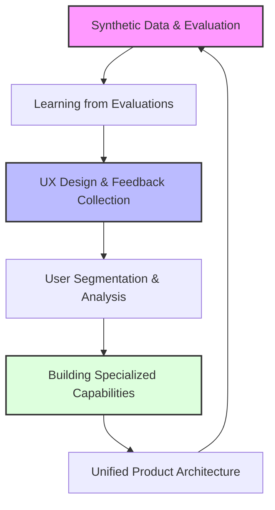

# The RAG Flywheel

## Data-Driven Product Development for AI Applications

*A systematic approach to building self-improving AI systems*

!!! abstract "About This Book"
    This book provides a structured approach to evolving Retrieval-Augmented Generation (RAG) from a technical implementation into a continuously improving product. You'll learn to combine product thinking with data science principles to create AI systems that deliver increasing value over time.
    
    Most teams focus on the latest models and algorithms while missing the fundamentals: understanding their data, measuring performance, and systematically improving based on user feedback. This resource shows you the proven approach used by companies like Zapier, Glean, and Exa.

## The RAG Improvement Flywheel

At the core of this book is the RAG improvement flywheel - a continuous cycle that transforms user interactions into product enhancements:

!!! tip "Beyond Technical Implementation"
    This book goes beyond teaching you how to implement RAG. It shows you how to think about RAG as a product that continuously evolves to meet user needs and deliver business value.

## Workshop Series

### [Introduction: Beyond Implementation to Improvement](workshops/chapter0.md)
**The Product Mindset for RAG Systems**

- Shifting from technical implementation to product-focused continuous improvement
- Understanding RAG as a recommendation engine wrapped around language models
- The improvement flywheel: transforming user interactions into system enhancements
- Moving from ad-hoc tweaking to systematic, data-driven improvement
- Case studies showing the difference between implementation and product mindsets

### [Chapter 1: Kickstarting the Data Flywheel with Synthetic Data](workshops/chapter1.md)
**Establishing Evaluation Frameworks and Overcoming the Cold Start Problem**

- Common pitfalls in AI development: reasoning fallacy, vague metrics, generic solutions
- Leading vs. lagging metrics: focusing on controllable inputs like experiment velocity
- Understanding precision and recall for retrieval evaluation
- Synthetic data generation techniques using chain-of-thought and few-shot prompting
- Building evaluation pipelines that run continuously
- Case studies: improving recall from 50% to 90% through systematic evaluation

### [Chapter 2: Converting Evaluations into Training Data for Fine-Tuning](workshops/chapter2.md)
**From Evaluation to Production Improvement**

- Why generic embeddings fall short for specialized applications
- Converting evaluation examples into effective few-shot prompts
- Understanding contrastive learning and hard negative mining
- Fine-tuning embedding models vs. language models: cost, complexity, and benefits
- Building training datasets from user interactions and feedback
- Re-rankers and linear adapters as cost-effective enhancement strategies

### Chapter 3: User Experience and Feedback Collection

#### [Chapter 3.1: Feedback Collection - Building Your Improvement Flywheel](workshops/chapter3-1.md)
**Designing Feedback Mechanisms That Users Actually Use**

- Making feedback visible and engaging: increasing rates from <1% to >30%
- Proven copy patterns: "Did we answer your question?" vs. generic feedback
- Segmented feedback targeting specific pipeline components
- Mining implicit feedback: query refinements, engagement time, citation clicks
- Creative UI patterns for collecting hard negatives
- Enterprise feedback collection through Slack integrations

#### [Chapter 3.2: Overcoming Latency - Streaming and Interstitials](workshops/chapter3-2.md)
**Transforming Waiting Time into Engagement Opportunities**

- Psychology of waiting: perceived vs. actual performance
- Implementing streaming responses for 30-40% higher feedback collection
- Skeleton screens and meaningful interstitials
- Platform-specific implementations: Slack bots, web interfaces
- Technical implementation: Server-Sent Events, structured data streaming
- Streaming function calls and reasoning processes

#### [Chapter 3.3: Quality of Life Improvements](workshops/chapter3-3.md)
**Citations, Chain of Thought, and Validation Patterns**

- Interactive citations that build trust while collecting feedback
- Chain of thought reasoning for 8-15% accuracy improvements
- Monologues for better comprehension in complex contexts
- Validation patterns as safety nets: reducing errors by 80%
- Strategic rejection of work to set appropriate expectations
- Showcasing capabilities to guide users toward successful interactions

### Chapter 4: Understanding Your Users Through Data Analysis

#### [Chapter 4.1: Topic Modeling and Analysis](workshops/chapter4-1.md)
**Finding Patterns in User Feedback and Queries**

- Moving from individual feedback to systematic pattern identification
- Topics vs. capabilities: understanding what users ask about vs. what they want the system to do
- Clustering and classification techniques for query segmentation
- Transforming "make the AI better" into specific, actionable priorities
- Resource allocation frameworks for maximum impact improvements

#### [Chapter 4.2: Prioritization and Roadmapping](workshops/chapter4-2.md)
**From Insights to Strategic Action Plans**

- Impact/effort prioritization using 2x2 frameworks
- Failure mode analysis: identifying root causes vs. symptoms
- Building strategic roadmaps based on user behavior patterns
- Continuous improvement systems that scale with usage
- Case studies: how query analysis changes development priorities

### Chapter 5: Building Specialized Retrieval Capabilities

#### [Chapter 5.1: Understanding Specialized Retrieval](workshops/chapter5-1.md)
**Beyond Basic RAG: The Power of Specialization**

- Why monolithic approaches reach limits with diverse query types
- Two complementary strategies: extracting metadata vs. creating synthetic text
- Mathematics of specialization: local models outperforming global approaches
- Organizational benefits: division of labor and incremental improvement
- Two-level measurement: router accuracy × retriever performance

#### [Chapter 5.2: Implementing Multimodal Search](workshops/chapter5-2.md)
**Practical Techniques for Documents, Images, Tables, and SQL**

- Advanced document retrieval: contextual chunks, page-level strategies, hybrid signals
- Image search challenges: bridging visual and textual understanding with rich descriptions
- Table search dual approach: tables as documents vs. queryable databases
- SQL generation using RAG playbook: inventory → exemplars → business context
- RAPTOR hierarchical summarization for complex documents
- Performance improvements: 40% better image retrieval, 85% table lookup accuracy

### Chapter 6: Unified Architecture and Intelligent Routing

#### [Chapter 6.1: Query Routing Foundations](workshops/chapter6-1.md)
**Building Cohesive Systems from Specialized Components**

- The API mindset: treating retrievers as services for language models
- Organizational structure: interface, implementation, router, and evaluation teams
- Evolution from monolithic to modular architecture
- Performance formula: P(success) = P(right tool) × P(right document | right tool)
- Framework development perspective for distributed RAG systems

#### [Chapter 6.2: Tool Interfaces and Implementation](workshops/chapter6-2.md)
**Implementing Routing Layers and Tool Selection**

- Designing tool interfaces with Pydantic models and comprehensive documentation
- Router implementation using structured outputs and few-shot examples
- Dynamic example selection based on query similarity
- Multi-agent vs. single-agent architecture decisions
- Tool portfolio design: multiple access patterns for same data
- MCP (Model Context Protocol) as emerging standard

#### [Chapter 6.3: Performance Measurement and Improvement](workshops/chapter6-3.md)
**Building Learning Systems That Continuously Improve**

- Measuring tool selection effectiveness: precision, recall, confusion matrices
- Dual-mode UI: chat interface + direct tool access
- User feedback as high-quality training data
- Diagnostic frameworks for identifying routing vs. retrieval problems
- Automated evaluation pipelines and continuous monitoring
- Creating improvement flywheel: interactions → data → better routing → higher satisfaction

## Expert Talks

### Foundation and Evaluation

**[Building Feedback Systems for AI Products](talks/zapier-vitor-evals.md)** - Vitor (Zapier)  
Simple UX changes increased feedback collection from 10 to 40+ submissions per day (4x improvement). Game-changing insight: specific feedback questions like "Did this run do what you expected?" dramatically outperform generic "How did we do?" prompts.

**[Text Chunking Strategies](talks/chromadb-anton-chunking.md)** - Anton (ChromaDB)  
Why chunking remains critical even with infinite context windows due to embedding model limitations and retrieval performance. Surprising discovery: default chunking strategies in popular libraries often produce terrible results for specific datasets.

**[Understanding Embedding Performance through Generative Evals](talks/embedding-performance-generative-evals-kelly-hong.md)** - Kelly Hong  
Generative benchmarking for creating custom evaluation sets from your own data. Surprising finding: model rankings on custom benchmarks often contradict MTEB rankings, showing that public benchmark performance doesn't guarantee real-world success.

### Training and Fine-Tuning

**[Enterprise Search and Fine-tuning Embedding Models](talks/glean-manav.md)** - Manav (Glean)  
Custom embedding models for each customer achieve 20% performance improvements over 6 months through continuous learning. Counter-intuitive insight: smaller, fine-tuned models often outperform larger general-purpose models for company-specific terminology.

**[Fine-tuning Re-rankers and Embedding Models for Better RAG Performance](talks/fine-tuning-rerankers-embeddings-ayush-lancedb.md)** - Ayush (LanceDB)  
Re-rankers provide 12-20% retrieval improvement with minimal latency penalty, making them "low-hanging fruit" for RAG optimization. Even small 6M parameter models show significant improvements.

### Production and Monitoring

**[Online Evals and Production Monitoring](talks/online-evals-production-monitoring-ben-sidhant.md)** - Ben & Sidhant  
Trellis framework for managing AI systems with millions of users. Critical discovery: traditional error monitoring (like Sentry) doesn't work for AI since there's no exception when models produce bad outputs.

**[RAG Anti-patterns in the Wild](talks/rag-antipatterns-skylar-payne.md)** - Skylar Payne  
90% of teams adding complexity to RAG systems see worse performance when properly evaluated. Major discovery: silent failures in document processing can eliminate 20%+ of corpus without detection.

### Query Analysis and Data Organization

**[Query Routing for RAG Systems](talks/query-routing-anton.md)** - Anton (ChromaDB)  
Why the "big pile of records" approach reduces recall due to approximate nearest neighbor algorithms. When filtering large indexes, compute budget is wasted on irrelevant nodes.

### Specialized Retrieval Systems

**[Agentic RAG](talks/colin-rag-agents.md)** - Colin Flaherty  
Surprising findings from top SWE-Bench performance: simple tools like grep and find outperformed sophisticated embedding models due to agent persistence and course-correction capabilities.

**[Better RAG Through Better Data](talks/reducto-docs-adit.md)** - Adit (Reducto)  
Hybrid computer vision + VLM pipelines outperform pure approaches for document parsing. Critical finding: even 1-2 degree document skews can dramatically impact extraction quality.

**[Encoder Stacking and Multi-Modal Retrieval](talks/superlinked-encoder-stacking.md)** - Daniel (Superlinked)  
LLMs as "pilots that see the world as strings" fundamentally can't understand numerical relationships. Solution: mixture of specialized encoders for different data types rather than forcing everything through text embeddings.

**[Lexical Search in RAG Applications](talks/john-lexical-search.md)** - John Berryman  
Why semantic search struggles with exact matching, product IDs, and specialized terminology. Lexical search provides efficient simultaneous filtering and rich metadata that helps LLMs make better decisions.

### Advanced Topics and Innovation

**[Semantic Search Over the Web with Exa](talks/semantic-search-exa-will-bryk.md)** - Will Bryk (Exa)  
Why AI systems need fundamentally different search engines than humans. Vision for "perfect search" includes test-time compute where complex queries may take hours or days.

**[RAG Without APIs: Browser-Based Retrieval](talks/rag-without-apis-browser-michael-struwig.md)** - Michael (OpenBB)  
Browser-as-data-layer for secure financial data access without traditional API redistribution. Innovation: stateless agent protocol enables remote function execution in browser.

## Quick Wins: High-Impact RAG Improvements

Based on real-world implementations, here are proven improvements you can implement quickly:

!!! success "Top 5 Quick Wins"
    1. **Change Feedback Copy**: Replace "How did we do?" with "Did we answer your question?"
    2. **Use Markdown Tables**: Format structured data as markdown tables instead of JSON/CSV or XML when tables are complex and multiple columns / headers are needed.
    3. **Add Streaming Progress**: Show "Searching... Analyzing... Generating..." with progress
    4. **Implement Page-Level Chunking**: For documentation, respect page boundaries, and use page-level chunking. Humans tend to create semantically coherent chunks at the page level.

!!! tip "Medium-Term Improvements (2-4 weeks)"
    - **Fine-tune embeddings**: $1.50 and 40 minutes for 6-10% improvement
    - **Add re-ranker**: 15-20% retrieval improvement
    - **Build specialized tools**: 10x better for specific use cases
    - **Implement contextual retrieval**: 30% better context understanding
    - **Create Slack feedback integration**: 5x more enterprise feedback

## How to Use This Resource

**For Beginners**: Start with the [Introduction](workshops/chapter0.md) to understand the product mindset, then work through the chapters sequentially.

**For Quick Wins**: Jump to the [Quick Wins section](#quick-wins-high-impact-rag-improvements) above for immediate improvements you can implement today.

**For Specific Problems**: Check the [FAQ](office-hours/faq.md) for answers to common questions, or browse talks by topic above.

**For Complete Implementation**: Follow the full workshop series from Chapter 1 through 6.3 to build a comprehensive self-improving RAG system.

## Key Insights Across All Content

**Most Important Finding**: Teams that iterate fastest on data examination consistently outperform those focused on algorithmic sophistication.

**Most Underutilized Techniques**: Fine-tuning embeddings and re-rankers are more accessible and impactful than most teams realize.

**Biggest Mistake**: 90% of teams add complexity that makes their RAG systems worse. Start simple, measure everything, improve systematically.

**Critical Success Factors**:
- Establish evaluation frameworks before building
- Design feedback collection into your UX from day one
- Understand your users and their query patterns
- Build specialized tools for different content types
- Create unified routing that feels seamless to users

## Frequently Asked Questions

Top questions from office hours:

- **"Is knowledge graph RAG production ready?"** Probably not. [See why →](office-hours/faq.md#is-knowledge-graph-rag-production-ready-by-now-do-you-recommend-it)
- **"How do we handle time-based queries?"** Use PostgreSQL with pgvector-scale. [Learn more →](office-hours/faq.md#how-do-we-introduce-a-concept-of-time-and-vector-search-to-answer-questions-like-whats-the-latest-news-without-needing-to-move-to-a-graph-database)
- **"Should we use DSPy for prompt optimization?"** It depends. [See when →](office-hours/faq.md#what-is-your-take-on-dspy-should-we-use-it)
- **"Would you recommend ColBERT models?"** Test against your baseline first. [See approach →](office-hours/faq.md#would-you-recommend-using-colbert-models-or-other-specialized-retrieval-approaches)

[Browse All FAQ](office-hours/faq.md){ .md-button } [View Office Hours](office-hours/){ .md-button }

## For Product Leaders, Engineers, and Data Scientists

!!! info "What You'll Learn"
    **For Product Leaders**
    - How to establish metrics that align with business outcomes
    - Frameworks for prioritizing AI product improvements  
    - Approaches to building product roadmaps for RAG applications
    - Methods for communicating AI improvements to stakeholders
    **For Engineers**
    - Implementation patterns that facilitate rapid iteration
    - Architectural decisions that enable continuous improvement
    - Techniques for building modular, specialized capabilities
    - Approaches to technical debt management in AI systems
    
    **For Data Scientists**
    - Methods for creating synthetic evaluation datasets
    - Techniques for segmenting and analyzing user queries
    - Frameworks for measuring retrieval effectiveness
    - Approaches to continuous learning from user interactions

## Navigate by Topic

**Evaluation & Metrics**: [Chapter 1](workshops/chapter1.md) • [Kelly Hong Talk](talks/embedding-performance-generative-evals-kelly-hong.md) • [Vitor Zapier Talk](talks/zapier-vitor-evals.md)

**Fine-tuning & Training**: [Chapter 2](workshops/chapter2.md) • [Ayush LanceDB Talk](talks/fine-tuning-rerankers-embeddings-ayush-lancedb.md) • [Manav Glean Talk](talks/glean-manav.md)

**User Experience**: [Chapter 3 Series](workshops/chapter3-1.md) • [Streaming Guide](workshops/chapter3-2.md) • [Quality Improvements](workshops/chapter3-3.md)

**Architecture & Routing**: [Chapter 6 Series](workshops/chapter6-1.md) • [Anton Query Routing](talks/query-routing-anton.md) • [Multi-modal Retrieval](talks/superlinked-encoder-stacking.md)

**Production & Monitoring**: [Ben & Sidhant Talk](talks/online-evals-production-monitoring-ben-sidhant.md) • [RAG Anti-patterns](talks/rag-antipatterns-skylar-payne.md)

## About the Author

Jason Liu brings practical experience from his work at Facebook, Stitch Fix, and as a consultant for companies like HubSpot, Zapier, and many others. His background spans computer vision, recommendation systems, and RAG applications across diverse domains.

!!! quote "Author's Philosophy"
   "The most successful AI products aren't the ones with the most sophisticated models, but those built on disciplined processes for understanding users, measuring performance, and systematically improving. This resource will show you how to create not just a RAG application, but a product that becomes more valuable with every interaction."

---

## Getting Started

Begin your journey by reading the [Introduction](workshops/chapter0.md) or jump directly to [Chapter 1](workshops/chapter1.md) to start building your evaluation framework and data foundation.

If you want to get discounts and 6 day email source on the topic make sure to subscribe to

