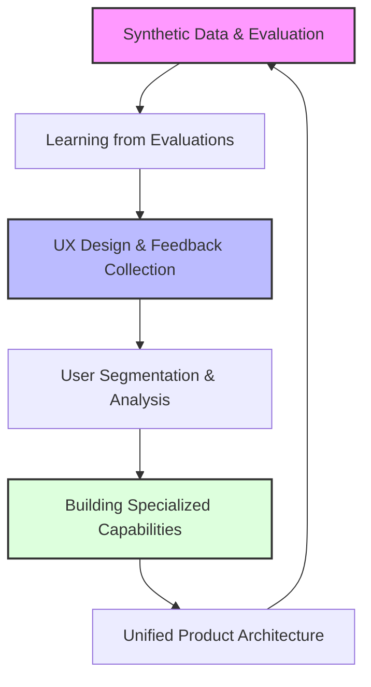

# The RAG Flywheel

## Data-Driven Product Development for AI Applications

_A systematic approach to building self-improving AI systems_

!!! abstract "About This Book"
This book provides a structured approach to evolving Retrieval-Augmented Generation (RAG) from a technical implementation into a continuously improving product. You'll learn to combine product thinking with data science principles to create AI systems that deliver increasing value over time.

## The RAG Improvement Flywheel

At the core of this book is the RAG improvement flywheel - a continuous cycle that transforms user interactions into product enhancements.

!!! tip "Beyond Technical Implementation"
This book goes beyond teaching you how to implement RAG. It shows you how to think about RAG as a product that continuously evolves to meet user needs and deliver business value.

## Chapters

### [Introduction: Beyond Implementation to Improvement](workshops/chapter0.md)

Understand why systematic improvement matters and how to approach RAG as a product rather than just a technical implementation.

### [Chapter 1: Starting the Flywheel](workshops/chapter1.md)

Learn how to overcome the cold-start problem, establish meaningful metrics, and create a data foundation that drives product decisions.

### [Chapter 2: From Evaluation to Enhancement](workshops/chapter2.md)

Transform evaluation insights into concrete product improvements through fine-tuning, re-ranking, and targeted enhancements.

### [Chapter 3: The User Experience of AI](workshops/chapter3-1.md)

Design interfaces that both delight users and gather valuable feedback, creating a virtuous cycle of improvement.

### [Chapter 4: Understanding Your Users](workshops/chapter4-1.md)

Segment users and queries to identify high-value opportunities and create targeted improvement strategies.

### [Chapter 5: Building Specialized Capabilities](workshops/chapter5-1.md)

Develop purpose-built solutions for different user needs spanning documents, images, tables, and structured data.

### [Chapter 6: Unified Product Architecture](workshops/chapter6-1.md)

Create a cohesive product experience that intelligently routes to specialized components while maintaining a seamless user experience.

### [Key Takeaways: Product Principles for AI Applications](misc/what-i-want-you-to-takeaway.md)

Core principles that will guide your approach to building AI products regardless of how the technology evolves.

## Talks and Presentations

Explore insights from industry experts and practitioners through our collection of talks, lightning lessons, and presentations:

### [Featured Talks](talks/index.md)

- **[Fine-tuning Re-rankers and Embedding Models for Better RAG Performance](talks/fine-tuning-rerankers-embeddings-ayush-lancedb.md)** - Practical approaches to enhancing retrieval quality (Ayush from LanceDB)
- **[RAG Anti-patterns in the Wild](talks/rag-antipatterns-skylar-payne.md)** - Common mistakes and how to fix them (Skylar Payne)
- **[Semantic Search Over the Web with Exa](talks/semantic-search-exa-will-bryk.md)** - Building AI-first search engines (Will Bryk)
- **[Understanding Embedding Performance through Generative Evals](talks/embedding-performance-generative-evals-kelly-hong.md)** - Custom evaluation methodologies (Kelly Hong)
- **[Online Evals and Production Monitoring](talks/online-evals-production-monitoring-ben-sidhant.md)** - Monitoring AI systems at scale (Ben Hylak & Sidhant Bendre)

[View all talks →](talks/index.md)

## For Product Leaders, Engineers, and Data Scientists

!!! info "What You'll Learn"
    **For Product Leaders**
    - How to establish metrics that align with business outcomes
    - Frameworks for prioritizing AI product improvements  
    - Approaches to building product roadmaps for RAG applications
    - Methods for communicating AI improvements to stakeholders
    **For Engineers**
    - Implementation patterns that facilitate rapid iteration
    - Architectural decisions that enable continuous improvement
    - Techniques for building modular, specialized capabilities
    - Approaches to technical debt management in AI systems
    
    **For Data Scientists**
    - Methods for creating synthetic evaluation datasets
    - Techniques for segmenting and analyzing user queries
    - Frameworks for measuring retrieval effectiveness
    - Approaches to continuous learning from user interactions

## Quick Wins: High-Impact RAG Improvements

Based on real-world implementations, here are proven improvements you can implement quickly:

!!! success "Top 5 Quick Wins"
    1. **Change Feedback Copy** 
       - Replace "How did we do?" with "Did we answer your question?"
       - **Impact**: 5x increase in feedback collection
       - **Effort**: 1 hour
    
    2. **Use Markdown Tables**
       - Format structured data as markdown tables instead of JSON/CSV
       - If tables are complex, represent it in XML
       - **Impact**: 12% better lookup accuracy
       - **Effort**: 2-4 hours
    
    3. **Add Streaming Progress**
       - Show "Searching... Analyzing... Generating..." with progress
       - Stream the response as it's being generated when possible
       - **Impact**: 45% reduction in perceived latency
       - **Effort**: 1 sprint
    
    4. **Implement Page-Level Chunking**
       - For documentation, respect page boundaries, and use page-level chunking. Humans tend to create semantically coherent chunks at the page level.
       - **Impact**: 20-30% better retrieval for docs
       - **Effort**: 1 day

!!! tip "Medium-Term Improvements (2-4 weeks)"
    - **Fine-tune embeddings**: $1.50 and 40 minutes for 6-10% improvement
    - **Add re-ranker**: 15-20% retrieval improvement
    - **Build specialized tools**: 10x better for specific use cases
    - **Implement contextual retrieval**: 30% better context understanding
    - **Create Slack feedback integration**: 5x more enterprise feedback

!!! info "Learn from the Experts"
    Before implementing, learn from these practical talks:
    - [**RAG Anti-patterns in the Wild**](talks/rag-antipatterns-skylar-payne.md) - Common mistakes across industries and how to fix them
    - [**Document Ingestion Best Practices**](talks/reducto-docs-adit.md) - Production-ready parsing for tables, PDFs, and complex documents

## About the Author

Jason Liu brings practical experience from his work at Facebook, Stitch Fix, and as a consultant for companies like HubSpot, Zapier, and many others. His background spans computer vision, recommendation systems, and RAG applications across diverse domains.

!!! quote "Author's Philosophy"
   "The most successful AI products aren't the ones with the most sophisticated models, but those built on disciplined processes for understanding users, measuring performance, and systematically improving. This book will show you how to create not just a RAG application, but a product that becomes more valuable with every interaction."

## Getting Started

Begin your journey by reading the [Introduction](workshops/chapter0.md) or jump directly to [Chapter 1](workshops/chapter1.md) to start building your evaluation framework and data foundation.

---

IF you want to get discounts and 6 day email source on the topic make sure to subscribe to

