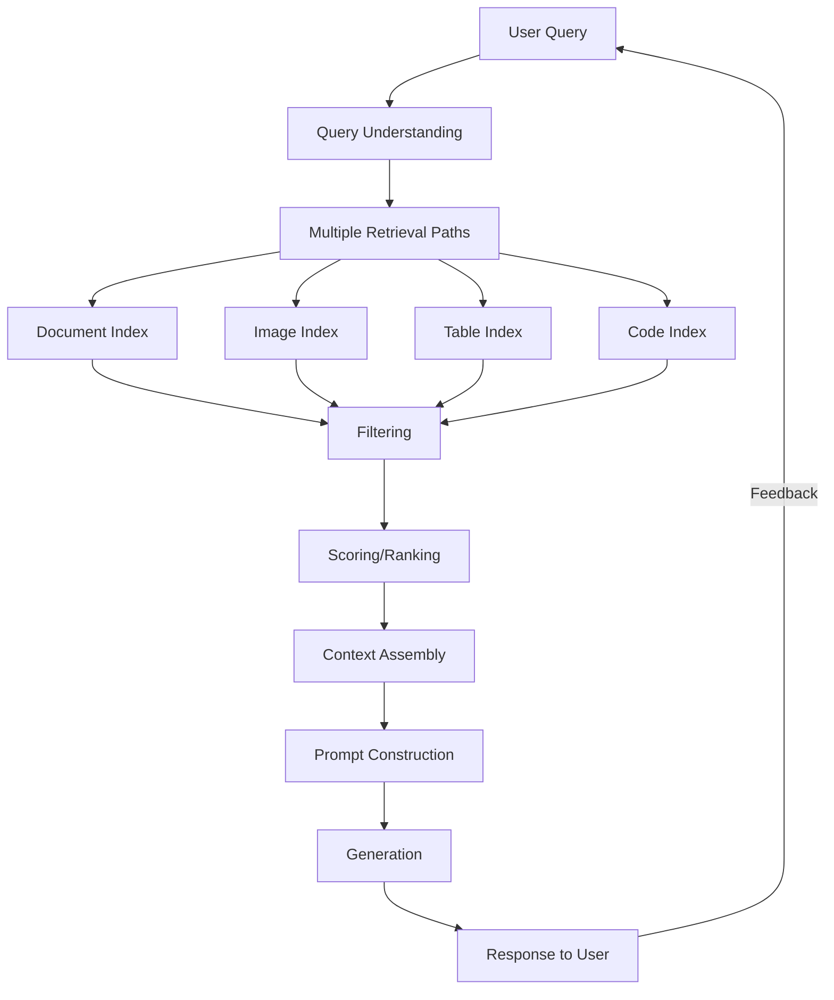
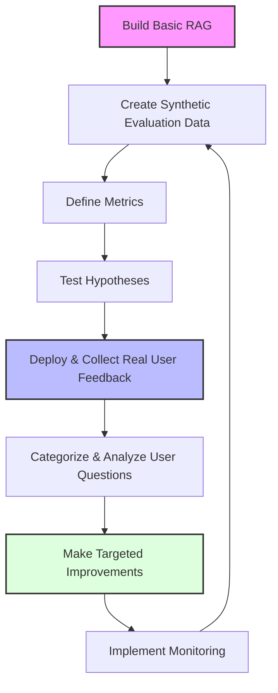
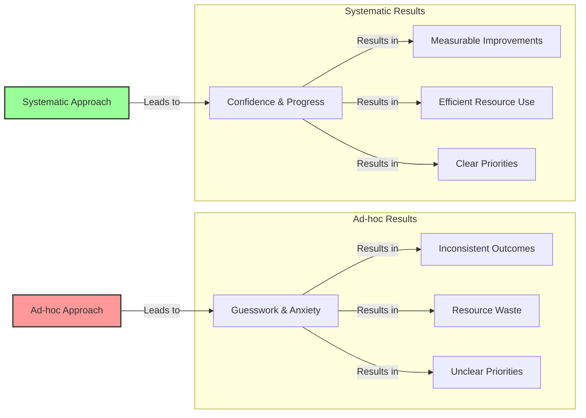

# Beyond Implementation to Improvement: A Product Mindset for RAG

!!! abstract "Chapter Overview"

    In this opening chapter, I introduce you to a fundamental shift in how we approach RAG systems—from static implementations to continuously improving products. You'll discover:

    - Why the most successful RAG systems are built as products, not just technical implementations
    - How to think about RAG as a recommendation engine wrapped around language models
    - The "improvement flywheel" that transforms user interactions into system enhancements
    - How to shift from ad-hoc tweaking to systematic, data-driven improvement
    - The mindset that separates successful AI products from those that stagnate after launch

## The Product Mindset: Why Most RAG Implementations Fail

When organizations implement RAG systems, they often approach it as a purely technical challenge. They focus on selecting the right embedding model, vector database, and LLM, then consider the project "complete" once these components are integrated and deployed.

This approach inevitably leads to disappointment. The system works well for demo queries and simple use cases, but struggles with the complexity and diversity of real-world questions. As users encounter these limitations, they lose trust in the system and engagement drops. Without clear metrics or improvement processes, teams resort to ad-hoc tweaking based on anecdotal feedback.

The fundamental issue? They've built a technical implementation, not a product.

Throughout my career building AI systems at Facebook, Stitch Fix, and for various clients, I've observed a consistent pattern: **the teams that succeed are those that treat their RAG implementations as products that continuously evolve rather than projects that eventually conclude.**

Consider these contrasting approaches:

| Implementation Mindset                                   | Product Mindset                                           |
| -------------------------------------------------------- | --------------------------------------------------------- |
| "We need to implement RAG"                               | "We need to solve specific user problems"                 |
| Technical metrics (embedding dimensions, context window) | User-centered metrics (answer relevance, task completion) |
| Project with a defined endpoint                          | Ongoing system that improves over time                    |
| Success = working demo                                   | Success = sustained user value                            |
| One-time architecture decisions                          | Evolutionary architecture that adapts                     |
| Focus on model selection                                 | Focus on feedback loops and data collection               |

The product mindset recognizes that launching your RAG system is just the beginning. The real work—and the real value—comes from how you systematically improve it based on user interactions.

## RAG as a Recommendation Engine

!!! important "Mental Model"
The most effective way to think about RAG isn't as a pipeline of retrieval, augmentation, and generation steps—it's as a **recommendation engine wrapped around language models**.

This shift in perspective is transformative. When you view RAG as a recommendation system, you naturally focus on the aspects that truly determine performance: selecting the most relevant information to present to the language model.

This recommendation engine perspective reveals important insights:

1. **Generation quality is capped by retrieval quality.** No amount of prompt engineering can overcome providing the wrong information to the LLM.

2. **Different queries need different retrieval strategies.** Just as Amazon uses different recommendation algorithms for books versus electronics, your RAG system needs specialized approaches for different query types.

3. **User feedback is essential.** Recommendation systems learn from interactions—what users click on, purchase, or engage with. Your RAG system should similarly learn from how users interact with responses.

4. **Cold start is a significant challenge.** Just as Netflix needs to learn your preferences, RAG systems need data to understand what makes a good response for your specific use case.

5. **The best recommendations are personalized.** As your system evolves, it should adapt to specific user preferences and patterns.

This perspective also explains why many RAG implementations underperform—they're built like simple search engines rather than sophisticated recommendation systems with feedback loops and personalization.

## The Improvement Flywheel: From Static to Dynamic Systems

At the core of the product mindset is what I call the "improvement flywheel"—a systematic process that transforms user interactions into continuous enhancements.

This flywheel addresses the most common challenges in RAG development:

| Phase                  | Business Challenge                               | Technical Challenge                        | Flywheel Solution                                                                                                                   |
| ---------------------- | ------------------------------------------------ | ------------------------------------------ | ----------------------------------------------------------------------------------------------------------------------------------- |
| **Cold Start**         | No data to guide design decisions                | No examples to train or evaluate against   | Generate synthetic questions from content Establish baseline metrics Compare architectural approaches                         |
| **Initial Deployment** | Understanding what users actually need           | Learning what causes poor performance      | Instrument application for data collection Implement feedback mechanisms Capture query patterns and failure modes             |
| **Growth**             | Prioritizing improvements with limited resources | Addressing diverse query types effectively | Use topic modeling to segment questions Identify highest-impact opportunities Build specialized capabilities for key segments |
| **Optimization**       | Maintaining quality as usage scales              | Combining multiple specialized components  | Create unified routing architecture Implement monitoring and alerts Establish continuous improvement processes                |

The beauty of this approach is that each phase feeds into the next, creating momentum that accelerates improvement over time. As you collect more data, you gain clearer insights into what's working and what isn't, allowing you to make increasingly targeted enhancements.

### Optimizing Feedback Collection

The effectiveness of your improvement flywheel depends heavily on how you collect feedback. During our office hours, we discovered that simply changing feedback prompt copy from "How did we do?" to "Did we answer your question?" increased feedback rates by 5x. This more specific framing focused users on the core value proposition rather than secondary concerns like latency or formatting.

When implementing feedback mechanisms, remember that:
- Binary feedback (thumbs up/down) generally yields higher response rates than free text fields
- For enterprise applications, combining button options with free text and posting responses to Slack creates transparency that encourages more feedback
- Every metric you track should lead to a specific follow-up action—it's not just about knowing the number

## The System vs. Ad Hoc Approaches

A system is a structured approach to solving problems that guides how we think about and tackle challenges. For RAG applications, this includes:

- A framework for evaluating technologies
- A decision-making process for prioritizing development efforts
- A methodology for diagnosing and improving performance
- Standard metrics and benchmarks for measuring success

The contrast between systematic and ad-hoc approaches is stark:

### The Cost of Lacking a System

Without a systematic approach, teams face significant challenges:

| Common Challenge                 | Without a System      | With a System                    |
| -------------------------------- | --------------------- | -------------------------------- |
| "Make the AI better"             | Anxiety and guesswork | Clear metrics and priority areas |
| Allocating engineering resources | Political decisions   | Data-driven prioritization       |
| Evaluating improvement ideas     | Subjective opinions   | Objective measurement            |
| Communicating progress           | Vague assertions      | Concrete metrics and examples    |
| Addressing user complaints       | Reactive firefighting | Proactive improvement            |

Having a system frees up mental energy for innovation and problem-solving by creating clarity around what's working, what isn't, and what to focus on next.

## From Engineer to Product Thinker: The Mindset Shift

To fully embrace the product mindset for RAG, you need to expand your thinking beyond technical implementation details. Here's what this mindset shift looks like in practice:

| Technical Implementation Focus                    | Product Development Focus                                               |
| ------------------------------------------------- | ----------------------------------------------------------------------- |
| "Which embedding model has the best performance?" | "Which embedding approach best solves our users' problems?"             |
| "How do we implement vector search?"              | "How do we discover which search features matter most to users?"        |
| "What's the optimal chunk size?"                  | "How do we measure whether our chunking approach is working for users?" |
| "How do we reduce hallucinations?"                | "How do we build user trust through transparent, accurate responses?"   |
| "Which model has the best capabilities?"          | "Which capabilities deliver the most value for our use case?"           |

This shift doesn't mean abandoning technical rigor—quite the opposite. It means applying that rigor to problems that actually matter to your users, guided by data rather than assumptions.

### Case Study: The Improvement Flywheel in Action

To illustrate the power of this approach, let's look at a real example from my consulting work with a legal technology company:

1. **Initial Implementation**: The company built a RAG system to help lawyers search through case law and legal documents. The initial implementation used standard embeddings and chunking, with middling performance.

2. **Synthetic Evaluation**: We created a dataset of 200 synthetic legal queries with gold-standard answers derived from their knowledge base, establishing baseline metrics showing only 63% retrieval accuracy.

3. **Hypothesis Testing**: Testing different chunking strategies and embedding models revealed that legal terminology required specialized approaches, boosting performance to 72%.

4. **Deployment and Feedback**: We implemented explicit feedback buttons and implicit tracking (time spent, copy actions), collecting data on 5,000+ real queries over two months.

5. **Pattern Analysis**: Topic modeling revealed distinct query categories (case citation, legal definition, procedural question) with varying performance.

6. **Targeted Improvements**: We built specialized retrievers for each category (citation parser, definition extractor, procedure classifier), pushing overall performance to 87%.

7. **Monitoring and Refinement**: Continuous tracking showed which query types were growing in popularity and which still needed improvement, guiding ongoing development.

The result wasn't just better technical performance—it was significantly higher user adoption, reduced time spent on research, and ultimately, better legal outcomes for clients.

## What You'll Learn in This Book

Throughout this book, I'll guide you through implementing every aspect of the improvement flywheel, with practical examples and code you can adapt to your own projects.

Here's what we'll cover in the upcoming chapters:

### [Chapter 1: Starting the Flywheel with Data](chapter1.md)

Learn how to overcome the cold-start problem through synthetic data generation, establish meaningful metrics that align with business goals, and create a foundation for data-driven improvement.

### [Chapter 2: From Evaluation to Product Enhancement](chapter2.md)

Discover how to transform evaluation insights into concrete product improvements through fine-tuning, re-ranking, and targeted capability development.

### [Chapter 3: The User Experience of AI](chapter3.md)

Explore how to design interfaces that both delight users and gather valuable feedback, creating the virtuous cycle at the heart of the improvement flywheel.

### [Chapter 4: Understanding Your Users](chapter4.md)

Learn techniques for segmenting users and queries to identify high-value opportunities and create prioritized improvement roadmaps.

### [Chapter 5: Building Specialized Capabilities](chapter5.md)

Develop purpose-built solutions for different user needs, spanning documents, images, tables, and structured data.

### [Chapter 6: Unified Product Architecture](chapter6.md)

Create a cohesive product experience that intelligently routes to specialized components while maintaining a seamless user experience.

## Reflection Questions

As you prepare for the next chapter, consider these questions about your current approach to RAG:

1. Are you treating your RAG implementation as a completed project or an evolving product?
2. What mechanisms do you have in place to learn from user interactions?
3. How do you currently measure the success of your RAG application?
4. What processes do you have for prioritizing improvements?
5. How would your approach change if you viewed RAG as a recommendation engine rather than a pipeline?

By shifting from an implementation mindset to a product mindset, you'll move from building RAG systems that work once to creating AI products that continuously improve and deliver increasing value over time.

In the next chapter, we'll take the first concrete step in the improvement flywheel: creating synthetic evaluation data to establish a foundation for systematic enhancement.

---

_Author Note: This approach has been refined through work with organizations ranging from startups to Fortune 500 companies across diverse domains including legal, financial, healthcare, and e-commerce. While the technical details vary by domain, the fundamental principles of the improvement flywheel remain consistent—focus on users, measure what matters, and systematically enhance based on data rather than assumptions._
