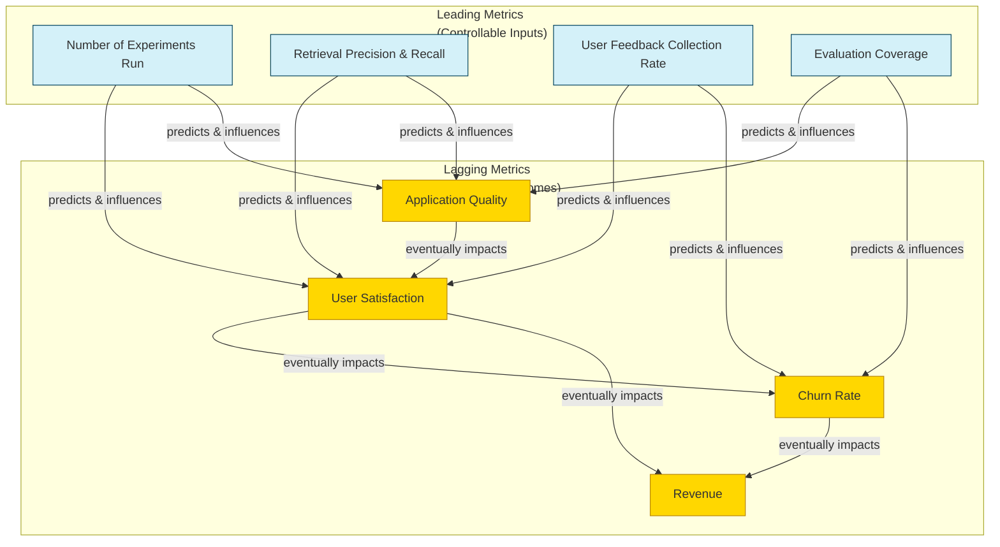
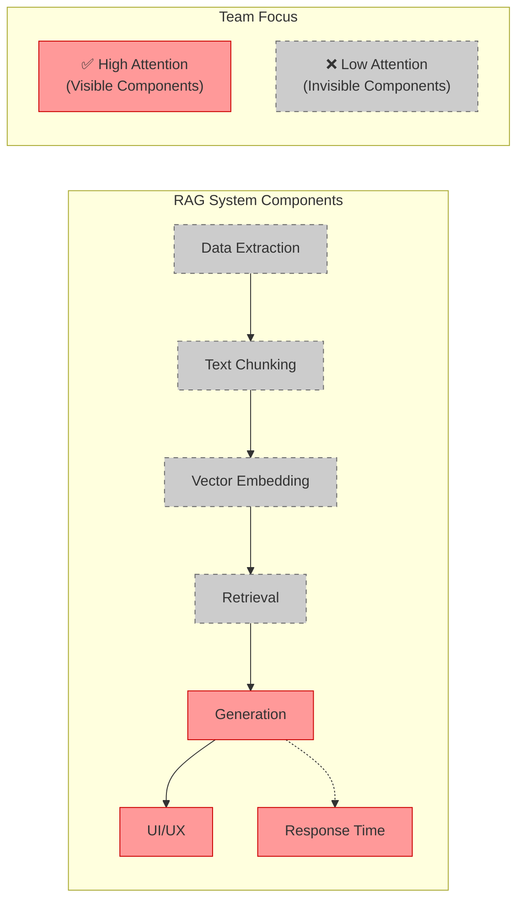
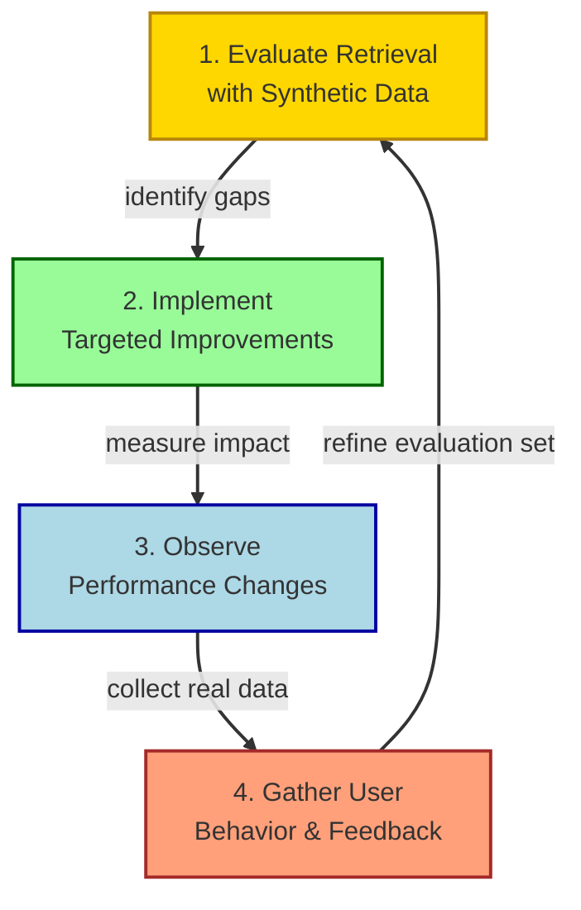

# Kickstarting the Data Flywheel with Synthetic Data

!!! abstract "Chapter Overview"

```
This chapter focuses on starting the improvement flywheel by establishing proper evaluation frameworks:

- Understanding common pitfalls in AI development
- Distinguishing between different types of metrics
- Creating synthetic data for evaluation
- Building frameworks to drive systematic improvements
- Measuring retrieval quality with precision and recall
- Implementing practical evaluation pipelines
```

## Introduction

Welcome to the first practical chapter on systematically improving RAG applications. This week is all about giving you the tools to kickstart the data flywheel—focusing on evaluations, understanding common mistakes, and using synthetic data to address concerns before you even have users.

The main challenge many teams face is knowing where to start when improving RAG applications. Without proper evaluation frameworks, teams often fall into a cycle of making random changes based on intuition rather than data. This chapter aims to break that cycle by establishing data-driven methods for improvement.

!!! quote "Key Philosophy"
"You can't improve what you don't measure. The goal is not to chase the latest AI techniques blindly, but to establish a flywheel of continuous improvement driven by clear metrics aligned with user outcomes."

## Common Pitfalls in AI Development

When I work with companies building RAG applications, I consistently see the same vicious cycle play out. Let's explore these common pitfalls to ensure you don't fall into the same traps.

### The Reasoning Fallacy

How often do we hear statements like "we need more complex reasoning" or "the model isn't smart enough"? In my experience, this is rarely the actual problem. Instead, it usually indicates a fundamental lack of user empathy and specificity in the tools we build.

!!! warning "Common Mistake"
When you hear statements like "we need more reasoning power," challenge yourself to answer:

```
- When was the last time we looked at data from customers?
- When did we last read user feedback?
- Are we actively asking for feedback?
```

The root issue is rarely that we need more complex reasoning—it's that we don't understand what our users actually want. This leads to building generic tools that don't solve specific problems well.

### The Vague Metrics Problem

Many developers unknowingly sabotage their applications by defining vague metrics. Thinking in terms like "does it look better?" or "does it feel right?" makes it impossible to measure progress objectively.

You would be surprised how pervasive this problem is. I've worked with companies valued at $100 million that maintain fewer than 30 evaluation examples. When something changes in their system, they have no way of understanding what actually moved the needle.

Without clear metrics, teams end up making random changes, seeing unclear results, becoming frustrated, and continuing the cycle of vagueness. Breaking this cycle requires establishing concrete, measurable objectives.


### Building Generic Solutions

Another common mistake is building very generic solutions for broad problems instead of specific work that delivers economic value. This means focusing on features rather than outcomes.

This typically happens because the mandate is too broad or the team has overpromised. The result? A generic tool with 30-40% churn rates that teams are too scared to fully launch because users might lose interest.

The solution is clear: try to be world-class in just a few narrow domains and earn complexity as you discover what your customers truly care about. Start specific, then expand gradually based on validated user needs.

## Leading versus Lagging Metrics

Understanding the distinction between leading and lagging metrics can transform your approach to improvement. This concept was profound to me when I worked at Facebook, and it applies perfectly to RAG applications. Shifting your focus from outcomes to inputs is often the most significant mindset change for successful RAG development.



### Lagging Metrics

Lagging metrics are outcomes that are difficult to improve directly but easy to measure. They're measurements of past results, often unresponsive to immediate changes, and represent the outputs of your system.

Examples of lagging metrics include:

- Application quality
- User satisfaction
- Churn rates
- Revenue

Think of lagging metrics like your body weight or strength. You can easily measure how much you weigh or how much you can lift, but you can't directly change these factors in the short term.

### Leading Metrics

Leading metrics, by contrast, are factors you can easily change but might be harder to measure perfectly. They predict future performance and provide feedback on when and where to intervene.

Examples of leading metrics include:

- Number of experiments run per week
- Evaluation coverage of different question types
- Retrieval precision and recall
- User feedback collection rate

### The Calories In, Calories Out Analogy

Let me offer a simple but powerful analogy from physical fitness that perfectly illustrates the relationship between leading and lagging metrics:

If your goal is weight management (a lagging metric), the most reliable path is focusing on calories consumed and calories burned (leading metrics). At any moment, you can count how many calories you've eaten and how many you've expended through activity. If you want to gain weight, ensure you've eaten enough; if you want to lose weight, ensure you've created a caloric deficit.

While this is admittedly reductive, the principle is profound: focus on the inputs you can control (calories), and the outputs you care about (weight) will follow predictably. The obsessive tracking of weight (the lagging metric) provides little actionable information compared to tracking calories (the leading metric).

In physical fitness, leading metrics would be calories consumed, workout frequency, and sleep quality. These factors are within your direct control and predictive of future outcomes.

### The #1 Leading Metric: Experiment Velocity

The most important leading metric for early-stage RAG applications is simply the number of experiments run. Just like counting calories is more effective for weight management than weighing yourself constantly, tracking experiment velocity is more useful than obsessing over end-user metrics that change slowly.

My recommendation? Completely restructure how you think about team stand-ups. Instead of focusing primarily on outcomes, count and increase the number of experiments you can run. If your team feels lost or unsure what to do next, the answer is simple: run more experiments.

During team meetings, shift focus from asking about the outcomes of experiments to increasing the number of experiments you can run. What infrastructure investments would improve that velocity? How can you brainstorm new ideas to design better experiments? This mindset shift makes all the difference.

## Absence Blindness and Intervention Bias

Two cognitive biases frequently derail RAG improvement efforts: absence blindness and intervention bias.

### Absence Blindness

Absence blindness is simple: you don't fix what you can't see. In RAG applications, I see this daily with almost every client. Teams focus obsessively on generation quality and latency—the visible parts of the system—while neglecting to check whether retrieval is even working correctly.

I've seen teams spend weeks fine-tuning prompts to improve the quality of generated text, only to discover that their retrieval system wasn't functioning properly at all. No amount of prompt engineering can compensate for a system that retrieves irrelevant documents or misses critical information.

Key questions almost no one asks until I prompt them:

- Have you verified whether your retrieval is bringing back the right documents?
- Are your text chunks properly segmented?
- Is your data extraction pipeline working as expected?
- Do you have metrics for retrieval separate from generation?



Have you verified whether your retrieval brings back the right documents? Are your text chunks properly segmented? Is your data extraction pipeline working as expected? These invisible components often cause the most significant issues but receive the least attention.

### Intervention Bias

Intervention bias is our tendency to take action just to feel in control, regardless of whether that action is effective. In RAG applications, this manifests as constantly switching between models, adding prompt tweaks, or implementing new features without measuring their impact.

In my consulting practice, I frequently get emails asking: "Should we use GPT-4 or Claude?" or "Will adding this prompt technique fix our issues?" The honest answer is always the same: it depends on your data, your evaluations, and your benchmarks. There are no universal answers.

Many teams make changes to feel like they're making progress rather than taking specific interventions against specific metrics and testing clear hypotheses. I see this pattern repeatedly:

1. Team faces RAG performance issues
1. Someone suggests a new model, chunking approach, or prompt technique
1. Quick implementation without proper testing
1. Subjective assessment: "It feels better"
1. New problems emerge, cycle repeats

While it feels good to be taking action, randomized changes create technical debt and confuse attribution of improvements. Each change should target a specific metric and test a clear hypothesis.

The solution is to establish evaluations that enable methodical improvement—evaluations that reflect and correlate with business outcomes you care about.

## The RAG Flywheel and Retrieval Evaluations

The basic principle of improving RAG applications is that everything we've learned in search is incredibly relevant to retrieval. If you already have a basic RAG setup, the next step is to bring in synthetic questions that test your system's retrieval capabilities.



### Why Prioritize Retrieval Evaluations

Many teams without machine learning backgrounds focus on subjective generation evaluations too early. While language models will continue improving at synthesis, it's our responsibility to improve search and retrieval.

Retrieval evaluations offer several advantages over generation evaluations:

1. **Speed**: Retrieval tests take milliseconds versus seconds or minutes for generation tests
1. **Cost**: They're significantly cheaper to run
1. **Objectivity**: Results are clear and unambiguous
1. **Scalability**: You can run thousands of tests quickly

When you focus on generation evaluations prematurely, factuality becomes subjective and confusing. As you adopt evaluation tools, you get flooded with information without clear actions. By contrast, improving precision and recall directly allows you to test whether lexical search, semantic search, or re-rankers improve your retrieval in a measurable way.

## Understanding Precision and Recall

Before diving into implementation, let's clarify what precision and recall actually mean in the context of RAG:


**Recall** is the percentage of relevant documents that are successfully retrieved. If there are 10 correct documents and your system finds 4 of them, recall is 40%. High recall means your system finds most of the relevant documents, which is crucial when facts are distributed across multiple documents.

**Precision** is the percentage of retrieved documents that are relevant. If your system returns 10 results but only 2 are relevant, precision is 20%. High precision means most retrieved documents are relevant.

With advanced models, recall tends to be more important than precision, as these models can better ignore irrelevant information. With simpler models, precision becomes more critical because irrelevant information can cause confusion.

## Case Studies: Real-World Improvements

Let's examine two case studies where focusing on retrieval metrics led to rapid improvements.

### Case Study 1: Report Generation from Expert Interviews

I worked with a company that generates reports from user research interviews. Consultants conduct 15-30 interviews with experts and request AI-generated reports summarizing key findings.

**Problem**: Customers noticed that only a subset of relevant quotes were included in reports. In one case, a consultant knew that 6 experts had expressed similar opinions, but the report only cited 3 of them. This 50% recall rate damaged trust in the system.

**Approach**: We set a goal to dramatically improve recall for these specific use cases. We manually built question-chunk relevance datasets by examining problematic examples and discovered that most issues could be addressed through better pre-processing.

**Result**: By experimenting with text chunking methods before ingestion, we improved recall from 50% to 90% in just a few iterations. This improvement restored customer confidence and established a workflow for continuous enhancement.

**Key Takeaway**: Text pre-processing that aligns with anticipated user queries can dramatically improve retrieval performance.

### Case Study 2: Blueprint Search for Construction

Another client needed to implement AI search for construction blueprints, allowing workers to ask questions about building plans.

**Problem**: Initial tests showed only 27% recall when trying to find the correct blueprint image for specific questions.

**Approach**: We hypothesized that better image captions would improve retrieval. We implemented a visual language model to create detailed captions for blueprints, using chain-of-thought prompting to reason about the images and generate hypothetical questions users might ask.

**Result**: In just four days of experimentation, recall improved from 27% to 85%. This allowed us to launch the feature and collect real user data, which revealed that 20% of queries involved counting objects in blueprints. This insight justified investing in bounding box models to count rooms and features automatically.

**Key Takeaway**: Testing specific subsystems independently enables rapid baseline improvements. Synthetic data generation for specific use cases can dramatically improve retrieval.

## Practical Implementation: Building Your Evaluation Framework

With synthetic data in hand, you can build a proper evaluation framework. This framework should:

1. Run questions through your retrieval system
1. Compare retrieved chunks to ground truth
1. Calculate precision and recall metrics
1. Track performance over time as you make changes

This framework becomes the foundation of your improvement flywheel. Every change to your system—whether a new embedding model, chunking strategy, or ranking approach—should be evaluated against these metrics.

### Building a Practical Evaluation Pipeline

Let's walk through building a simple but effective evaluation pipeline:

```python
def evaluate_retrieval(evaluation_data, retriever_fn, k=10):
    """
    Evaluate retrieval performance on a dataset.

    Args:
        evaluation_data: List of dicts with 'question' and 'relevant_docs' keys
        retriever_fn: Function that takes question text and returns docs
        k: Number of top results to consider

    Returns:
        Dict containing evaluation metrics
    """
    results = []

    for item in evaluation_data:
        question = item['question']
        ground_truth = set(item['relevant_docs'])

        # Call retrieval system
        retrieved_docs = retriever_fn(question, top_k=k)
        retrieved_ids = [doc['id'] for doc in retrieved_docs]

        # Calculate metrics
        retrieved_relevant = set(retrieved_ids) & ground_truth
        precision = len(retrieved_relevant) / len(retrieved_ids) if retrieved_ids else 0
        recall = len(retrieved_relevant) / len(ground_truth) if ground_truth else 1.0

        # Store individual result
        results.append({
            'question_id': item.get('id', ''),
            'question': question,
            'precision': precision,
            'recall': recall,
            'retrieved_docs': retrieved_ids,
            'relevant_docs': list(ground_truth),
            'metadata': item.get('metadata', {})
        })

    # Aggregate metrics
    avg_precision = sum(r['precision'] for r in results) / len(results)
    avg_recall = sum(r['recall'] for r in results) / len(results)

    return {
        'avg_precision': avg_precision,
        'avg_recall': avg_recall,
        'detailed_results': results
    }
```

### Running Regular Evaluations

Make evaluation a regular part of your development cycle:

1. **Continuous testing**: Run evaluations with every significant change to your system
1. **Weekly benchmarks**: Schedule comprehensive evaluations weekly
1. **Version comparison**: Always compare new changes against previous versions
1. **Failure analysis**: Regularly review cases with 0% recall to identify patterns
1. **Difficulty progression**: As scores improve, add more challenging test cases

### Integrating with Development Workflow

To maximize the value of your evaluation framework:

1. **Build a dashboard**: Create a simple interface showing metrics over time
1. **Implement automatic testing**: Run evaluations as part of your CI/CD pipeline
1. **Set alert thresholds**: Get notified if metrics drop below critical levels
1. **Document all experiments**: Keep track of changes and their impact on metrics
1. **Tie to business metrics**: Connect retrieval metrics to business outcomes

Remember that your evaluation framework should evolve with your application. Start simple and add complexity as you gain more insights and collect more data.

## Creating Synthetic Data for Evaluation

If you're starting a RAG application without user data, synthetic data generation is your best approach to kickstart improvement. While everyone talks about synthetic data, it's not as simple as asking an LLM for more data. You need to make LLMs create diverse, realistic datasets that reflect potential production traffic.


### Basic Approach: Question Generation

The simplest approach is:

1. Take a random text chunk from your corpus
1. Ask a language model to generate a question that this text chunk would answer
1. Verify that when you search with this question, the original text chunk is retrieved

This creates a basic synthetic dataset to test how well your system can find the right information. Recall becomes a binary metric: either you find the source chunk or you don't.

### Generating Diverse Synthetic Data

To make your synthetic data truly valuable, you need diversity. Here are several approaches to ensure comprehensive coverage:

#### 1. Variation in Question Types

Create questions that test different retrieval capabilities:

- **Factual questions**: Direct questions with answers explicitly stated in the text
- **Inferential questions**: Questions requiring connecting multiple pieces of information
- **Comparative questions**: Queries that involve comparing different entities or concepts
- **Hypothetical questions**: "What if" scenarios related to the content
- **Clarification questions**: Queries asking for elaboration on specific topics

#### 2. Linguistic Diversity Techniques

Vary how questions are phrased:

- **Paraphrasing**: Generate multiple phrasings of the same question
- **Terminology variation**: Use synonyms and domain-specific language
- **Complexity levels**: Mix simple direct questions with complex compound queries
- **Query length**: Include both short keyword-style and verbose natural language questions
- **Formatting diversity**: Questions, commands, statements that imply questions

#### 3. Chain-of-Thought Generation

Use chain-of-thought prompting to create more nuanced questions:

```
Given this text chunk:
[CHUNK]

First, identify 3-5 key facts or concepts in this text.
For each key concept:
1. Think about different ways someone might ask about it
2. Consider various levels of prior knowledge the asker might have
3. Imagine different contexts in which this information might be relevant

Now, generate 5 diverse questions about this text that:
- Vary in complexity and format
- Would be asked by users with different backgrounds
- Target different aspects of the information
- Require different types of retrieval capabilities to answer correctly

For each question, explain your reasoning about why this is a realistic user question.
```

#### 4. Few-Shot Prompting for Domain Specificity

If you have even a handful of real user questions, use them as examples:

```
I'm creating questions that users might ask about [DOMAIN].
Here are some examples of real questions:

1. [REAL QUESTION 1]
2. [REAL QUESTION 2]
3. [REAL QUESTION 3]

Here's a text passage:
[CHUNK]

Please generate 5 new questions similar in style and intent to the examples above,
that would be answered by this text passage.
```

#### 5. Adversarial Question Generation

Deliberately create challenging questions:

```
Given this text passage:
[CHUNK]

Generate 3 challenging questions that:
1. Use different terminology than what appears in the passage
2. Require understanding the implications of the content
3. Might confuse a basic keyword search system
4. Would still be reasonable questions a user might ask

For each question, explain why it's challenging and what makes it a good test case.
```

### Building Comprehensive Evaluation Sets

Once you're generating diverse questions, structure your evaluation sets strategically:

1. **Coverage mapping**: Ensure questions cover all document types and topics
1. **Difficulty distribution**: Include easy (80-90% expected recall), medium (50-70%), and hard (30-50%) questions
1. **Ground truth validation**: Have subject matter experts verify questions and relevant documents
1. **Domain segmentation**: Create separate evaluation sets for different use cases or domains
1. **Synthetic/real blending**: As you collect real data, gradually blend it with synthetic data

### Using Synthetic Data Beyond Evaluation

Your synthetic data can serve multiple purposes:

1. **Retrieval benchmarking**: Measuring search quality
1. **Few-shot examples**: Enhancing your LLM's understanding in prompts
1. **Fine-tuning data**: Training specialized embeddings or rerankers
1. **User experience testing**: Simulating realistic user sessions

By investing time in creating high-quality synthetic data upfront, you establish a foundation that accelerates every aspect of your RAG development process.

## Additional Resources

!!! info "Tools and Libraries for RAG Evaluation" - **[RAGAS](https://github.com/explodinggradients/ragas)**: Open-source framework for evaluating RAG applications - **[LangChain Evaluation](https://python.langchain.com/docs/guides/evaluation/)**: Tools for evaluating retrieval and generation - **[Prompttools](https://github.com/promptslab/prompttools)**: Toolkit for testing and evaluating LLM applications - **[MLflow for Experiment Tracking](https://mlflow.org/)**: Open-source platform for managing ML lifecycle

## Reflection Questions

!!! question "Self-Assessment" 1. What are your leading and lagging metrics for your RAG application? How do they relate to each other?

```
2. How might you generate more diverse and challenging synthetic questions for your specific domain?

3. Where does your current evaluation framework fall short, and what additional metrics might be valuable?

4. What experiment could you run this week to test a hypothesis about improving retrieval quality?

5. How will you incorporate real user feedback into your evaluation framework as it becomes available?
```

## Conclusion and Next Steps

In this chapter, we've established the foundation for systematically improving your RAG application by focusing on proper evaluation frameworks. Rather than making subjective judgments or random changes, you now have the tools to measure progress objectively and make data-driven decisions.

By prioritizing retrieval metrics like precision and recall, you can run more experiments in less time, at lower cost, and with greater confidence in the results. This approach sets the stage for incorporating user feedback and advanced fine-tuning techniques.

!!! tip "What's Coming Next"
In [Chapter 2](chapter2.md), we'll explore how to convert evaluations into training data for fine-tuning, allowing you to create specialized models that better reflect your unique business needs.

## Summary

Remember these key principles as you move forward:

1. **Focus on leading metrics** - Particularly experiment velocity, which you can control directly
1. **Do the obvious thing repeatedly** - Success often looks boring, like counting calories in and calories out
1. **Combat absence blindness** - Pay attention to retrieval quality, not just the visible parts like generation
1. **Avoid intervention bias** - Make targeted changes based on specific hypotheses, not random tweaks
1. **Embrace empiricism** - There are no universal answers that work for all use cases—test everything

The goal is not to chase the latest AI techniques blindly, but to establish a flywheel of continuous improvement driven by clear metrics aligned with user outcomes. Start with synthetic data, focus on retrieval before generation, and measure everything. These practices will serve as the foundation for all our subsequent improvements to your RAG application.

As one of my clients discovered after implementing these principles: "We spent three months trying to make our system better through prompt engineering and model switching. In just two weeks with proper evaluations, we made more progress than in all that time."
