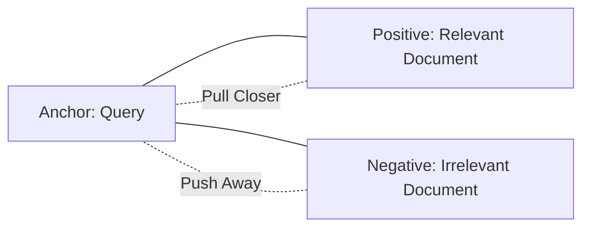

# Converting Evaluations into Training Data for Fine-Tuning

!!! abstract "Chapter Overview"
This chapter explores how to transform evaluation data into valuable training assets:

    - Converting evaluation examples into few-shot prompts
    - Understanding the limitations of generic embeddings
    - Creating datasets for fine-tuning retrieval models
    - Learning how contrastive learning improves embeddings
    - Testing approaches systematically
    - Building a roadmap for continuous improvement

## Introduction

In the previous chapter, we established our evaluation framework and generated synthetic data to benchmark our RAG system. Now we take the crucial next step in our improvement journey: transforming these evaluations into practical training assets that can significantly boost performance.

This chapter bridges the gap between evaluation and production improvement, showing how the same datasets serve both purposes. The fundamental philosophy here is simple but powerful: **the data you collect for evaluation should never go to waste**. Every question, every relevance judgment, and every performance insight can—and should—be repurposed to train your system.

!!! quote "Key Philosophy"
"Every evaluation example is a potential training example. The data flywheel transforms what begins as a handful of evaluation examples into few-shot prompts, then into training datasets for fine-tuning embedding models and re-rankers."

As we'll explore, this transformation process follows a natural progression. What begins as a handful of evaluation examples can evolve into few-shot prompts, then into training datasets for fine-tuning embedding models and re-rankers. This is the essence of the RAG improvement flywheel—data collected for one purpose fuels improvements across your entire system.

## Why Generic Embeddings Fall Short

Before we dive into the transformation process, we need to understand a fundamental challenge in RAG applications: generic embeddings from third-party providers often fall short for specialized applications. This isn't because they're poorly designed—in fact, models like OpenAI's embeddings are remarkably capable. The issue is that they're designed to serve every possible use case, which means they serve no specific use case perfectly.

!!! warning "Limitation of Generic Models"
Generic embedding models inherit assumptions about what "similarity" means—assumptions that may not align with your specific needs. They don't know:

    1. The specific datasets they were trained on
    2. The objective function that defined success during training
    3. The weighting given to different types of similarity
    4. The trade-offs made to accommodate diverse use cases

### The Elusive Nature of "Similarity"

At the heart of embedding models is a deceptively simple concept: they convert text (or other data) into numerical vectors that capture semantic meaning. The assumption is that items with similar meanings will have vectors that are close to each other when measured by cosine similarity or other distance metrics.

!!! example "Domain-Specific Similarity"
In e-commerce, what does it mean for two products to be similar? Are they similar because they're substitutes (different brands of red shirts) or complements (a shirt and matching pants)?

    For music recommendations, are songs similar because they share the same genre, appear in the same playlists, or appeal to the same listeners?

    Perhaps the clearest example comes from dating apps. Should "I love coffee" and "I hate coffee" be considered similar or different? From a linguistic perspective, they're opposites. From a topic perspective, both profiles care enough about beverages to mention them prominently.

But here's the problem: "similarity" is poorly defined when we move beyond general language understanding. The correct answer isn't universal—it depends entirely on your application's objectives.

### The Hidden Assumptions in Provider Models

When you use embedding models from providers like OpenAI, Cohere, or others, you're inheriting a set of assumptions about what "similarity" means—assumptions that may not align with your specific needs.

!!! example "Legal Document Search Failure"
One memorable case involved a legal document search application. The generic embeddings performed reasonably well for finding factual information but struggled with procedural questions. The embeddings didn't adequately capture the relationships between legal procedures and their applications—a specific type of similarity vital to legal professionals but not emphasized in general-purpose training data.

The key insight here isn't that provider embeddings are bad—they're actually remarkable technical achievements. It's that their definition of similarity is generic, while your application needs are specific. And as we'll see, fine-tuning with your own data bridges this gap.

## From Evaluation to Few-Shot Examples

While fine-tuning embedding models can dramatically improve retrieval, we can often make significant improvements using a simpler approach: few-shot examples. Let's explore how to transform evaluation examples into effective few-shot prompts.

### The Power of Examples in Context

Few-shot learning has emerged as one of the most powerful techniques for guiding language model behavior. Rather than fine-tuning the model itself (which requires specialized infrastructure and significant data), few-shot learning simply includes examples within the prompt.

!!! info "How Few-Shot Learning Works"
When you provide a language model with examples of how to respond to similar queries, you activate its ability to recognize patterns and apply them to new inputs. It's like showing a human a few examples of a task before asking them to perform it themselves—no specialized training required, just clear demonstrations.

This approach is particularly powerful for RAG applications because different query types often need different retrieval and response strategies. A few well-chosen examples can help the model recognize the current query type and apply the appropriate strategy.

### Selecting the Right Examples

Not all evaluation examples make good few-shot prompts. I've seen teams simply grab random examples from their evaluation set, only to find the model's performance actually decreased. The problem wasn't the model—it was the examples.

!!! tip "Characteristics of Good Examples"
The best examples for few-shot learning share several characteristics:

    1. They represent common query patterns your users actually use
    2. They demonstrate clear, step-by-step reasoning paths
    3. They cover a diverse range of topics or question types
    4. They avoid being too specific or unusual

Remember the synthetic data generation techniques we explored in Chapter 1? You can use those same methods to generate examples specifically for few-shot learning. The key difference is that for few-shot examples, you need not just questions and answers, but also the reasoning process that connects them.

### Building Your Few-Shot Library

Creating a comprehensive few-shot example library is a strategic investment that pays dividends across your entire RAG application. I recommend organizing your examples into a structured library:

1. Start by filtering your evaluation data for the highest-quality examples
2. Group them by query type or intent (factual questions, how-to guides, comparisons, etc.)
3. Select representative examples from each group
4. Format them consistently for inclusion in prompts
5. Test their effectiveness with your RAG pipeline
6. Iterate and refine based on performance

!!! example "Structured Few-Shot Prompt"
```
You are an assistant specialized in answering questions about [domain].

    Here are some examples of how to answer questions:

    Question: [Example Question 1]
    Thinking: [First, I'll identify the key entities in the question. Then I'll look for information about their relationship...]
    Answer: [Example Answer 1]

    Question: [Example Question 2]
    Thinking: [This appears to be a comparison question. I should look for information about both entities and highlight similarities and differences...]
    Answer: [Example Answer 2]

    Now please answer the following question:
    Question: [Actual User Query]
    ```

This organized approach helps you maintain and evolve your example library as your application grows. You can track which examples work best for different situations, rotate examples to prevent overfitting, and continuously refine based on user interactions.

## Practical Implementation: Building the Data Flywheel for Fine-Tuning

While few-shot learning is powerful, fine-tuning your embedding models can create even more dramatic improvements in retrieval quality. The challenge is getting enough high-quality data to make fine-tuning worthwhile. This is where the concept of the data flywheel becomes crucial.

### Starting the Flywheel

I often tell teams that building a RAG application is like practicing martial arts—there's a "wax on, wax off" aspect to it. You start with a small set of examples that serve as your evaluation benchmarks. As you collect more data, those examples become few-shot prompts. And as your dataset grows further, it becomes training data for fine-tuning.

!!! info "Data Collection Milestones" - With 20 examples, you can build basic evaluation benchmarks - With 30 examples, you can create effective few-shot prompts - With 1000+ examples, you can fine-tune your retrieval models

The beauty of this approach is that you're continuously repurposing the same data for increasingly sophisticated improvements. Each stage builds on the previous one, creating a virtuous cycle of enhancement.

!!! warning "Start Collecting Now"
You need to start collecting the right data now, even if you're not ready to fine-tune yet. The sooner you start logging relevant user interactions, the sooner you'll reach the critical mass needed for fine-tuning.

### What Data Should You Log?

For RAG applications, the most valuable data points to collect include:

1. The actual queries users make
2. Which retrieved chunks were cited in the final responses
3. Which responses received positive feedback (and which didn't)
4. Which queries required refinement or follow-up

These signals help you understand which documents are truly relevant to which queries—the fundamental relationship you're trying to capture in fine-tuned embeddings.

!!! example "Domain-Specific Relevance Signals"
For other applications, the relevance signals will differ:

    - In e-commerce: track which items are purchased together, viewed in sequence, or added to the same lists
    - For music recommendations: log which songs appear in the same playlists or are hearted by the same users
    - For dating apps: record which profiles match and go on to have meaningful conversations

The key is defining what "relevance" means in your specific context and systematically collecting data that captures this relationship.

!!! warning "Missed Opportunity Story"
I worked with one team that built a beautiful RAG application for internal documents but failed to implement any feedback collection mechanisms. Six months later, when they wanted to fine-tune their embeddings, they had to start from scratch with synthetic data because they had no record of which retrieved documents had actually been helpful to users. Don't make this mistake—plan your data collection from day one.

## Understanding Contrastive Learning for Embeddings

To understand how fine-tuning works for embedding models, we need to explore contrastive learning—the technique that powers most modern embedding fine-tuning approaches.

### Learning Through Contrasts

Contrastive learning is based on a simple but powerful idea: learning what things are similar by understanding what things are different. Rather than trying to predict absolute values, contrastive learning focuses on relative relationships.

!!! info "Triplet Structure"
The most common implementation uses a structure called a triplet, which consists of:

    1. An **anchor** (usually the query)
    2. A **positive example** (a document that's relevant to the query)
    3. A **negative example** (a document that's not relevant to the query)

The goal of training is straightforward: adjust the embedding model so that the distance between the anchor and positive example decreases, while the distance between the anchor and negative example increases. In other words, pull similar things closer together and push dissimilar things further apart.



This approach is particularly effective for embedding models because it directly optimizes for the distance relationships we care about in retrieval tasks.

### Creating Effective Triplets for RAG

For RAG applications, there are several natural ways to create triplet datasets:

- **Anchor**: The user's query
- **Positive**: Document chunks that were cited in the final response or received positive feedback
- **Negative**: Document chunks that were retrieved but not cited, or received negative feedback

!!! example "Healthcare RAG Triplet"
Imagine a healthcare RAG application where a user asks:

    ```
    What are the side effects of medication X?
    ```

    Our retrieval system might return several documents, including:

    ```
    Document A: "Medication X may cause drowsiness, nausea, and in rare cases, allergic reactions."

    Document B: "Medication X is used to treat high blood pressure and should be taken with food."
    ```

    If Document A is cited in the response while Document B isn't, we can create a triplet:

    ```json
    {
      "anchor": "What are the side effects of medication X?",
      "positive": "Medication X may cause drowsiness, nausea, and in rare cases, allergic reactions.",
      "negative": "Medication X is used to treat high blood pressure and should be taken with food."
    }
    ```

Through many such examples, the model learns that queries about side effects should be closer to texts describing adverse reactions than to texts describing indications or administration instructions.

### The Challenge of Hard Negatives and How UX Can Help

The triplet example above introduces an important subtlety in contrastive learning. Notice that our negative example, "Medication X is used to treat high blood pressure," is still about the same medication—it's just not about side effects. This makes it what we call a "hard negative"—it's similar to what we're looking for in some ways (same medication) but different in crucial aspects (not about side effects).

!!! info "Value of Hard Negatives"
Hard negatives are much more valuable for training than "easy negatives." If instead our negative example had been about car maintenance—completely unrelated to medications—the model wouldn't learn much from this contrast because it's already obvious that car maintenance isn't relevant to medication side effects.

    The truly challenging distinction—and the one that will improve our retrieval quality the most—is teaching the model to distinguish between different aspects of related topics.

This is where hard negative mining becomes crucial. Hard negative mining is the process of finding negative examples that are challenging but instructive for the model.

!!! tip "Designing UX for Better Training Data"
If you're serious about improving your embeddings, consider explicitly designing your UX to capture these signals:

    1. **Document-level feedback mechanisms**: Add simple thumbs up/down options next to each retrieved document, not just for the final answer

    2. **Click tracking**: Record which documents users click on and which they ignore—those ignored despite ranking highly are excellent hard negative candidates

    3. **Dwell time analysis**: If a user quickly returns from a document without spending time reading it, that's a strong signal it wasn't relevant

    4. **Explicit comparison interfaces**: For critical applications, consider interfaces that ask users to compare documents and select the most relevant one

    5. **Query reformulation tracking**: When a user modifies their query slightly and gets better results, you can pair the original query with documents from the improved results to create training pairs

One particularly effective approach I've seen involved a "more like this" button next to helpful documents. This not only improved the immediate user experience but also created clear signals about which documents were semantically related in the users' mental models—relationships that might not be obvious from text content alone.

## The Power of Re-Rankers in RAG Systems

While embedding models are the workhorses of retrieval, re-rankers provide an additional layer of refinement that can significantly improve results. Where embedding models (also called bi-encoders) encode queries and documents separately, re-rankers (cross-encoders) process them together to make more nuanced relevance judgments.

### Bi-Encoders vs. Cross-Encoders: Understanding the Trade-offs

The fundamental trade-off between embedding models and re-rankers is between speed and accuracy:

!!! info "Model Comparison"
**Bi-encoders (embedding models)**: - Encode query and document independently - Allow pre-computation of document embeddings - Enable fast vector similarity operations - Work well for first-pass retrieval of candidates - Examples include OpenAI's text-embedding models, SBERT, MPNet

    **Cross-encoders (re-rankers)**:
    - Process query and document together as a pair
    - Cannot pre-compute relevance scores
    - Provide more accurate relevance judgments
    - Work best for re-ranking a smaller set of candidates
    - Examples include Cohere Rerank, monoT5

This complementary relationship makes them perfect partners in a two-stage retrieval process: use embeddings to quickly find candidate documents, then use a re-ranker to sort them more accurately.

!!! example "Re-Ranker Success Story"
One team I worked with was debating whether to invest in fine-tuning their embeddings or implementing a re-ranker. When they tested both approaches, they found that fine-tuning embeddings improved recall from 65% to 78%, while adding a re-ranker (even without fine-tuning) improved it to 82%. Combining both approaches pushed performance to 91%—a transformative improvement from where they started.

### Creating Training Data for Re-Rankers

Re-rankers benefit from more nuanced training data than binary relevant/not-relevant labels. While you can start with the same data you use for embedding fine-tuning, consider enriching it with graded relevance scores:

1. Create pairs of (query, document) with relevance scores on a scale (often 0-5)
2. Include a range of scores to help the model learn gradations of relevance
3. Train the model to predict these more nuanced relevance scores

!!! example "Graded Relevance Example"
`json
    {
      "query": "How do I reset my password?",
      "documents": [
        {"text": "Step-by-step password reset guide", "score": 5},
        {"text": "General account management information", "score": 3},
        {"text": "Creating a strong password", "score": 2},
        {"text": "About our company", "score": 0}
      ]
    }
    `

This richer data helps the re-ranker understand not just what's relevant versus irrelevant, but also what's highly relevant versus somewhat relevant—a distinction that can significantly improve user experience.

## Testing Different Approaches Systematically

With your evaluation framework from Chapter 1 and your growing dataset of examples, you can now test various improvement approaches systematically. This experimental mindset is critical to making steady progress.

!!! tip "Good Experimentation Practices"
Good experimentation requires discipline and structure. For each test:

    1. Form a clear hypothesis: "Implementing a re-ranker will improve recall@10 by at least 15%"
    2. Define success criteria before running the experiment
    3. Isolate a single variable whenever possible
    4. Measure impact on your established metrics
    5. Document both successful and unsuccessful experiments

Common experiments worth running include:

1. **Embedding model comparisons**: Test different models (OpenAI, Cohere, open-source alternatives)
2. **Chunking strategy variations**: Try different chunk sizes and overlap percentages
3. **Retrieval method comparisons**: Compare lexical, semantic, and hybrid approaches
4. **Re-ranking impact assessment**: Measure the effect of adding a re-ranker
5. **Few-shot prompt variations**: Test different examples and formats

!!! example "Debate Resolved Through Data"
One team I worked with spent weeks debating which embedding model to use, with different team members advocating for their preferred option. Instead of continuing the debate, they implemented a simple experiment: they indexed their documents with three different embedding models and measured recall on their evaluation set. The results settled the debate in hours, not weeks, and the team moved forward with data-backed confidence.

This cyclical process creates a data-driven improvement flywheel that continuously enhances your system's performance.

## Building a Roadmap for Continuous Improvement

Based on your experimental results, you can now build a roadmap for ongoing improvements. This isn't just about technical enhancements—it's about creating a systematic process for evolution.

!!! tip "Prioritization Framework"
When deciding what to improve next, consider multiple factors:

    1. **Impact**: Which changes will most dramatically improve key metrics?
    2. **Effort**: How much work is required to implement each change?
    3. **Dependencies**: Which improvements depend on others being completed first?
    4. **Risk**: What is the chance of negative side effects or regressions?

I've found that impact/effort prioritization works particularly well for RAG improvements. Plot potential enhancements on a simple 2x2 grid with impact on one axis and effort on the other, then focus on high-impact, low-effort improvements first. These "quick wins" build momentum and demonstrate value while you prepare for more complex enhancements.

!!! example "Prioritization in Action"
In one project, we identified that implementing BM25 hybrid retrieval would be high-impact and medium-effort, while fine-tuning custom embeddings would be high-impact but high-effort. We prioritized the hybrid retrieval first, which gave us immediate gains while we collected data for the eventual embedding fine-tuning.

## Additional Resources

!!! info "Tools and Libraries"

    ### Understanding Embedding Models

    1. **Sentence Transformers Library** ([https://www.sbert.net/](https://www.sbert.net/)): This library provides easy-to-use implementations for state-of-the-art embedding models, supporting both pairwise datasets and triplets for fine-tuning.

    2. **Modern BERT** ([https://huggingface.co/sentence-transformers](https://huggingface.co/sentence-transformers)): These newer models offer 8,000 token sequence lengths and generally outperform classic BERT-based models.

    3. **Cohere Re-ranking Models** ([https://cohere.com/rerank](https://cohere.com/rerank)): Cohere offers state-of-the-art re-ranking capabilities with a fine-tuning API that makes it relatively easy to customize for your specific needs.

!!! info "Key Concepts"

    #### Contrastive Learning In-Depth

    Contrastive learning trains models to recognize similarities and differences between items by pushing and pulling examples in the embedding space:

    - **Triplet Loss**: Optimizes the distance between anchor-positive pairs relative to anchor-negative pairs
    - **InfoNCE Loss**: Contrasts a positive pair against multiple negative examples
    - **Multiple Negatives Ranking Loss**: Handles batches of queries with multiple negatives per query

    #### Scaling and Efficiency Considerations

    For large datasets or production workloads:

    - Consider parallel processing frameworks (like Modal) to accelerate embedding and training
    - Experiment with multi-GPU training for faster iterations
    - Evaluate the trade-offs between API costs and self-hosting
    - Test multiple model variations simultaneously to find optimal configurations

## Reflection Questions

!!! question "Self-Assessment" 1. What specific definition of "similarity" is most important for your application's domain?

    2. How would you create effective few-shot examples from your existing evaluation data?

    3. What user interactions in your application could provide valuable training signals for fine-tuning?

    4. If you had to prioritize one retrieval improvement for your system, would it be embeddings, re-ranking, or something else? Why?

    5. What experiments could you run to test your hypotheses about improving retrieval quality?

## Conclusion and Next Steps

In this chapter, we've explored how to transform evaluation data into valuable training assets:

1. Converting evaluation examples into few-shot prompts
2. Understanding the limitations of generic embeddings
3. Creating datasets for fine-tuning retrieval models
4. Learning how contrastive learning improves embeddings
5. Testing approaches systematically
6. Building a roadmap for continuous improvement

The key insight to take away is that data collection and repurposing form the foundation of systematic RAG improvement. Every question, every piece of feedback, and every evaluation can fuel your improvement flywheel if properly captured and utilized.

!!! tip "What's Coming Next"
In [Chapter 3](chapter3-1.md), we'll dive into deployment strategies, user feedback collection methods, and how to use this feedback to further refine your RAG application. We'll explore practical techniques for gathering implicit and explicit feedback, designing effective user interfaces, and closing the loop between user interactions and system improvements.

## Summary

The data flywheel approach transforms what begins as evaluation into training assets that continuously improve your RAG system. By understanding the limitations of generic models, implementing few-shot examples, and preparing for fine-tuning, you create a foundation for ongoing enhancement. This systematic approach ensures that every piece of data you collect contributes to a cycle of improvement that makes your application increasingly effective for your specific use case.
