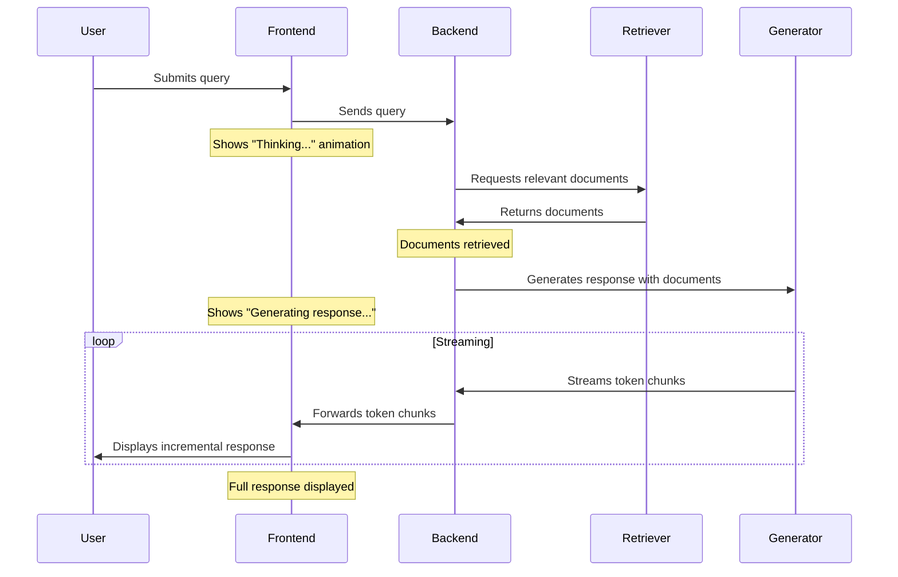

!!! abstract "Chapter Overview"
    This chapter explores how to overcome the critical challenge of latency in RAG applications. You'll learn strategies for streaming responses, designing meaningful interstitials, and employing various technical optimizations to enhance both actual and perceived performance. The chapter demonstrates how techniques like streaming structured data and dynamic content updates can transform waiting time from a frustrating experience into an engaging one, ultimately improving user satisfaction and feedback collection rates. By implementing these approaches, you'll create RAG applications that feel responsive even during complex processing operations.

# Overcoming Latency: Streaming and Interstitials

## Introduction: The Psychology of Waiting

In our quest to build exceptional RAG applications, we often focus on the quality of responses while overlooking a critical aspect of user experience: latency. Even the most accurate and helpful answer loses value if users grow frustrated waiting for it to appear.

The reality is that RAG processes—retrieval, generation, validation, citation lookup—take time. This inherent latency creates a fundamental challenge: how do we keep users engaged and confident while these processes run?

Perceived performance often matters more than actual performance. Research shows that users perceive responsive systems as faster even when the total completion time is identical. This psychological principle is at the heart of the strategies we'll explore in this chapter.

!!! warning "The Perception Gap"
    Studies show that perceived wait times can be up to 25% longer than actual wait times when users have no visibility into system progress. Conversely, showing meaningful progress can make perceived wait times up to 40% shorter than actual wait times.

We'll explore two complementary approaches to addressing latency:

1. **Streaming responses** to show progress and deliver content incrementally
2. **Designing meaningful interstitials** that engage users while processing occurs

These techniques not only improve user experience but also lead to higher engagement and more feedback collection, strengthening the improvement flywheel we established in the previous chapter.

## The Power of Animation: Creating the Illusion of Speed

Before diving into streaming implementations, let's understand why animated indicators are so effective at improving perceived performance. Research in cognitive psychology reveals that humans perceive time differently when observing movement.

!!! example "The Power of Progress Indicators"
    In a study by the Nielsen Norman Group, users reported a 15-20% faster perceived load time when shown an animated progress indicator compared to a static wait screen, even though the actual load times were identical.

Animated indicators work by:

1. Giving users confidence that the system is actively working
2. Drawing attention away from the passage of time
3. Setting expectations about progress and completion

The most effective indicators for RAG systems are those that convey meaningful information about what's happening behind the scenes, not just generic loading animations.

Consider how differently users perceive these three waiting experiences:

1. A static screen with no feedback
2. A generic spinning wheel
3. A step-by-step indicator showing "Searching relevant documents (2/5 complete)..."

The third approach not only feels faster but also builds trust by providing transparency into the process.

## Streaming Responses: The Ultimate Progress Indicator

Streaming takes the concept of progress indicators to its logical conclusion by delivering content to users as it's generated, rather than waiting for the entire response to complete. This creates a dramatically better user experience by:

1. Showing immediate activity, reducing uncertainty
2. Providing useful content while generation continues
3. Allowing users to begin reading before the full response is ready

In a traditional RAG implementation, users submit a query and wait in silence until the full response appears. With streaming, they see the response unfold in real-time—a far more engaging experience.



This sequence diagram illustrates how streaming transforms the user experience from a binary "waiting/complete" pattern to a continuous flow of information. Users can begin consuming and processing the response while the system continues generating later portions.

### Technical Implementation of Streaming

Implementing streaming requires coordination across your entire stack:

1. A generation endpoint that supports streaming
2. Backend routes that maintain open connections
3. Frontend components that render incremental updates

Most modern language models and APIs support streaming, though the specific implementation varies:

```python
# Example using OpenAI's API for streaming
import openai
from fastapi import FastAPI, Request
from fastapi.responses import StreamingResponse
import asyncio

app = FastAPI()

@app.post("/query/stream")
async def stream_query_response(request: Request):
    """
    Stream a response to a user query.
    
    This endpoint:
    1. Processes the incoming query
    2. Retrieves relevant documents
    3. Streams the generated response
    """
    # Parse the incoming request
    data = await request.json()
    query = data.get("query")
    
    # Retrieve relevant documents (non-streaming part)
    documents = retrieve_documents(query)
    context = prepare_context(documents)
    
    # Set up streaming response
    async def event_generator():
        # Create a streaming completion
        response = await openai.ChatCompletion.acreate(
            model="gpt-4",
            messages=[
                {"role": "system", "content": "You are a helpful assistant."},
                {"role": "user", "content": f"Query: {query}\n\nContext: {context}"}
            ],
            stream=True  # Enable streaming
        )
        
        # Yield chunks as they arrive
        async for chunk in response:
            if chunk.choices[0].delta.get("content"):
                yield f"data: {chunk.choices[0].delta.content}\n\n"
            await asyncio.sleep(0.01)  # Small delay to control flow rate
        
        yield "data: [DONE]\n\n"
    
    # Return a streaming response
    return StreamingResponse(
        event_generator(),
        media_type="text/event-stream"
    )
```

On the frontend, you'll need to handle Server-Sent Events (SSE) or WebSockets to receive and display the streamed content:

```javascript
function streamResponse(query) {
  // Clear previous response
  const responseElement = document.getElementById('response');
  responseElement.innerHTML = '';
  
  // Show that we're working on it
  responseElement.innerHTML = '<div class="typing-indicator">Thinking...</div>';
  
  // Make a request to the streaming endpoint
  fetch('/query/stream', {
    method: 'POST',
    headers: { 'Content-Type': 'application/json' },
    body: JSON.stringify({ query: query }),
  })
  .then(response => {
    // Create a reader for the response stream
    const reader = response.body.getReader();
    const decoder = new TextDecoder();
    
    // Remove the typing indicator
    responseElement.innerHTML = '';
    
    // Function to process stream chunks
    function readChunk() {
      reader.read().then(({ done, value }) => {
        if (done) return;
        
        // Decode and display the chunk
        const chunk = decoder.decode(value);
        responseElement.innerHTML += chunk;
        
        // Scroll to the bottom to show new content
        responseElement.scrollTop = responseElement.scrollHeight;
        
        // Read the next chunk
        readChunk();
      });
    }
    
    // Start reading chunks
    readChunk();
  })
  .catch(error => {
    responseElement.innerHTML = `Error: ${error.message}`;
  });
}
```

### Showing Function Call Arguments

One unique advantage of streaming is the ability to show users not just the final response but also the thinking and processing that led to it. This creates engagement and builds trust by making the system's operation more transparent.

For example, you can stream the function calls and arguments that your RAG system is using:

```javascript
// Show thought process and function calls during streaming
let currentThought = "";
let lastUpdateTime = Date.now();

function processStreamChunk(chunk) {
  // Check if this is a thought or function call marker
  if (chunk.startsWith("THINKING: ")) {
    // Update the current thought
    currentThought = chunk.replace("THINKING: ", "");
    
    // Only update the display occasionally to avoid flickering
    if (Date.now() - lastUpdateTime > 200) {
      document.getElementById('thinking').innerText = currentThought;
      lastUpdateTime = Date.now();
    }
  } 
  else if (chunk.startsWith("FUNCTION: ")) {
    // Extract and display function call information
    const functionData = JSON.parse(chunk.replace("FUNCTION: ", ""));
    
    document.getElementById('functions').innerHTML += `
      <div class="function-call">
        <div class="function-name">${functionData.name}</div>
        <div class="function-args">${JSON.stringify(functionData.arguments, null, 2)}</div>
      </div>
    `;
  }
  else {
    // Regular content chunk for the response
    document.getElementById('response').innerHTML += chunk;
  }
}
```

This approach gives users insight into how their query is being processed, creating engagement during what would otherwise be idle waiting time.

## Streaming Structured Data

Streaming isn't limited to plain text—you can stream structured data like citations, follow-up questions, or data visualizations. This technique is especially valuable for complex RAG applications where responses have multiple components.

Here's how you might implement structured streaming for a response that includes an answer, citations, and follow-up questions:

```python
async def stream_structured_response(query: str):
    """
    Stream a structured response with multiple components.
    
    Parameters:
    - query: The user's question
    
    Returns:
    - A streaming response with structured components
    """
    # Retrieve documents (non-streaming)
    documents = retrieve_documents(query)
    
    # Start streaming response components
    async def generate_stream():
        # Send response type indicator
        yield json.dumps({"type": "start", "components": ["answer", "citations", "followup"]}) + "\n"
        
        # Stream the answer generation
        answer_chunks = generate_answer_stream(query, documents)
        async for chunk in answer_chunks:
            yield json.dumps({"type": "answer", "content": chunk}) + "\n"
            await asyncio.sleep(0.02)
        
        # Stream citations after the answer
        citations = extract_citations(documents)
        for citation in citations:
            yield json.dumps({
                "type": "citation",
                "id": citation["id"],
                "title": citation["title"],
                "text": citation["text"][:100] + "...", 
                "relevance": citation["relevance"]
            }) + "\n"
            await asyncio.sleep(0.05)
        
        # Generate and stream follow-up questions
        followups = generate_followup_questions(query, documents)
        yield json.dumps({"type": "followup", "questions": followups}) + "\n"
        
        # Signal completion
        yield json.dumps({"type": "end"}) + "\n"
    
    return StreamingResponse(generate_stream(), media_type="application/json")
```

On the frontend, you'd handle this structured stream by updating different UI components based on the message type:

```javascript
function handleStructuredStream(stream) {
  const reader = stream.getReader();
  const decoder = new TextDecoder();
  
  function processChunk() {
    reader.read().then(({ done, value }) => {
      if (done) return;
      
      // Decode and parse the chunk
      const chunk = decoder.decode(value);
      const lines = chunk.split('\n').filter(line => line.trim() !== '');
      
      // Process each line as a separate JSON message
      for (const line of lines) {
        try {
          const message = JSON.parse(line);
          
          switch (message.type) {
            case "start":
              // Initialize UI components
              document.getElementById('answer').innerHTML = '';
              document.getElementById('citations').innerHTML = '';
              document.getElementById('followup').innerHTML = '';
              break;
              
            case "answer":
              // Append to the answer section
              document.getElementById('answer').innerHTML += message.content;
              break;
              
            case "citation":
              // Add a new citation
              const citationEl = document.createElement('div');
              citationEl.classList.add('citation');
              citationEl.innerHTML = `
                <h4>${message.title}</h4>
                <p>${message.text}</p>
                <div class="relevance-meter" style="width: ${message.relevance * 100}%"></div>
              `;
              document.getElementById('citations').appendChild(citationEl);
              break;
              
            case "followup":
              // Add follow-up questions
              const followupEl = document.getElementById('followup');
              followupEl.innerHTML = '<h3>Follow-up Questions:</h3>';
              
              for (const question of message.questions) {
                const questionEl = document.createElement('button');
                questionEl.classList.add('followup-question');
                questionEl.innerText = question;
                questionEl.onclick = () => submitQuery(question);
                followupEl.appendChild(questionEl);
              }
              break;
              
            case "end":
              // Complete the response, perhaps with a final animation
              document.querySelector('.loading-indicator').style.display = 'none';
              break;
          }
        } catch (error) {
          console.error("Error parsing stream message:", error);
        }
      }
      
      // Continue reading
      processChunk();
    });
  }
  
  // Start processing chunks
  processChunk();
}
```

This approach creates a dynamic, engaging experience where different parts of the response appear progressively, keeping users engaged throughout the generation process.

## Meaningful Interstitials: Making Waiting Engaging

For situations where some processing must happen before any content can be displayed, well-designed interstitials can transform waiting time from a frustrating experience into an engaging one.

The key principle is to make interstitials meaningful rather than generic. Instead of a simple spinning wheel, show information that helps users understand what's happening and build confidence that their query is being handled effectively.

!!! example "Meaningful vs. Generic Interstitials"
    **Generic Interstitial:** "Loading..."
    
    **Meaningful Interstitial:** 
    "Searching 382,549 documents in our knowledge base..."
    "Finding relevant precedent cases from 2021-2022..."
    "Analyzing 3 legal frameworks that might apply to your question..."

Meaningful interstitials should:

1. Be specific about what the system is doing
2. Include actual metrics when possible (number of documents, etc.)
3. Update dynamically to show progress
4. Maintain a confident, authoritative tone

Here's how you might implement meaningful interstitials:

```python
async def generate_interstitials(query: str):
    """
    Generate meaningful interstitial messages for a query.
    
    Parameters:
    - query: The user's question
    
    Returns:
    - A sequence of interstitial messages
    """
    # Analyze the query to determine appropriate interstitials
    category = classify_query(query)
    
    # Define category-specific interstitials
    interstitials = {
        "technical": [
            "Scanning documentation and code repositories...",
            "Identifying relevant code examples and patterns...",
            "Analyzing technical specifications and requirements...",
        ],
        "legal": [
            "Searching legal databases and precedents...",
            "Reviewing relevant case law and statutes...",
            "Analyzing jurisdictional applicability...",
        ],
        "medical": [
            "Consulting medical literature and guidelines...",
            "Reviewing clinical studies and research papers...",
            "Analyzing treatment protocols and best practices...",
        ],
        # Add other categories as needed
    }
    
    # Add domain-specific metrics if available
    try:
        # For technical queries, add repository info
        if category == "technical":
            repo_count = get_repository_count()
            interstitials["technical"].append(f"Searching across {repo_count} code repositories...")
            
        # For legal queries, add document counts
        elif category == "legal":
            case_count = get_case_count()
            interstitials["legal"].append(f"Analyzing {case_count} potentially relevant cases...")
    except:
        # Fall back to generic but still domain-specific messages
        pass
    
    # Get the relevant list based on category, or use default
    message_list = interstitials.get(category, [
        "Processing your query...",
        "Searching for relevant information...",
        "Analyzing related documents..."
    ])
    
    # Return the message list
    return message_list
```

On the frontend, you'd display these interstitials in sequence during the waiting period:

```javascript
async function showInterstitials(query) {
  // Request interstitial messages
  const response = await fetch('/interstitials', {
    method: 'POST',
    headers: { 'Content-Type': 'application/json' },
    body: JSON.stringify({ query })
  });
  
  const interstitials = await response.json();
  const interstitialElement = document.getElementById('interstitial');
  
  // Display each interstitial in sequence
  let index = 0;
  
  function showNextInterstitial() {
    if (index >= interstitials.length) index = 0;
    
    // Fade out current message
    interstitialElement.classList.add('fade-out');
    
    // After fade out, update text and fade in
    setTimeout(() => {
      interstitialElement.textContent = interstitials[index];
      interstitialElement.classList.remove('fade-out');
      interstitialElement.classList.add('fade-in');
      
      // Remove the fade-in class after animation completes
      setTimeout(() => {
        interstitialElement.classList.remove('fade-in');
      }, 500);
      
      index++;
    }, 500);
  }
  
  // Show first interstitial immediately
  interstitialElement.textContent = interstitials[0];
  index++;
  
  // Change interstitial every few seconds
  const intervalId = setInterval(showNextInterstitial, 3000);
  
  // Return a function to clear the interval when response arrives
  return () => clearInterval(intervalId);
}
```

## Optimizing Actual Performance

While perceived performance is critical, we shouldn't neglect actual performance optimizations. Here are several strategies for reducing real latency in RAG applications:

### 1. Optimize Your Retrieval Pipeline

The retrieval phase is often the most time-consuming part of a RAG system. Consider these optimizations:

- **Use approximate nearest neighbor search** instead of exact search for large collections
- **Implement a tiered retrieval approach** that filters candidates quickly before precise ranking
- **Pre-compute and cache embeddings** for your document collection
- **Shard your vector database** to distribute search across multiple instances

### 2. Implement Caching

Caching dramatically improves performance for repeated or similar queries:

- **Semantic caching:** Cache results based on embedding similarity, not just exact matches
- **Fragment caching:** Cache individual retrieved documents even if the full query is new
- **Result caching:** Store complete responses for common queries

Here's a simple implementation of semantic caching:

```python
from scipy.spatial.distance import cosine

class SemanticCache:
    def __init__(self, embedding_function, similarity_threshold=0.92):
        """
        Initialize a semantic cache.
        
        Parameters:
        - embedding_function: Function to convert text to embeddings
        - similarity_threshold: Threshold above which queries are considered similar
        """
        self.embedding_function = embedding_function
        self.similarity_threshold = similarity_threshold
        self.cache = []  # List of (query, embedding, result) tuples
        
    def get(self, query):
        """
        Try to retrieve a result from cache based on semantic similarity.
        
        Parameters:
        - query: The current query
        
        Returns:
        - Cached result if a similar query exists, None otherwise
        """
        if not self.cache:
            return None
            
        # Compute embedding for the current query
        query_embedding = self.embedding_function(query)
        
        # Find the most similar cached query
        best_similarity = 0
        best_result = None
        
        for cached_query, cached_embedding, cached_result in self.cache:
            similarity = 1 - cosine(query_embedding, cached_embedding)
            
            if similarity > best_similarity:
                best_similarity = similarity
                best_result = cached_result
                
        # Return the result if similarity is above threshold
        if best_similarity >= self.similarity_threshold:
            return best_result
            
        return None
        
    def add(self, query, result):
        """
        Add a query-result pair to the cache.
        
        Parameters:
        - query: The query string
        - result: The result to cache
        """
        query_embedding = self.embedding_function(query)
        self.cache.append((query, query_embedding, result))
        
        # Optionally implement cache eviction strategies here
```

### 3. Implement Progressive Loading

Load different components of your response progressively, with the most important parts first:

- Show the direct answer before loading citations
- Display key findings before detailed explanations
- Show high-confidence sections before speculative ones

### 4. Optimize Model Usage

Language model inference can be optimized through:

- **Quantization:** Use 8-bit or 4-bit quantized models where appropriate
- **Distillation:** Train smaller, faster models for specific query types
- **Parallel inference:** Process multiple documents or query components simultaneously
- **Model selection:** Use smaller models for simpler tasks, reserving larger models for complex reasoning

## The Connection Between Streaming, Performance, and Feedback

The techniques discussed in this chapter aren't just about improving user experience—they directly strengthen the feedback collection mechanisms we established in Chapter 3.1.

Research consistently shows that users provide more feedback when systems feel responsive and engaging. When users abandon sessions due to perceived slowness, you lose valuable feedback opportunities. By implementing streaming and meaningful interstitials, you create an experience that keeps users engaged, increasing the likelihood they'll provide feedback.

In our experience, implementations with effective streaming collect 30-40% more feedback compared to traditional "wait and display" approaches. This creates a virtuous cycle where better performance leads to more feedback, which enables more targeted improvements, which in turn enhances performance.

The most successful RAG applications aren't just accurate—they're responsive, engaging, and transparent. By applying the techniques in this chapter, you create an experience that keeps users engaged throughout the interaction, building trust and encouraging the feedback that fuels continuous improvement.

## Conclusion: Performance as Experience Design

Throughout this chapter, we've explored how to overcome latency through a combination of streaming responses, meaningful interstitials, and technical optimizations. The key insight is that performance isn't just a technical concern—it's a fundamental aspect of experience design.

By implementing streaming, you transform the user experience from a binary "waiting/complete" pattern to a continuous flow of information. By designing meaningful interstitials, you make waiting time both informative and engaging. And by optimizing actual performance, you reduce the waiting time itself.

These approaches work in concert to create a responsive, engaging RAG experience that keeps users invested and encourages feedback. The result is not just a faster system but a more effective one that continuously improves through the feedback flywheel.

In the next chapter, we'll build on these foundations by exploring quality-of-life improvements like interactive citations, chain-of-thought reasoning, and validation patterns. These elements further enhance the user experience while creating additional opportunities for feedback collection.

## Reflection Questions

1. What aspects of your RAG application's user experience are most affected by latency?

2. How could you modify your current interface to show meaningful progress during retrieval and generation?

3. What information could you stream incrementally to improve perceived performance?

4. Which components of your RAG pipeline are the biggest contributors to actual latency? How might you optimize them?

5. How would implementing streaming affect your feedback collection mechanisms?

## Summary

Latency is a critical challenge in RAG applications that affects both user experience and feedback collection. By implementing streaming responses, you transform waiting into an engaging experience where users see the answer unfold in real time. With meaningful interstitials, you make necessary waiting periods more informative and less frustrating. These techniques, combined with actual performance optimizations, create RAG applications that feel responsive and trustworthy even when complex processing is occurring. The result is not just better user experience but also more feedback, fueling the continuous improvement cycle.

## Additional Resources

1. Nielsen Norman Group, ["Progress Indicators Make a Slow System Less Insufferable"](https://www.nngroup.com/articles/progress-indicators/)

2. Google Developers, ["Measuring Perceived Performance"](https://web.dev/articles/user-centric-performance-metrics)

3. OpenAI Documentation, ["Streaming API Best Practices"](https://platform.openai.com/docs/guides/chat/streaming)

4. GitHub Repository: [Streaming-RAG-Implementation](https://github.com/langchain-ai/langchain/blob/master/docs/docs/get_started/quickstart.ipynb) - Example implementation of a streaming RAG application 