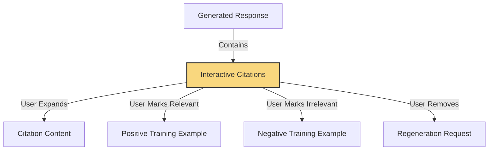
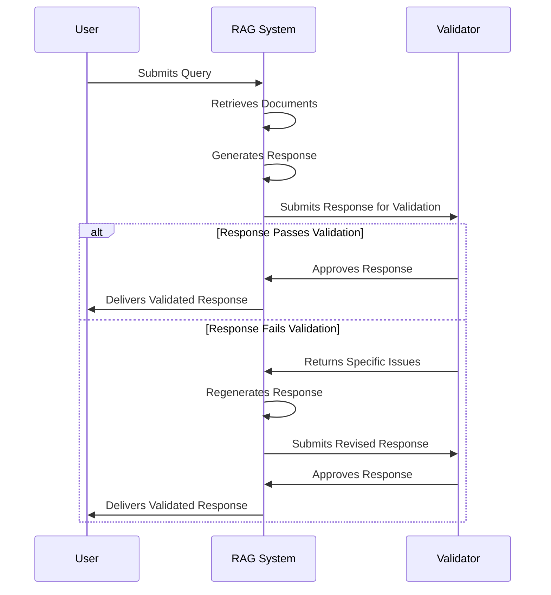

# 3.3 Quality of Life Improvements: Citations, Chain of Thought, and Validation

!!! abstract "Chapter Overview"

    This chapter explores essential quality-of-life improvements that transform RAG systems from functional to exceptional. You'll learn how to implement interactive citations that build trust while collecting valuable feedback, techniques for making reasoning transparent through chain-of-thought approaches, and validation methods that catch errors before they reach users. These enhancements not only improve immediate user experience but also strengthen your feedback flywheel by creating additional opportunities for collecting insights. By implementing these techniques, you'll create a RAG system that users genuinely enjoy using—one that explains its reasoning, justifies its answers, and demonstrates reliability through self-correction.

## Introduction: From Functional to Exceptional

In the previous two chapters, we established critical foundations for successful RAG applications: robust feedback collection mechanisms in Chapter 3.1 and techniques to overcome latency in Chapter 3.2. Now we're ready to elevate our system from merely functional to truly exceptional by addressing the subtle but powerful elements that transform user experience.

Think of a RAG system as similar to a home. The feedback mechanisms are like the foundation—essential but invisible to most visitors. The streaming capabilities are like the utilities—noticed primarily when they're not working well. What we'll cover in this chapter are the finishing touches that visitors actually see and interact with directly: the paint, the furniture, the artwork—the elements that transform a house into a home.

These "quality of life" improvements may seem like optional enhancements, but they often make the difference between systems that are occasionally useful and those that become indispensable tools that users rely on daily. They build trust through transparency, improve reasoning through explicit thinking processes, and prevent errors before they reach users.

!!! quote "Industry Insight"
    "These quality of life improvements represent massively missed opportunities for many RAG teams. Implementing chain of thought in ways that matter to your business has been one of the highest-impact changes we've seen, consistently producing a 10% bump in performance. That might not sound dramatic, but it's often the difference between something that's usable and something that's impossible to deploy in production."

In this chapter, we'll explore three categories of improvements:

1. **Citations**: How to transform static references into interactive elements that build trust while providing valuable feedback signals
2. **Chain of Thought**: Techniques to make reasoning transparent, improving both accuracy and user confidence
3. **Validation**: Methods to catch errors before they reach users, creating more reliable experiences

Each of these approaches not only enhances immediate user experience but also strengthens the feedback flywheel we've been building throughout these chapters. By implementing these techniques, you'll create a RAG system that users not only tolerate but genuinely enjoy using—a system that explains its reasoning, justifies its answers, and catches its own mistakes.

!!! example "Real-world Impact"
    One healthcare company implementing the techniques in this chapter saw their user satisfaction scores increase by 34% in just six weeks. More importantly, their user trust metrics—measuring how much users believed and acted on the system's recommendations—increased by 62%. This wasn't just about making users happy; it fundamentally changed how their system influenced real-world decisions.

## Beyond the Basics: Elevating User Experience

When I first started working with RAG systems, I viewed success primarily through the lens of retrieval accuracy and response relevance. If a system could find the right information and generate a coherent answer, I considered it a job well done. But as I gained experience deploying these systems to real users, I realized that truly exceptional RAG applications go beyond these basic capabilities to deliver experiences that build trust, showcase reasoning, and prevent errors before they happen.

In this chapter, we'll explore what I've come to think of as "quality of life improvements"—techniques that transform a technically sound RAG system into a delightful user experience. These approaches don't necessarily improve retrieval or generation in a fundamental way, but they dramatically enhance how users perceive and interact with your system. And as we'll see, many of these techniques create valuable opportunities for additional feedback collection, strengthening the flywheel we established in Chapter 3.1.

After implementing the feedback collection mechanisms from Chapter 3.1 and the streaming techniques from Chapter 3.2, you've already built a solid foundation. Now we'll add the finishing touches that create a truly exceptional experience.

## Citations: Building Trust Through Transparency

### The Dual Purpose of Citations

When I first started working with RAG systems, I viewed citations as primarily a trust-building mechanism—a way to show users that the system's responses were grounded in actual documents rather than fabricated. While this is certainly valuable, I've come to realize that citations serve an equally important purpose: they're golden opportunities for feedback collection.

Think about it this way. When a user sees a citation in a response, they're naturally curious about the source. By making citations interactive and engaging, you create touchpoints for feedback that feel natural and contextual. This isn't just about slapping a thumbs-up button on your interface; it's about integrating feedback collection into the core user experience.

The most effective approach turns citations from static references into interactive elements that users can engage with:

1. Quote different parts of responses and visually link them to specific citations
2. Allow users to expand citations to review the full context
3. Enable users to provide feedback on individual citations
4. Let users remove irrelevant citations and request regeneration



I worked with a legal research team that implemented this approach for their in-house attorneys. Each generated response included interactive citations linked to specific case law or statutes. Attorneys could click on citations to see the full context, and importantly, they could mark citations as relevant or irrelevant to their query. When they marked a citation as irrelevant, the system would regenerate the response without using that source.

This interaction served two purposes: it immediately improved the user experience by removing unhelpful information, and it generated invaluable training data for our retrieval system. Each marked citation became labeled data that helped us fine-tune our embedding models. Within three months, we had collected over 50,000 labeled examples—a dataset that would have been prohibitively expensive to create manually.

!!! tip "Citations as UI Elements"
Design your citations not just as references but as interactive UI elements. When users can explore, evaluate, and modify citations, they become active participants in improving your system rather than passive consumers of information.

### Crafting Citation-Rich Responses

Creating effective citations begins with how you prompt your language model. Instead of treating citations as an afterthought, build them into your response generation process from the ground up.

Here's a prompt template that encourages detailed, well-structured citations:

```python
def create_citation_prompt(query: str, documents: list):
    """
    Create a prompt that encourages detailed citation usage.

    Parameters:
    - query: The user's question
    - documents: Retrieved documents for context

    Returns:
    - A structured prompt that will generate well-cited responses
    """
    # Format document context with identifiers
    formatted_docs = []
    for i, doc in enumerate(documents):
        formatted_docs.append(f"DOCUMENT [{i+1}]: {doc.title}\n{doc.content}")

    context = "\n\n".join(formatted_docs)

    prompt = f"""
    Answer the following question based ONLY on the provided documents.
    For each piece of information in your answer, include a citation to the specific document it came from using the format [X] where X is the document number.

    If the documents don't contain enough information to fully answer the question, say so clearly and cite which documents you used for the partial answer.

    At the end of your answer, include a "Sources" section that lists all the documents you cited.

    QUESTION: {query}

    DOCUMENTS:
    {context}

    ANSWER (with citations):
    """

    return prompt
```

On the frontend, you can transform these citations into interactive elements:

```javascript
function renderCitedResponse(response) {
  // Parse the response to extract citations
  const citationRegex = /\[(\d+)\]/g;
  const citedResponse = response.answer.replace(
    citationRegex,
    (match, docNum) => {
      // Create an interactive citation element
      return `<span class="citation" 
                   data-doc-id="${docNum}" 
                   onclick="expandCitation(${docNum})">
                ${match}
              </span>`;
    },
  );

  // Render the response
  document.getElementById("response").innerHTML = citedResponse;

  // Render the sources section
  const sourcesElement = document.getElementById("sources");
  response.sources.forEach((source, index) => {
    const sourceElement = document.createElement("div");
    sourceElement.className = "source";
    sourceElement.innerHTML = `
      <div class="source-header">
        <span class="source-number">[${index + 1}]</span>
        <span class="source-title">${source.title}</span>
        <div class="feedback-buttons">
          <button onclick="markRelevant(${index})">✓ Relevant</button>
          <button onclick="markIrrelevant(${index})">✗ Irrelevant</button>
        </div>
      </div>
      <div class="source-content" id="source-content-${index}" style="display: none;">
        ${source.content}
      </div>
    `;
    sourcesElement.appendChild(sourceElement);
  });
}
```

This creates an interactive experience where citations are visually distinct, clickable elements. When users engage with these elements, you can collect valuable feedback while enhancing their understanding of the response.

## Chain of Thought: Making Thinking Visible

### The Underutilized Superpower

One of the most underutilized yet powerful techniques for improving RAG responses is chain of thought prompting—asking the model to reason step by step before providing its final answer. This approach typically provides a 10% performance improvement for classification and reasoning tasks, which might sound modest until you realize it's often the difference between a system that's occasionally helpful and one that's consistently reliable.

!!! quote "Expert Insight"
    "Chain of thought is a massively missed opportunity for many RAG teams. With the advent of models like Claude 3 Opus and GPT-4o, we know this approach is a game-changer for performance. Even without these advanced models, implementing chain of thought in ways that matter to your business has consistently been one of the highest-impact improvements we've seen."

I've found chain of thought particularly valuable for complex retrieval tasks where multiple documents need to be synthesized or where subtle judgments about relevance are required. By making the reasoning explicit, you can identify where things might be going wrong and provide more targeted guidance.

!!! note "Performance Impact"
    In our testing across multiple domains, chain of thought prompting consistently improved answer accuracy by 8-15%, with the biggest gains coming in complex reasoning scenarios like multi-hop questions and comparative analyses. This improvement can be the difference between a system that's deployable in production versus one that fails to meet quality thresholds.

When implementing chain of thought, structure it clearly to separate the thinking process from the final response. XML tags work well for this purpose, creating distinct sections that can be processed differently by your application.

Chain of thought also serves another purpose: it can become an engaging loading interstitial. By streaming the reasoning process, you transform waiting time into a transparent window into how the system is working through the problem, building both engagement and trust.

```python
def chain_of_thought_prompt(query: str, documents: list):
    """
    Create a prompt that encourages step-by-step reasoning.

    Parameters:
    - query: The user's question
    - documents: Retrieved documents for context

    Returns:
    - A prompt that will generate reasoning steps and a final answer
    """
    context = "\n\n".join([f"DOCUMENT: {doc.content}" for doc in documents])

    prompt = f"""
    You will answer the user's question based on the provided documents.
    First, think step by step about how to answer the question using the documents.
    Then provide your final answer.

    Structure your response like this:
    <thinking>
    Your step-by-step reasoning process here...
    </thinking>

    <answer>
    Your final answer here, with citations to specific documents...
    </answer>

    USER QUESTION: {query}

    DOCUMENTS:
    {context}
    """

    return prompt
```

Taking this a step further, you can stream the thinking process as a separate UI component or interstitial. This serves two purposes: it makes the waiting time more engaging by showing users that complex reasoning is happening, and it allows users to intervene if they notice the reasoning going astray.

```javascript
let thinkingComplete = false;
let currentSection = null;
let thinking = "";
let answer = "";

function processStreamedToken(token) {
  // Check for section tags
  if (token.includes("<thinking>")) {
    currentSection = "thinking";
    return;
  } else if (token.includes("</thinking>")) {
    thinkingComplete = true;
    currentSection = null;
    // Render the complete thinking section
    document.getElementById("thinking-container").style.display = "block";
    document.getElementById("thinking").innerHTML = thinking;
    return;
  } else if (token.includes("<answer>")) {
    currentSection = "answer";
    return;
  } else if (token.includes("</answer>")) {
    currentSection = null;
    return;
  }

  // Process tokens based on current section
  if (currentSection === "thinking") {
    thinking += token;
    // If thinking isn't complete yet, show it streaming
    if (!thinkingComplete) {
      document.getElementById("thinking-container").style.display = "block";
      document.getElementById("thinking").innerHTML = thinking;
    }
  } else if (currentSection === "answer") {
    answer += token;
    document.getElementById("answer").innerHTML = answer;
  }
}
```

I worked with a financial advisory firm that implemented this approach for their investment recommendation system. As the model reasoned through market conditions, client preferences, and portfolio considerations, this thinking was streamed to the advisor in a separate panel. If the advisor noticed a misunderstanding or faulty assumption in the reasoning, they could pause generation and refine their query before a final recommendation was produced.

This interactive approach not only improved recommendation quality but also created a valuable feedback loop where advisors could correct misunderstandings early in the process. Each correction became training data that helped the system learn and improve over time.

On the frontend, you can implement this with an expandable "See reasoning" section that users can toggle to view the model's step-by-step analysis. This transparency builds trust by demystifying the AI process and gives users insight into how conclusions were reached.

The beauty of chain of thought isn't just that it improves immediate response quality—it also creates a more explainable, trustworthy system that users feel comfortable relying on. In domains where decisions matter and consequences are real, this transparency can be the difference between a system that's used occasionally and one that becomes an indispensable tool.

## Monologues: Solving the Context Management Problem

### Reasoning in Limited Windows

As context windows grow larger, one might think that managing complex information would become easier. Counterintuitively, though, larger context windows often create new challenges for language models, which can struggle to attend to the most relevant information among thousands of tokens.

Monologuing—having the model explicitly reiterate key information before generating a response—has emerged as a powerful technique to enhance reasoning and quality, especially with large contexts and complex documents.

!!! example "Key Insight"
    When dealing with very long contexts, language models often struggle with recall and fully processing all instructions. By having the model monologue - explicitly reiterate key information before answering - we reorganize the context in a way that allows the model to effectively "re-read" the prompt, improving reasoning dramatically without complex architectural changes.

The process is wonderfully simple: ask the model to "think out loud" about what information is relevant before generating the final answer. This serves several purposes:

1. It helps the model re-read and reinforce important context
2. It allows the model to organize scattered information into a coherent structure
3. It creates natural separation between reasoning and response
4. It produces valuable data for future fine-tuning
5. It can replace more complex multi-stage agents for many use cases
6. It can improve consistency by ensuring the model considers all relevant factors

Monologues have proven particularly effective at replacing complex agent architectures for many use cases. Rather than building intricate multi-stage processes, you can often achieve similar results with a single thoughtfully constructed monologue prompt, saving both development time and computational resources.

Here's an example prompt for implementing monologues:

```python
def monologue_prompt(query: str, documents: list, pricing_data: str):
    """
    Create a prompt that encourages monologuing for improved comprehension.

    Parameters:
    - query: The user's question about pricing options
    - documents: Relevant call transcripts or customer information
    - pricing_data: Pricing documentation and guidelines

    Returns:
    - A prompt that will generate a structured monologue before answering
    """
    context = "\n\n".join([f"TRANSCRIPT: {doc.content}" for doc in documents])

    prompt = f"""
    You'll help generate a pricing quote based on the call transcript and pricing documentation.

    First, reiterate the key variables that determine pricing options according to the documentation.
    Then, identify specific parts of the transcript that relate to these variables.
    Next, determine which pricing options from the documentation are most relevant.
    Finally, provide a recommended pricing quote with justification.

    QUESTION: {query}

    TRANSCRIPT:
    {context}

    PRICING DOCUMENTATION:
    {pricing_data}

    MONOLOGUE AND ANSWER:
    """

    return prompt
```

I want to share a specific case study that demonstrates the power of monologues. We were working with a SaaS company that needed to generate pricing quotes based on sales call transcripts and a complex pricing document. The initial approach—simply providing the transcript and pricing document as context—resulted in quotes that were often inconsistent or missed key information from the transcript.

!!! example "Monologue Implementation"
    Rather than building a complex multi-stage agent, we found it was much more effective to simply cache-prompt the pricing data and inject a single call transcript with specific monologue instructions.

We implemented a monologue-based approach that instructed the model to:

1. First reiterate the variables that determine pricing options
2. Then identify relevant parts of the transcript that mention these variables
3. Next determine which pricing tiers and options apply
4. Finally generate the actual quote with justification

The results were remarkable—quote accuracy improved from 62% to 94%, and sales representatives reported much greater confidence in the system's recommendations. The monologue approach helped the model connect scattered information from the transcript with the precise rules in the pricing document, creating much more coherent reasoning.

!!! success "Business Impact"
    After implementing this approach, 90% of the follow-up emails were accepted by sales reps without any edits. This generated a wealth of training data that we used to fine-tune a smaller, more efficient model. Eventually, the fine-tuned model achieved similar accuracy without needing the explicit monologue step, demonstrating how monologues can be used as a stepping stone to more efficient solutions.

!!! example "Monologue in Action"
**Query:** What pricing should we offer based on this call transcript?

    **Monologue:**
    Let me identify the key pricing variables from our documentation:
    1. Number of users (determines tier)
    2. Required features (basic, professional, enterprise)
    3. Length of contract commitment (monthly vs. annual)
    4. Add-on options (API access, premium support)

    From the transcript, I can see:
    - The customer mentioned needing "around 50 user seats" (line 127)
    - They specifically asked about the "workflow automation feature" (line 213)
    - They stated "we're looking for an annual commitment" (line 289)
    - They expressed interest in "API access for integration" (line 342)

    According to our pricing documentation:
    - 50 users falls into the Medium Business tier ($30/user/month)
    - Workflow automation is part of the Professional plan
    - Annual commitment provides a 20% discount
    - API access is a $500/month add-on

    **Answer:**
    Based on the call transcript, I recommend offering the Professional plan with API access add-on:
    - 50 users × $30/user/month = $1,500/month
    - API access add-on: $500/month
    - Subtotal: $2,000/month
    - Annual commitment (20% discount): $19,200/year

    This aligns with their needs for workflow automation and API access while providing the annual discount they're expecting.

This example shows how monologues can dramatically improve comprehension and reasoning, especially for complex tasks with multiple documents. The approach doesn't require any special architecture—just thoughtful prompting that encourages the model to organize information before generating a response.

Monologues can also improve tonality and quality by separating reasoning from response generation. Have the model first reason about what to say, then say it in the desired tone. This creates datasets for future fine-tuning without reasoning steps, allowing you to eventually distill the reasoning process into more efficient models.

## Validation Patterns: The Safety Net Approach

### Catching Errors Before They Reach Users

In the early days of RAG systems, there was a tendency to treat the language model's response as the final word—whatever it generated went straight to the user, for better or worse. As these systems have evolved and stakes have increased, we've learned the value of adding validation layers that catch issues before they reach users.

!!! quote "Industry Perspective"
    "As language models get more sophisticated, we're finding that a single well-designed prompt combined with simple validation often outperforms complex multi-stage agent behaviors. I recommend implementing validation patterns before building elaborate agent architectures - they're simpler to deploy, easier to debug, and frequently just as effective."

Think of validation patterns as safety nets for your RAG system. Just as a circus performer feels more confident with a net below, your system can be more ambitious knowing that validation checks will catch potential errors.

Before implementing complex agent systems or multi-step pipelines, consider adding simple validation patterns to your RAG application. For latency-insensitive applications—where an extra second or two of processing won't harm the user experience—validators can significantly increase trust and satisfaction by ensuring responses meet quality standards.

!!! tip "When to Use Validators"
    Validators are particularly valuable in:
    
    1. High-stakes domains where errors could have significant consequences
    2. Applications where users make important decisions based on system output
    3. Scenarios where specific constraints must be enforced (like valid URLs or specific data formats)
    4. Cases where you need to increase user trust in system outputs
    
    The slight latency increase is often well worth the improved reliability and user confidence.



Validators act as a quality control layer that checks responses before they reach the user. The process is straightforward:

1. Generate your reasoning, citations, and response as usual
2. Pass the results to a secondary system (LLM or simple programmatic tests)
3. Evaluate whether the response meets quality criteria
4. If issues are found, provide specific feedback and regenerate

I worked with a healthcare information provider that implemented a simple factual consistency validator for their patient-facing RAG system. After generating a response about treatment options, the validator would check whether all mentioned treatments were actually present in the retrieved documents and whether any contraindications or warnings had been omitted. If discrepancies were found, the response would be regenerated with specific instructions to correct the issues.

This approach reduced factual errors by over 80% with minimal impact on latency—a trade-off well worth making given the sensitive nature of healthcare information. The validator wasn't complex or expensive to implement, but it dramatically improved reliability and trustworthiness.

### A Practical Example: URL Validation

Let me share a concrete example that illustrates the power of simple validators. I worked with a marketing team building a system to generate personalized follow-up emails that included links to case studies and marketing materials. The language model was excellent at crafting personalized messages, but we encountered a persistent problem: about 4% of generated emails contained URLs that either didn't exist or linked to internal resources that weren't publicly accessible.

Rather than scrapping the approach or implementing a complex agent system, we added a straightforward validator that ran after response generation:

```python
def validate_urls_in_email(email_body: str, allowed_domains: list):
    """
    Validate that all URLs in an email are valid and from allowed domains.

    Parameters:
    - email_body: The generated email content
    - allowed_domains: List of allowed domains for links

    Returns:
    - (is_valid, issues): Tuple of validation result and list of issues
    """
    # Extract all URLs using regex
    url_regex = r'https?://(?:[-\w.]|(?:%[\da-fA-F]{2}))+'
    urls = re.findall(url_regex, email_body)

    issues = []

    # Check each URL
    for url in urls:
        # Check if the domain is allowed
        domain = urlparse(url).netloc
        if domain not in allowed_domains:
            issues.append(f"URL {url} contains disallowed domain {domain}")
            continue

        # Check if the URL exists (returns 200)
        try:
            response = requests.head(url, timeout=3)
            if response.status_code != 200:
                issues.append(f"URL {url} returned status code {response.status_code}")
        except Exception as e:
            issues.append(f"URL {url} failed to connect: {str(e)}")

    return len(issues) == 0, issues

def regenerate_email_if_needed(query: str, initial_email: str, allowed_domains: list):
    """
    Validate and potentially regenerate an email if URLs are problematic.
    """
    is_valid, issues = validate_urls_in_email(initial_email, allowed_domains)

    if is_valid:
        return initial_email

    # If validation failed, regenerate with specific guidance
    issues_text = "\n".join(issues)
    regeneration_prompt = f"""
    The previously generated email contained the following URL issues:
    {issues_text}

    Please regenerate the email, either:
    1. Removing any problematic URLs entirely, or
    2. Replacing them with valid URLs from these domains: {', '.join(allowed_domains)}

    Original request: {query}
    """

    regenerated_email = generate_email(regeneration_prompt)
    return regenerated_email
```

The results were remarkable. After implementing this validator, the error rate dropped from 4% to 0% after just one retry. 

!!! success "Beyond Validation: Fine-tuning from Corrections"
    Even more interestingly, we took the validation process a step further. After collecting sufficient examples of corrections, we fine-tuned our model (distilling GPT-4 into a smaller model) using this dataset of corrected responses. The result was astonishing - the base error rate before validation dropped to nearly zero. The model had effectively learned from its corrections, internalizing the patterns of valid URLs and avoiding problematic ones altogether.
    
    This entire validation and fine-tuning process took just three days to implement and resulted in a much faster application since we no longer needed the retry loop. The model now produces valid URLs in a single pass.

This example illustrates a broader principle: validation doesn't just catch errors—it creates valuable training data that can improve your system over time. Each correction becomes a learning opportunity, gradually reducing the need for the validator itself.

!!! warning "Persistent Challenges"
    It's worth noting that even in early 2025, even the most advanced models can still produce hallucinated URLs when given the opportunity. Simple validators remain valuable safeguards even as models continue to improve.

## Strategic Rejection of Work

### When "I Don't Know" is the Right Answer

One of the most overlooked strategies for improving RAG application reliability is knowing when to reject work. Rather than delaying deployment until all edge cases are solved, implement strategic rejection for scenarios where your system isn't yet strong enough. This allows you to deploy sooner while collecting data to improve problematic segments.

!!! quote "Industry Insight"
    "One of the things you'll realize as you analyze your RAG system's performance is that oftentimes you can make your application much more reliable just by rejecting certain types of work. This is a massively underutilized strategy - many teams try to handle every query thrown at them rather than focusing on what they can reliably deliver."

The approach is simple but powerful:

1. Identify segments where performance is consistently poor
2. Create rejection messages that set appropriate expectations
3. Provide feedback forms to gather information about rejected queries
4. Give users the option to proceed with caution if they wish

This pattern works particularly well for specialized domains where some questions might require expertise your system hasn't yet developed. By acknowledging limitations transparently, you build trust while focusing on the areas where you can deliver value reliably.

!!! example "Rejection in Practice"
    One enterprise RAG application we built for legal research would explicitly reject certain types of complex regulatory analysis questions with a message like:
    
    "I notice you're asking about cross-jurisdictional implications of regulation X. Currently, I'm not confident in my ability to analyze multi-jurisdictional regulatory conflicts accurately. Would you like me to instead focus on the requirements within your primary jurisdiction, or connect you with a regulatory specialist?"
    
    This approach was far better received than attempting answers that might contain subtle but critical errors.

```python
def should_reject_query(query: str, confidence_threshold: float = 0.85):
    """
    Determine if a query should be politely rejected.

    Parameters:
    - query: The user's question
    - confidence_threshold: Minimum confidence to accept the query

    Returns:
    - (should_reject, reason): Whether to reject and why
    """
    # Analyze the query
    query_category = classify_query(query)
    query_complexity = assess_complexity(query)
    expected_confidence = predict_confidence(query, query_category, query_complexity)

    # Check against thresholds
    if expected_confidence < confidence_threshold:
        reason = f"This appears to be a {query_category} question with {query_complexity} complexity. " \
                 f"Based on similar questions, our confidence is {expected_confidence:.2f}, " \
                 f"which is below our threshold of {confidence_threshold:.2f}."
        return True, reason

    return False, None

def handle_query_with_rejection(query: str):
    """
    Process a query with potential rejection if the system isn't confident.
    """
    should_reject, reason = should_reject_query(query)

    if should_reject:
        return {
            "type": "rejection",
            "message": f"I'm not confident I can answer this question accurately. {reason}",
            "allow_override": True,
            "feedback_requested": True
        }
    else:
        # Process normally
        documents = retrieve_documents(query)
        response = generate_response(query, documents)
        return {
            "type": "answer",
            "message": response
        }
```

Design your rejection system with precision-recall tradeoffs in mind - avoid rejecting questions you can actually answer well. The rejection should always be polite, explain the limitation, and where possible, suggest alternative approaches or questions the system can handle.

## Showcasing Capabilities

### Guide Users to What You Do Well

While RAG systems can theoretically answer a wide range of questions, most excel at particular types of queries. Explicitly highlighting what your system does well guides user behavior toward successful interactions.

!!! quote "UX Design Insight"
    "Not all prompting should be for the language model - we should also prompt the user. People are generally lazy and often don't know exactly what they want. By giving them examples early on, you make their lives easier while showcasing capabilities they might not have known were possible."

Implement these strategies to showcase your system's strengths:

- Show suggested query types that leverage your strengths
- Create UI elements that highlight special capabilities 
- Provide examples of successful interactions
- Use white space to create different blocks showcasing specialized capabilities

Perplexity provides an excellent example of this approach. Their interface showcases different capabilities (web search, academic papers, math equations) with specific UI elements, guiding users toward interactions that will be successful.

!!! example "Capability Demonstration"
    When Perplexity added their "Social" search capability, many users didn't even know this was possible. By prominently featuring this option in the interface, they not only educated users about a new capability but also increased engagement with a feature they wanted to promote.

By highlighting certain capabilities, you not only improve user satisfaction by focusing on strengths, but you also set appropriate expectations about what the system doesn't handle well. This creates a more predictable experience where users know what to expect.

This approach also complements the strategic rejection strategy - when users are guided toward your strengths, they're less likely to attempt queries that would trigger rejection responses.

## Putting It All Together: The Complete Experience

When implemented together, these quality of life improvements create a comprehensive, trustworthy experience that elevates your RAG application above typical implementations:

1. **Streaming** creates an engaging, responsive experience that keeps users engaged
2. **Citations** build trust and provide opportunities for feedback collection
3. **Chain of thought** makes reasoning transparent and improves accuracy
4. **Monologues** enhance comprehension of complex information
5. **Validation** catches errors before they reach users
6. **Strategic rejection** sets appropriate expectations
7. **Capability showcasing** guides users to successful interactions

Each element reinforces the others, creating a system that feels polished, trustworthy, and genuinely helpful. Users don't just get answers—they understand where those answers come from, see the reasoning behind them, and trust that they've been validated for accuracy.

## Preparing for the Next Chapter

With these quality of life improvements in place, your RAG system now provides an exceptional user experience that builds trust, encourages engagement, and generates valuable feedback. In the next chapter, we'll explore how to make sense of all the data you're collecting through topic modeling and clustering techniques. These approaches will help you identify patterns in user queries and system performance, revealing the highest-impact opportunities for improvement.

## Conclusion: The Complete RAG Experience

Throughout this chapter, we've explored techniques that transform a technically sound RAG system into an exceptional user experience. Let's recap the key principles we've covered:

1. **Interactive citations build trust and collect feedback** - By making citations explorable and interactive, you simultaneously build confidence and gather valuable training signals, allowing users to delete irrelevant citations and regenerate better answers.

2. **Chain of thought reasoning improves accuracy and transparency** - Making thinking visible not only leads to better answers (with a consistent 10% performance improvement) but also helps users understand how conclusions were reached, building trust in the system's outputs.

3. **Monologues enhance comprehension of complex information** - Encouraging the model to organize and reiterate key information improves reasoning in complex contexts without requiring elaborate multi-stage agent architectures.

4. **Validation patterns catch errors before they reach users** - Simple validation checks dramatically improve reliability, creating both immediate value and generating training data that can improve base model performance over time.

5. **Strategic rejection sets appropriate expectations** - Being transparent about limitations builds trust while collecting data for future improvements, making your system more reliable by focusing on what it can do well.

6. **Capability showcasing guides users effectively** - Explicitly highlighting your system's strengths improves user satisfaction and engagement while setting appropriate expectations.

!!! quote "Practical Implementation Strategy"
    "When implementing these improvements, I recommend starting with citations and validation patterns, as they provide the most immediate reliability gains. Then add chain of thought for complex reasoning scenarios, followed by strategic rejection for edge cases. These foundational elements will deliver the most value for your development time while setting the stage for more advanced techniques."

These improvements work in concert with the feedback mechanisms from Chapter 3.1 and the streaming techniques from Chapter 3.2 to create a comprehensive, user-centered RAG experience. Each element reinforces the others: citations provide opportunities for feedback, streaming makes the thinking process engaging, and validation ensures that what users see is reliable.

This completes our exploration of deployment and feedback collection. We've now built a robust system that not only delivers accurate information but does so in a way that users find trustworthy, engaging, and helpful. The system collects feedback naturally, feels responsive despite complex processing, and provides transparency into its reasoning and sources.

In Chapter 4, we'll shift our focus to analyzing the wealth of data you're now collecting. Through topic modeling and clustering techniques, you'll learn to identify patterns in user queries and system performance, revealing focused opportunities for improvement. This marks an exciting transition from building a great system to understanding how it's being used in the real world and systematically enhancing its capabilities based on that understanding.

By implementing the techniques from all three parts of Chapter 3, you've built the foundation for a continuous improvement cycle driven by user feedback and data analysis—a system that doesn't just answer questions but gets better with every interaction.
