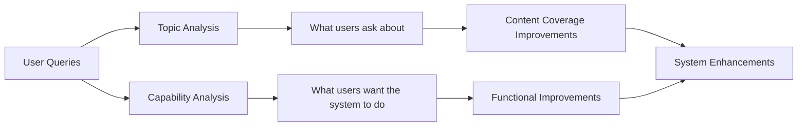

# Prioritization and Roadmapping: From Insights to Action

!!! abstract "Chapter Overview"
This chapter explores how to turn query pattern insights into strategic action plans:

    - Identifying high-value, high-impact opportunities
    - Applying prioritization frameworks to improvement decisions
    - Creating a strategic roadmap for RAG enhancement
    - Analyzing failure modes and root causes
    - Building systems that continuously improve

## Understanding Topics and Capabilities

Before diving into prioritization techniques, let's clarify two key concepts: topics and capabilities.

### Topics vs. Capabilities

!!! info "Key Definitions" - **Topics**: Subject matter domains in your content (e.g., "account management," "pricing," "technical specifications") - **Capabilities**: Functional abilities your system should have (e.g., "summarization," "comparison," "step-by-step instructions")

These concepts provide two complementary lenses for analyzing user needs. When I work with teams to improve their RAG systems, I often find they conflate these two dimensions, leading to unfocused efforts. A topic tells you what users are asking about, while a capability tells you what they want the system to do with that information.

I remember working with a healthcare company whose initial analysis simply categorized queries by medical conditions. While helpful, this one-dimensional view missed critical patterns. When we added capability analysis, we discovered that queries about common conditions like diabetes primarily needed comparison capabilities ("How does medication A compare to B?"), while queries about rare conditions needed comprehensive summarization ("Give me an overview of treatment options for X"). This insight completely changed their improvement priorities.

!!! example "Topics vs. Capabilities Example"
Consider these user queries in a product support RAG:

    - "How do I reset my password?"
      - **Topic**: Account security
      - **Capability**: Step-by-step instructions

    - "Compare the Pro and Basic plans"
      - **Topic**: Pricing/Plans
      - **Capability**: Comparison

    - "Summarize the latest product release notes"
      - **Topic**: Product updates
      - **Capability**: Summarization

Understanding both dimensions lets you prioritize more effectively. For instance, you might discover that comparison capabilities underperform across multiple topics, revealing a systematic weakness rather than a content gap.