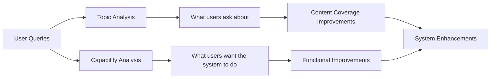
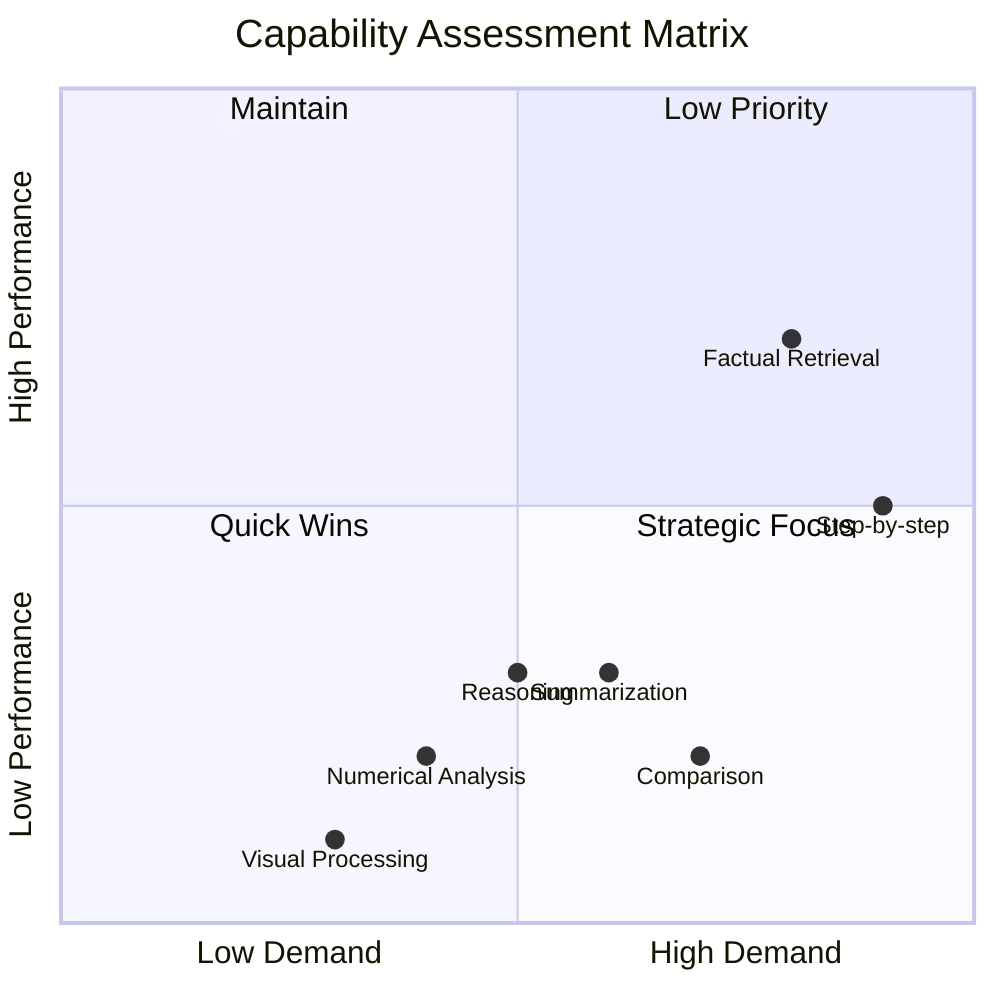
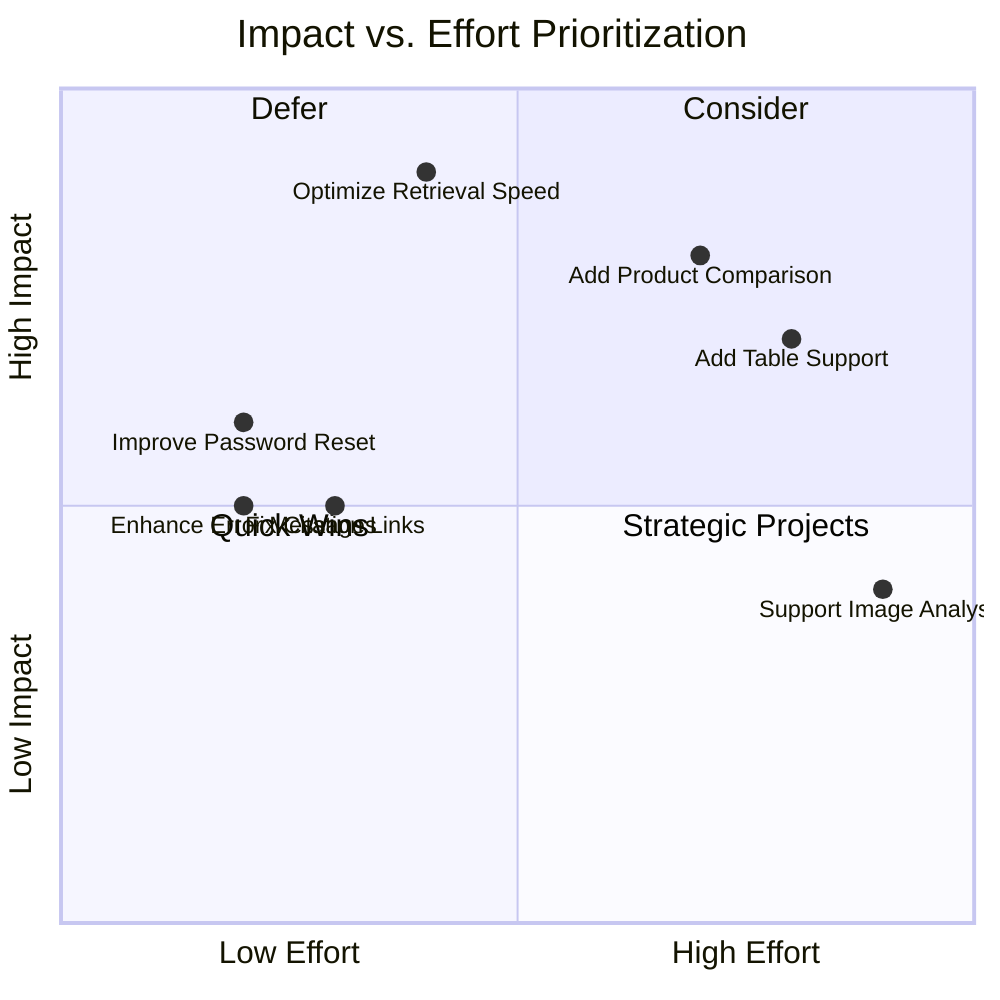
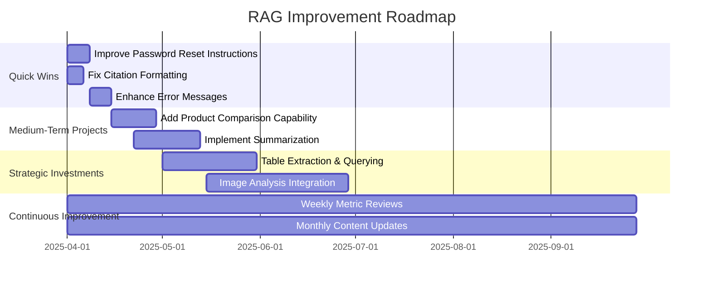

# Topic Modeling and Clustering: Finding Patterns in User Feedback

!!! abstract "Chapter Overview"
This chapter explores how to identify patterns in user queries and feedback to prioritize improvements:

    - Understanding the difference between topics and capabilities
    - Applying topic modeling techniques to user queries
    - Categorizing queries for targeted improvements
    - Identifying high-value, high-impact opportunities
    - Creating a strategic roadmap for RAG enhancement

## Introduction: From Collecting Feedback to Understanding It

In Chapter 3, we built a comprehensive system for deployment and feedback collection: we designed mechanisms to capture valuable user signals in Chapter 3.1, implemented streaming to create engaging experiences in Chapter 3.2, and added quality-of-life improvements to enhance trust and transparency in Chapter 3.3. Now we're faced with a new challenge—one that nearly every team encounters after successful deployment: making sense of all that feedback data.

The first time I deployed a successful RAG system with robust feedback collection, I felt a mix of triumph and panic. Within weeks, we had thousands of queries, ratings, and interaction signals. But when my manager asked, "So what should we improve next?" I realized I had no systematic way to answer that question. We were drowning in data but struggling to extract actionable insights.

This is where topic modeling and clustering become transformative. While it's tempting to dive into individual feedback instances or fixate on particularly negative comments, the real power comes from identifying patterns that reveal systematic opportunities for improvement. By grouping similar queries and analyzing performance patterns, you move from reacting to individual feedback to making strategic decisions about where to invest your limited resources.

!!! quote "Key Philosophy"
"Not all improvements are created equal. The art of systematic RAG development is identifying which capabilities will deliver the most value to your users."

Think of this process as similar to a product manager analyzing customer segments. Just as not all customers have the same needs or value, not all query types deserve the same attention. Some query categories might represent a small percentage of volume but be critical to your most valuable users. Others might be frequent but easily satisfied with simple improvements. The goal is to move beyond "making the AI better" to precisely targeting your efforts where they'll have the maximum impact.

In this chapter, we'll explore practical techniques for segmenting and analyzing user queries, identifying patterns in performance, and creating a strategic roadmap for improvement. By the end, you'll have a data-driven framework for deciding exactly where to focus your efforts and which capabilities to develop next.

## Understanding Topics and Capabilities

Before diving into techniques, let's clarify two key concepts: topics and capabilities.

### Topics vs. Capabilities

!!! info "Key Definitions" - **Topics**: Subject matter domains in your content (e.g., "account management," "pricing," "technical specifications") - **Capabilities**: Functional abilities your system should have (e.g., "summarization," "comparison," "step-by-step instructions")

These concepts provide two complementary lenses for analyzing user needs. When I work with teams to improve their RAG systems, I often find they conflate these two dimensions, leading to unfocused efforts. A topic tells you what users are asking about, while a capability tells you what they want the system to do with that information.



I remember working with a healthcare company whose initial analysis simply categorized queries by medical conditions. While helpful, this one-dimensional view missed critical patterns. When we added capability analysis, we discovered that queries about common conditions like diabetes primarily needed comparison capabilities ("How does medication A compare to B?"), while queries about rare conditions needed comprehensive summarization ("Give me an overview of treatment options for X"). This insight completely changed their improvement priorities.

!!! example "Topics vs. Capabilities Example"
Consider these user queries in a product support RAG:

    - "How do I reset my password?"
      - **Topic**: Account security
      - **Capability**: Step-by-step instructions

    - "Compare the Pro and Basic plans"
      - **Topic**: Pricing/Plans
      - **Capability**: Comparison

    - "Summarize the latest product release notes"
      - **Topic**: Product updates
      - **Capability**: Summarization

Understanding both dimensions lets you prioritize more effectively. For instance, you might discover that comparison capabilities underperform across multiple topics, revealing a systematic weakness rather than a content gap.

## Topic Modeling Techniques

Now let's explore approaches for identifying topics in your user queries.

### Automated Topic Modeling

Several algorithms can help identify topics in your query dataset:

1. **LDA (Latent Dirichlet Allocation)**: Traditional statistical approach
2. **BERTopic**: Leverages transformer models for better semantic understanding
3. **LLM-based clustering**: Uses language models to group and label topics

When I began applying topic modeling to RAG applications in 2022, I used traditional techniques like LDA. While these worked reasonably well for longer documents, they often struggled with the brevity and specificity of user queries. Modern approaches like BERTopic and LLM-based clustering have dramatically improved our ability to identify meaningful patterns in even short, ambiguous queries.

#### Useful Clustering Libraries

!!! tip "Recommended Clustering Tools" - **[BERTopic](https://github.com/MaartenGr/BERTopic)**: A powerful library that combines transformers with traditional clustering - **[Top2Vec](https://github.com/ddangelov/Top2Vec)**: Generates topic vectors without predefined numbers of topics - **[LLMClustering](https://github.com/Thinkall/LLM-Clustering)**: Uses large language models for clustering with zero-shot classification - **[HDBSCAN](https://github.com/scikit-learn-contrib/hdbscan)**: Density-based clustering that works well for identifying natural groupings - **[OpenAI Text Embedding Clustering](https://platform.openai.com/docs/guides/embeddings/use-cases)**: Using OpenAI embeddings with standard clustering algorithms

Each of these approaches has different strengths. BERTopic excels at finding coherent topics in varied document collections, while LLM-based approaches can provide more intuitive topic labels. The key is that these tools are for _analysis_ purposes—they help you understand patterns in your data that would be difficult to detect manually.

!!! tip "Cross-Reference"
Remember the synthetic data approaches from [Chapter 1](chapter1.md)? You can use similar techniques to generate additional examples for each discovered topic to improve your evaluation sets.

#### Example: BERTopic Implementation

!!! example "BERTopic Code Example"

````python
from bertopic import BERTopic
import pandas as pd
from sklearn.feature_extraction.text import CountVectorizer

    # Assuming 'queries' is a list of user query strings
    # Configure BERTopic with more options for better control
    vectorizer = CountVectorizer(ngram_range=(1, 2), stop_words="english", min_df=5)

    topic_model = BERTopic(
        language="english",
        min_topic_size=10,
        vectorizer_model=vectorizer,
        calculate_probabilities=True,
        verbose=True
    )

    # Fit the model and transform documents to topics
    topics, probs = topic_model.fit_transform(queries)

    # View topic information
    topic_info = topic_model.get_topic_info()

    # Extract the top 10 topics
    top_topics = topic_info.head(10)

    # For each top topic, get the representative documents
    for topic_id in top_topics['Topic']:
        if topic_id == -1:  # Skip the outlier topic
            continue
        print(f"Topic {topic_id}: {topic_model.get_topic(topic_id)}")
        topic_docs = [queries[i] for i, t in enumerate(topics) if t == topic_id]
        for doc in topic_docs[:5]:
            print(f"  - {doc}")
        print()

    # Visualize topics
    topic_model.visualize_topics()

    # Save model for later use
    topic_model.save("topic_model")
    ```

In one e-commerce project, this approach revealed that over 20% of user queries fell into a "product comparison" topic that our system handled poorly. We hadn't prioritized comparison capabilities because individual comparison queries seemed infrequent, but topic modeling revealed they formed a substantial segment when viewed collectively.

#### Visualizing BERTopic Results

BERTopic provides excellent visualization capabilities that can help communicate findings to stakeholders:

```python
# Create interactive intertopic distance map
topic_model.visualize_topics()

# Show hierarchical clustering of topics
topic_model.visualize_hierarchy()

# Visualize topic similarity
topic_model.visualize_heatmap()

# Show topic distribution over time (if you have timestamp data)
topics_over_time = topic_model.topics_over_time(queries, timestamps)
topic_model.visualize_topics_over_time(topics_over_time)
````

These visualizations are invaluable for communicating your findings to stakeholders and building consensus around improvement priorities.

### LLM-Based Clustering and Classification

While traditional clustering methods work well, I've found that LLM-based approaches can provide more intuitive and actionable results, especially for domain-specific applications.

!!! example "OpenAI Embeddings + HDBSCAN Clustering"

````python
import numpy as np
import openai
import pandas as pd
from sklearn.metrics.pairwise import cosine_similarity
import hdbscan

    # Get embeddings for queries
    def get_embeddings(queries, model="text-embedding-3-large"):
        embeddings = []

        for query in queries:
            response = openai.Embedding.create(
                model=model,
                input=query
            )
            embedding = response['data'][0]['embedding']
            embeddings.append(embedding)

        return np.array(embeddings)

    # Get embeddings
    query_embeddings = get_embeddings(queries)

    # Cluster the embeddings
    clusterer = hdbscan.HDBSCAN(
        min_cluster_size=5,
        min_samples=3,
        metric='euclidean',
        cluster_selection_method='eom'
    )

    cluster_labels = clusterer.fit_predict(query_embeddings)

    # Add cluster labels to original data
    df = pd.DataFrame({
        'query': queries,
        'cluster': cluster_labels
    })

    # For each cluster, get representative examples
    for cluster_id in sorted(set(cluster_labels)):
        if cluster_id == -1:
            continue  # Skip noise points

        cluster_examples = df[df['cluster'] == cluster_id]['query'].values
        print(f"Cluster {cluster_id}:")
        for example in cluster_examples[:5]:
            print(f"  - {example}")
        print()

    # Use LLM to label each cluster
    def get_cluster_label(examples):
        prompt = f"""Given these example queries that belong to the same topic:
        {examples}

        Provide a short, descriptive label (3-5 words) for this topic that captures what these queries have in common.
        """

        response = openai.ChatCompletion.create(
            model="gpt-4",
            messages=[
                {"role": "system", "content": "You are a helpful assistant that labels query clusters."},
                {"role": "user", "content": prompt}
            ]
        )

        return response.choices[0].message.content.strip()

    # Label each cluster
    for cluster_id in sorted(set(cluster_labels)):
        if cluster_id == -1:
            continue

        examples = df[df['cluster'] == cluster_id]['query'].values[:10]
        examples_text = "\n".join([f"- {ex}" for ex in examples])
        label = get_cluster_label(examples_text)

        print(f"Cluster {cluster_id} → {label}")
    ```

This hybrid approach uses state-of-the-art embeddings with traditional clustering algorithms, then leverages LLMs to provide human-readable labels—combining the best of both worlds.

### From Clustering to Classification

!!! important "Analysis vs. Production"
It's critical to understand that clustering is primarily an **analytical tool**, not a production monitoring solution. The clusters you discover during analysis should inform the development of robust classifiers that can categorize incoming queries in real-time.

In my experience, the journey from analysis to production follows a clear pattern:

1. **Exploratory Phase**: Use clustering to discover patterns and identify key query categories
2. **Taxonomy Development**: Create a standardized set of topics and capabilities
3. **Classifier Development**: Build and train classifiers that can apply this taxonomy to new queries
4. **Production Implementation**: Deploy the classifiers as part of your monitoring pipeline

I once worked with a team that made the mistake of trying to use their clustering solution directly in production. The clusters would shift over time as new data arrived, making it impossible to track consistent metrics or identify clear trends. By switching to a classification approach based on their initial clustering insights, they created a stable monitoring system that could track performance over time.

#### Building Production-Ready Classifiers

Once you've identified your key query categories through clustering, you can build classifiers using several approaches:

1. **LLM-based Classification with Few-Shot Examples**

   Large language models excel at classification tasks when provided with a few examples. This approach leverages the model's pre-trained knowledge and ability to understand context. By providing 2-3 examples per category in your prompt, you can achieve surprisingly accurate classification without any formal training.

   The key advantage of this approach is its flexibility—you can add new categories on the fly without retraining. It's particularly valuable in the early stages of your project when your taxonomy is still evolving. However, it does require API calls for each classification, which can increase latency and costs in high-volume applications.

2. **Embedding-based Classification**

   This approach uses vector embeddings to represent queries and categories in a shared semantic space. By calculating the average embedding for example queries in each category, you create "centroid" vectors that represent each category. New queries are classified by finding the closest category centroid.

   Embedding-based classification is computationally efficient once the category embeddings are created, making it suitable for real-time applications. It works particularly well for capturing semantic similarity and can handle nuanced relationships between concepts. The downside is that it may struggle with categories that are distinguished by specific keywords rather than overall semantic meaning.

3. **BERT-based Classification**

   Fine-tuning a BERT model (or similar transformer architecture) creates a specialized classifier that can achieve high accuracy with sufficient training data. BERT models understand context bidirectionally and can capture subtle linguistic patterns that distinguish different query types.

   The BERT approach shines when you have a stable taxonomy and sufficient examples for each category (typically 50+ per category for good results). Once trained, these models can run efficiently on GPU hardware and handle high query volumes. The main drawback is the initial training requirement and the need to retrain when adding new categories.

In practice, I've found that a hybrid approach works best for most RAG applications:

- Start with LLM-based classification during the exploratory phase when your taxonomy is still evolving
- Transition to embedding-based methods as your categories stabilize and query volume increases
- Eventually implement a fine-tuned BERT classifier once you've collected sufficient training examples

This progression allows you to begin categorizing queries immediately while building toward a more efficient and accurate system over time. The insights gained from early classification efforts directly inform your training data collection for more sophisticated models.

#### Setting Up Production Monitoring

With your classifiers in place, you can now implement a production monitoring system that tracks performance by query category:

```python
def log_query_metrics(query, response, user_feedback=None):
    """
    Log metrics for a user query, categorizing it and tracking performance.

    Parameters:
    - query: The user's query
    - response: The system's response
    - user_feedback: Optional user feedback (thumbs up/down, etc.)
    """
    # Classify the query
    query_category = classify_query(query, category_examples)
    query_capability = identify_capability(query)

    # Calculate metrics (customize based on your evaluation framework)
    retrieval_quality = calculate_retrieval_quality(query, response)
    generation_quality = calculate_generation_quality(response)

    # Log to your monitoring system
    log_entry = {
        "timestamp": datetime.now().isoformat(),
        "query": query,
        "category": query_category,
        "capability": query_capability,
        "retrieval_quality": retrieval_quality,
        "generation_quality": generation_quality,
        "user_feedback": user_feedback
    }

    # Add to your logging/monitoring solution
    monitoring_db.insert_one(log_entry)
````

This structured approach allows you to:

- Track performance trends by category over time
- Identify emerging query types that might need new categories
- Spot performance degradation in specific categories
- Prioritize improvements based on volume and success rates

In one healthcare RAG application, this monitoring approach revealed that while overall satisfaction metrics remained stable, there was significant degradation in queries about medication interactions—an issue that wouldn't have been visible without category-specific monitoring.

### Manual Query Categorization

While automated methods are helpful, manual review offers valuable insights that algorithms might miss. In every RAG project I've worked on, a combination of automated and manual approaches yielded the best results.

1. **User intent labeling**: Classify queries by what users are trying to accomplish
2. **Difficulty assessment**: Rate queries by how challenging they are to answer
3. **Success/failure tagging**: Label queries based on system performance

Manual review is particularly valuable for understanding the "why" behind query patterns. For example, in a legal research application, we initially categorized certain queries as "precedent searches" based on automated clustering. However, manual review revealed that users weren't primarily interested in precedents; they were looking for contradictions between cases to support arguments. This nuance completely changed how we approached retrieval for those queries.

!!! warning "Sample Size Considerations"
You don't need to manually categorize every query. A representative sample of 100-200 queries can provide significant insights while keeping the task manageable.

### Combining Automated and Manual Approaches

The most effective approach combines automation with human judgment:

1. Run automated clustering to identify potential topics
2. Manually review and refine clusters
3. Use human expertise to identify themes automation might miss
4. Create a curated taxonomy of topics and capabilities

This hybrid approach provides the efficiency of automation with the nuanced understanding that comes from human review. I've found that after just a few hours of manual review, domain experts can identify patterns that might have taken weeks to discover purely through automated means.

## Capability Analysis Framework

Beyond topics, understanding the capabilities users need is crucial. This analysis reveals functional gaps in your system that span across multiple topics.

### Common RAG Capabilities

!!! info "Core RAG Capabilities" - **Factual retrieval**: Finding and presenting specific facts - **Summarization**: Condensing information into concise overviews - **Comparison**: Highlighting similarities and differences - **Step-by-step procedures**: Breaking down complex tasks - **Reasoning with context**: Drawing conclusions from multiple pieces of information - **Numerical analysis**: Working with numbers, statistics, and calculations - **Visual information processing**: Handling charts, images, and diagrams

These capabilities often require specialized approaches beyond basic retrieval and generation. For example, effective comparison capabilities might need parallel queries or specialized prompting techniques, while numerical analysis might require formula extraction and calculation capabilities.

!!! tip "Cross-Reference"
These capabilities become the foundation for specialized indices we'll build in [Chapter 5](chapter5.md).

### Analyzing Capability Gaps

Once you've identified the capabilities your users need, the next step is determining where your system succeeds and struggles:

1. Group user queries by required capability
2. Analyze performance metrics across each group
3. Identify capabilities with poor performance
4. Categorize failure modes for each capability

In a financial services RAG application I worked with, this analysis revealed that queries requiring numerical analysis had satisfaction rates 40% lower than other capability types. The system could find relevant documents containing financial data, but struggled to perform calculations or interpret trends from that data. This clear capability gap became a priority for improvement.



This visualization instantly reveals where to focus: comparison capabilities are in high demand but performing poorly, making them an ideal strategic focus area. Step-by-step procedures represent quick-win opportunities, while visual processing might be a lower priority despite its performance issues.

## Prioritization Frameworks

With topics and capabilities identified, how do you prioritize improvements? Too often, teams make these decisions based on which user complained most loudly or which improvement seems easiest to implement. A systematic approach requires balancing multiple factors.

### The Impact/Effort Matrix

The classic impact/effort matrix provides a simple but effective framework for prioritization. I've used this approach with numerous teams to transform vague improvement plans into clear roadmaps with stakeholder buy-in.

!!! example "Impact/Effort Prioritization"
Plot potential improvements on two axes:

    - **Impact**: Frequency × Value to users
    - **Effort**: Development complexity and resources required

    Prioritize high-impact, low-effort improvements first, followed by high-impact, high-effort strategic investments.



When applying this framework to a customer service RAG application, we identified that adding product comparison capabilities would require significant effort but would address a high-impact need. Meanwhile, fixing citation links offered a quick win that could be implemented immediately while the larger strategic project was underway.

### The Value-Driven Approach

Beyond simple impact/effort, a more sophisticated approach considers multiple dimensions of value:

1. **Business value**: Revenue impact or cost savings
2. **Strategic alignment**: Support for key business initiatives
3. **Technical foundation**: Enabling future improvements
4. **User satisfaction**: Impact on overall experience

I once worked with a team that initially deprioritized table extraction capabilities based purely on query frequency. However, when we considered business value, we discovered that table-based queries, while less common, primarily came from procurement teams making high-value purchasing decisions. The business impact of improving this capability far outweighed its relatively low frequency.

!!! tip "Value Calculation"
Value = (Frequency × Importance × Success Gap) / Effort

    Where:
    - Frequency = How often users ask about this topic/capability
    - Importance = How critical it is to their goals (1-5 scale)
    - Success Gap = Current success rate subtracted from 100%
    - Effort = Implementation complexity (1-5 scale)

This formula balances multiple factors to identify the highest-value improvements. It recognizes that the most valuable improvements aren't always the most requested features—they're the ones that address critical needs where your system currently underperforms.

## Creating a Strategic Roadmap

Based on your analysis, the next step is developing a strategic roadmap for improvements. This roadmap should balance quick wins with strategic investments, creating momentum while building toward long-term capabilities.

### Roadmap Components

!!! info "Strategic Roadmap Elements"
A complete RAG improvement roadmap includes:

    - **Short-term wins**: Quick, high-impact improvements
    - **Medium-term projects**: Substantial capability enhancements
    - **Long-term investments**: Fundamental architectural improvements
    - **Continuous improvement**: Ongoing refinement processes
    - **Evaluation milestones**: Points to measure progress

I've found that successful roadmaps maintain a balance of 60% capability-focused improvements and 40% topic-focused improvements. The capability improvements tend to have broader impact across multiple query types, while topic improvements address specific content needs for high-value domains.

!!! tip "Cross-Reference"
This roadmap should align with the specialized indices and multimodal RAG strategies we'll explore in [Chapter 5](chapter5.md).

### Example Strategic Roadmap

Consider this example roadmap based on analysis of a product support RAG:



This roadmap balances immediate improvements with longer-term strategic investments. It begins with quick wins to build momentum and demonstrate value, followed by more substantial capability enhancements, and finally foundational investments in specialized capabilities that will differentiate the system.

## Advanced Analysis Techniques

Beyond basic clustering, several advanced techniques can provide deeper insights into user needs and system performance.

### Embedding Visualization

Use dimensionality reduction to visualize query clusters, revealing relationships that might not be apparent in simple categorization. I've found this approach particularly valuable for identifying edge cases and understanding the boundaries between different query categories.

!!! example "UMAP Visualization Code"

````python
import numpy as np
import umap
import matplotlib.pyplot as plt
import seaborn as sns

    # Assuming 'query_embeddings' is an array of embedding vectors
    # and 'topic_labels' contains the topic for each query

    # Reduce embeddings to 2D for visualization
    reducer = umap.UMAP(random_state=42)
    embedding_2d = reducer.fit_transform(np.array(query_embeddings))

    # Create a scatter plot colored by topic
    plt.figure(figsize=(12, 10))
    sns.scatterplot(
        x=embedding_2d[:, 0],
        y=embedding_2d[:, 1],
        hue=topic_labels,
        palette="tab20",
        alpha=0.7
    )
    plt.title("Query Embeddings by Topic")
    plt.show()
    ```

In a legal research application, this visualization revealed that queries about international law formed distinct clusters based on jurisdictions, which helped us refine our retrieval strategies for cross-jurisdictional questions.

### Failure Mode Analysis

Beyond identifying what fails, understanding why certain queries fail can reveal deeper patterns in your system's limitations:

1. Identify common patterns in failed queries
2. Analyze retrieval performance for each failure case
3. Review generation quality for retrieved contexts
4. Identify whether failures stem from content gaps or capability limitations

In one project, we discovered that a significant portion of failures weren't due to missing content or poor retrieval, but rather the system's inability to reconcile conflicting information from different sources. This insight led us to develop specific prompting techniques for handling contradictory information, dramatically improving satisfaction scores for those query types.

!!! warning "Common Failure Modes" - **Retrieval failures**: System can't find relevant documents - **Context limitations**: Relevant documents exist but don't contain needed information - **Generation problems**: The retrieved context is good, but the generation is poor - **Hallucinations**: The system fabricates information not in the context - **Format issues**: The information is correct but poorly presented

Understanding these failure modes is critical because each requires a different solution approach. Retrieval failures might need better embedding models or query processing, while hallucinations often require improved prompting or validation steps.

## From Analysis to Action: Addressing Inventory vs. Capability Issues

Once you've identified patterns in your user queries and system performance, the next step is determining what type of solution is needed. In my experience, most improvement opportunities fall into two categories: inventory issues and capability issues.

### Inventory Issues: Expanding Your Knowledge Base

Inventory issues occur when your system lacks the content needed to answer certain questions. The solution typically involves expanding your knowledge base or improving ingestion processes.

Signs of inventory issues include:

- Low cosine similarities across retrieved documents
- No results from lexical search
- LLM refusing to answer due to missing information
- Retrieved chunks never being cited in responses

I worked with a healthcare company whose RAG system frequently failed to answer questions about recent treatment guidelines. Analysis revealed the problem wasn't in the retrieval or generation components—they simply hadn't updated their knowledge base with the latest medical literature. By implementing an automated ingestion pipeline for new guidelines, they resolved the issue without any changes to the core RAG system.

### Capability Issues: Enhancing Functional Abilities

Capability issues arise when your system has the relevant information but lacks the functionality to process or present it effectively. These often require more sophisticated solutions, such as:

- Building specialized retrievers for specific query types
- Implementing metadata extraction and filtering
- Developing new prompting strategies
- Creating custom rendering for different content types

A financial services RAG system I consulted on had complete information about investment products but performed poorly on comparison queries. The problem wasn't missing content—it was that the system couldn't effectively compare features across multiple products. By implementing a specialized comparison capability that ran parallel queries and formatted results in a tabular view, satisfaction for these queries improved by over 60%.

By distinguishing between inventory and capability issues, you can target your solutions more effectively. Inventory issues often have straightforward fixes through content expansion, while capability issues may require the specialized techniques we'll explore in Chapter 5.

## Resources and Further Reading

To help you implement the techniques described in this chapter, here's a curated list of resources for topic modeling, clustering, and query classification in RAG applications:

### Topic Modeling and Clustering Libraries

- **[BERTopic Documentation](https://maartengr.github.io/BERTopic/index.html)**: Comprehensive documentation for BERTopic with tutorials and examples
- **[UMAP](https://umap-learn.readthedocs.io/en/latest/)**: Dimensionality reduction technique used in many modern clustering approaches
- **[Sentence-Transformers](https://www.sbert.net/)**: Library for creating embeddings that work well for semantic similarity tasks
- **[LDAvis](https://github.com/cpsievert/LDAvis)**: Interactive visualization of topic models
- **[Top2Vec](https://github.com/ddangelov/Top2Vec)**: Alternative topic modeling approach that works well with short texts

### Classification and Production Monitoring

- **[Hugging Face Text Classification](https://huggingface.co/tasks/text-classification)**: Resources for building and deploying text classifiers
- **[Scikit-learn Classification Metrics](https://scikit-learn.org/stable/modules/model_evaluation.html)**: Tools for evaluating classifier performance
- **[FastAPI Monitoring with Prometheus](https://fastapi.tiangolo.com/advanced/monitoring/)**: Implementing metrics monitoring for your API
- **[OpenAI Classification Examples](https://platform.openai.com/docs/guides/classification)**: Guidelines for implementing classification with OpenAI models
- **[MLflow for Model Tracking](https://mlflow.org/docs/latest/tracking.html)**: Tools for tracking classifier performance over time

### Academic Papers and Articles

- **[Pre-training is a Hot Topic: Contextualized Document Embeddings Improve Topic Coherence](https://aclanthology.org/2021.acl-short.96.pdf)**: Research on modern topic modeling approaches
- **[BERTopic: Neural topic modeling with a class-based TF-IDF procedure](https://arxiv.org/abs/2203.05794)**: Academic paper describing the BERTopic methodology
- **[Topic Modeling in Embedding Spaces](https://arxiv.org/abs/1907.04907)**: Theoretical foundations for embedding-based topic modeling

### Tutorials and Guides

- **[Topic Modeling with BERTopic](https://towardsdatascience.com/topic-modeling-with-bertopic-e4896fc3b961)**: Step-by-step tutorial on implementing BERTopic
- **[From Clustering to Classification](https://neptune.ai/blog/clustering-to-classification)**: Guide on transitioning from unsupervised to supervised approaches
- **[Building a Real-time Classification System](https://engineering.fb.com/2021/01/26/ml-applications/real-time-classification/)**: Facebook Engineering's approach to real-time text classification
- **[Query Categorization for Analytics](https://netflixtechblog.com/supporting-content-decision-makers-with-machine-learning-995b7b76006f)**: Netflix's approach to search query analysis

### Visualization Tools

- **[Plotly Dash](https://plotly.com/dash/)**: Framework for building interactive dashboards to visualize clustering results
- **[Streamlit](https://streamlit.io/)**: Easy-to-use framework for building data apps to explore topic models
- **[Bokeh](https://bokeh.org/)**: Interactive visualization library for modern web browsers

These resources should provide a solid foundation for implementing the concepts discussed in this chapter. As you move from analysis to production, remember that the goal is to create a stable classification system that allows you to track performance consistently over time, not just to discover interesting patterns in your data.

## Conclusion and Next Steps

In this chapter, we've explored how to apply topic modeling and clustering to identify patterns in user queries and prioritize improvements:

1. Understanding the difference between topics and capabilities
2. Applying topic modeling techniques to user queries
3. Categorizing queries for targeted improvements
4. Identifying high-value, high-impact opportunities
5. Creating a strategic roadmap for RAG enhancement

This analysis transforms vague directives like "make the AI better" into specific, data-driven improvement plans. By understanding what your users are asking about and what capabilities they need, you can focus your efforts where they'll have the greatest impact.

A critical insight from this chapter is the distinction between clustering for analysis and classification for production. While exploratory clustering helps you discover patterns and identify key categories, deploying stable classifiers based on these insights is what enables effective monitoring over time. This transition—from unsupervised discovery to supervised classification—is essential for building a production RAG system that can be systematically improved based on consistent metrics.

By implementing the production monitoring approaches outlined in this chapter, you create a data pipeline that continuously validates your improvement efforts against real user needs. This establishes a feedback loop that goes beyond simple thumbs-up/down ratings to provide granular, category-specific insights that drive targeted enhancements.

The segmentation and prioritization framework we've developed here serves as the foundation for the specialized improvements we'll explore in the coming chapters. Rather than trying to enhance every aspect of your system simultaneously, you now have a methodology for identifying the specific enhancements that will deliver the most value.

As we move into [Chapter 5](chapter5.md), we'll explore how to implement specialized indices and retrieval techniques for the high-priority capability gaps you've identified. Each of these techniques addresses specific query types and user needs, creating a system that doesn't just answer general questions but excels at the precise capabilities your users value most.

The journey from collecting feedback to understanding patterns to implementing targeted improvements forms the core of systematic RAG development—a methodical approach that replaces guesswork with data-driven decision making.

!!! tip "What's Coming Next"
In [Chapter 5](chapter5.md), we'll explore specialized improvements through multimodal search and contextual retrieval. We'll build on the priorities identified in this chapter to create targeted solutions for specific query types.
````
