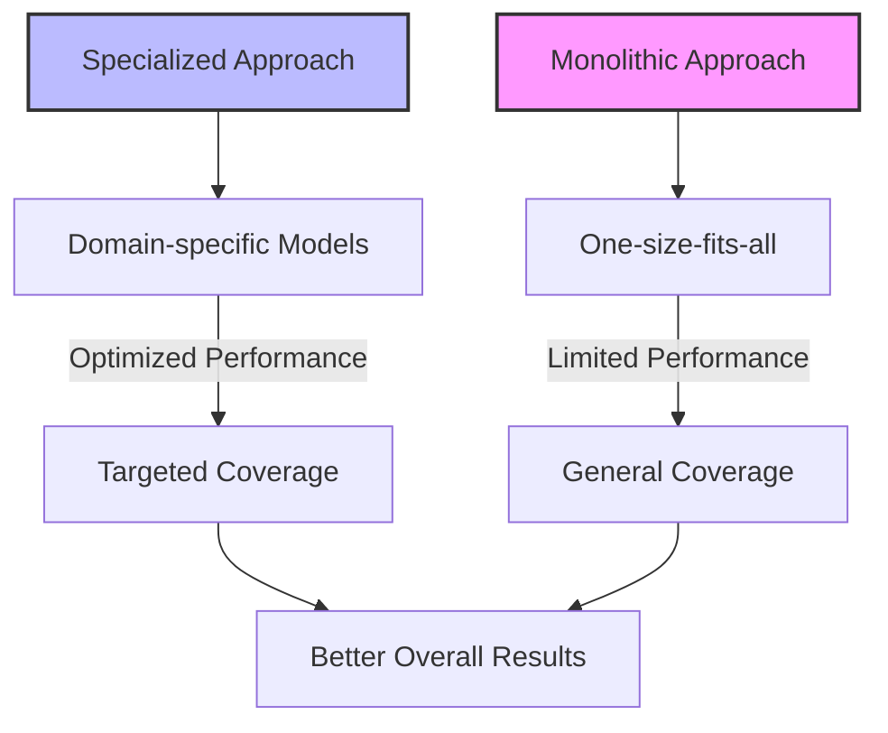

# Understanding Specialized Retrieval: Beyond Basic RAG

!!! abstract "Chapter Overview"

```
This part explores the foundations of specialized retrieval and its importance:

- Understanding why specialized retrievers outperform general-purpose solutions
- Learning key strategies for enhancing retrievability
- Measuring performance at both router and retriever levels
- Implementing metadata extraction and synthetic summaries
```

## Introduction

In our journey through systematically improving RAG applications, we've reached a pivotal moment. The previous sessions have equipped us with the fundamental building blocks: the RAG playbook, synthetic data generation, fine-tuning approaches, user experience design for data collection, and segmentation techniques. Now, in Session 5, we turn our attention to a concept that often separates basic implementations from truly exceptional ones—multimodal RAG and specialized search indices.

!!! note "Building on the Foundation"
    - **[Chapter 1](../chapter1.md)**: Evaluation metrics for each specialized retriever
    - **[Chapter 2](../chapter2.md)**: Fine-tuning embeddings for specific domains
    - **[Chapter 3](../chapter3-1.md)**: Collecting feedback on retrieval quality
    - **[Chapter 4](../chapter4-2.md)**: Identifying which capabilities need specialization

!!! quote "Key Insight"
The fundamental insight that drives this session is deceptively simple yet profound: _not all queries are created equal_. Different types of information require different approaches to retrieval. Just as you wouldn't use a hammer for every home repair task, you shouldn't rely on a single retrieval mechanism for every type of query your users might have.

Today, we'll explore how to identify distinct capabilities through segmentation and address each with tailored approaches. We'll see why specialized models solving specific problems consistently outperform general-purpose solutions, and how this paradigm shift can transform your RAG implementation from adequate to exceptional.

## The Power of Specialization

### Beyond the Monolithic Approach

Traditional RAG implementations often begin with a single, monolithic index—a one-size-fits-all approach that attempts to handle every query with the same retrieval mechanism. While this approach can work for simple use cases, it quickly reaches its limits when confronted with the rich diversity of real-world queries.

!!! example "Diverse Query Needs"
Consider a hardware store's knowledge base. A customer searching for a specific product by model number requires a fundamentally different search approach than someone asking about the durability of various power tools, or another customer trying to find items within a specific weight range. The first query is best served by lexical search matching exact strings, the second by semantic search understanding concepts and opinions, and the third by structured data queries.

This diversity of information needs is why major search engines like Google have developed specialized tools—Maps for location-based queries, Photos for visual search, YouTube for video content, and classic web search for text-based information. While these began as separate products, the true innovation came when Google learned to seamlessly route users to the appropriate tool based on the nature of their query.

!!! quote "From Previous Cohort"
"I've been building separate indices for years without realizing that's what I was doing. This framework just helps me do it more systematically."

### The Mathematics of Specialization

The superiority of specialized approaches isn't just theoretical—it's mathematically demonstrable. When distinct segments exist within a population of queries, a collection of local decision models will consistently outperform a global model trying to handle all cases.

This principle manifests in modern machine learning in multiple ways. We see it in the evolution from monolithic models to mixtures of experts, where specialized sub-models handle different types of inputs. We see it in the trend toward decomposing complex tasks into simpler subtasks that can be solved independently before being recombined.



!!! info "Organizational Benefits"
Beyond the performance benefits, specialized indices offer practical organizational advantages:

```
1. **Division of labor**: Teams can work on isolated, well-defined problems rather than tangling with the entire system
2. **Incremental improvement**: Adding a new specialized index is less disruptive than rebuilding an entire system
3. **Targeted innovation**: Teams can innovate within their specific domain without risking the stability of the whole
```

!!! quote "Industry Perspective"
"Building specialized indices isn't just about performance—it's about creating a sustainable path for continuous improvement."

## Two Paths to Better Retrieval

When improving retrieval capabilities for RAG applications, two complementary strategies emerge. Think of them as opposite sides of the same coin—one extracting structure from the unstructured, the other creating retrieval-optimized representations of structured data.

!!! quote "Key Insight"
If you remember nothing else from this chapter, remember this: These strategies essentially create materialized views of your existing data, processed by AI through either structuring or rewriting.

### Strategy 1: Extracting Metadata

The first approach involves defining and extracting more metadata from your text chunks. Instead of viewing your content as an undifferentiated mass of text, you identify valuable structured information that can be exposed to search engines.

!!! example "Metadata Extraction Examples"
\- In finance applications, distinguishing between fiscal years and calendar years
\- For legal document systems, classifying contracts as signed or unsigned and extracting payment dates and terms
\- When processing call transcripts, categorizing them by type (job interviews, stand-ups, design reviews)
\- For product documentation, identifying specifications, compatibility information, and warranty details

This approach essentially asks: "What structured information is hiding within our unstructured content that would make it easier to search?" Once extracted, this metadata can be stored in traditional databases like PostgreSQL, enabling powerful filtering and structured queries beyond what's possible with pure vector search.

!!! tip "Practical Application"
When consulting with financial clients, we discovered that simply being able to distinguish between fiscal years and calendar years dramatically improved search accuracy for financial metrics. Similarly, for legal teams, identifying whether a contract was signed or unsigned allowed for immediate filtering that saved hours of manual review.

!!! example "Financial Metadata Model"

````
```python
from pydantic import BaseModel
from datetime import date
from typing import Optional, List

class FinancialStatement(BaseModel):
    """Structured representation of a financial statement document."""
    company: str
    period_ending: date
    revenue: float
    net_income: float
    earnings_per_share: float
    fiscal_year: bool = True  # Is this fiscal year (vs calendar year)?
    # Additional fields that might be valuable:
    sector: Optional[str] = None
    currency: str = "USD"
    restated: bool = False  # Has this statement been restated?
    
def extract_financial_data(document_text: str) -> FinancialStatement:
    """
    Extract structured financial data from document text using LLM.

    Args:
        document_text: Raw text from financial document

    Returns:
        Structured FinancialStatement object with extracted data
    """
    # Define a structured extraction prompt
    system_prompt = """
    Extract the following financial information from the document:
    - Company name
    - Period end date
    - Whether this is a fiscal year report (vs calendar year)
    - Revenue amount (with currency)
    - Net income amount
    - Earnings per share
    - Business sector
    - Whether this statement has been restated
    
    Format your response as a JSON object with these fields.
    """
    
    # Use LLM to extract the structured information
    # Implementation depends on your LLM framework
    extracted_json = call_llm(system_prompt, document_text)
    
    # Parse the extracted JSON into our Pydantic model
    return FinancialStatement.parse_raw(extracted_json)
```
````

By extracting these structured elements from quarterly reports, organizations can enable precise filtering and comparison that would have been impossible with text-only search. For instance, you can easily query "Show me all companies in the tech sector with revenue growth over 10% in fiscal year 2024" or "Find all restated financial statements from the last quarter."

### Strategy 2: Building Synthetic Text Chunks

The second approach reverses the flow: taking structured data (or even unstructured data) and producing synthetic text chunks optimized for retrieval. These chunks serve as semantic pointers to the original content, enabling more effective recall.

!!! quote "Practical Perspective"
"If the first approach is to extract structured data from text chunks for easier structured search, the second approach is to create synthetic text chunks optimized specifically for embedding and retrieval."

!!! tip "Synthetic Text Applications"
\- For image collections: Generate detailed descriptions capturing searchable aspects
\- For research interviews: Extract common questions and answers to form an easily searchable FAQ
\- For numerical data: Create natural language descriptions of key trends and outliers
\- For product documentation: Generate comprehensive feature summaries that anticipate user queries
\- For customer service transcripts: Create problem-solution pairs that capture resolution patterns

These synthetic chunks become intermediaries—easier to search than the original content, but pointing back to that source material when needed for the final response. When implemented correctly, you gain the benefits of both worlds: optimized retrieval via the synthetic chunks, and full fidelity from the source content.

## Measuring What Matters

As we introduce specialized indices, our measurement framework expands to assess performance at two levels:

!!! info "Two-Level Measurement Framework"

```
1. Are we selecting the right retrieval method for each query? 
2.  Is each retrieval method finding the right information?
```

The overall probability of finding the correct information becomes a product of these two probabilities:

!!! example "Performance Formula"
P(finding correct data) = P(selecting correct retriever) × P(finding correct data | correct retriever)

This formula provides a powerful diagnostic tool. When your system underperforms, it helps identify whether the issue lies with retriever selection or with the individual retrievers themselves.

!!! tip "Diagnostic Example"
If you find that your system correctly routes 95% of queries to the appropriate retriever, but those retrievers only find relevant information 60% of the time, your priority should be improving retrieval quality rather than router accuracy.

This two-level evaluation framework ensures you invest your improvement efforts where they'll have the greatest impact.

!!! tip "Next Steps"
    In [Chapter 6](../chapter6-1.md), we'll explore how to bring these specialized components together through intelligent routing, creating a unified system that seamlessly directs queries to the appropriate retrievers.

---

IF you want to get discounts and 6 day email source on the topic make sure to subscribe to

<script async data-uid="010fd9b52b" src="https://fivesixseven.kit.com/010fd9b52b/index.js"></script>
