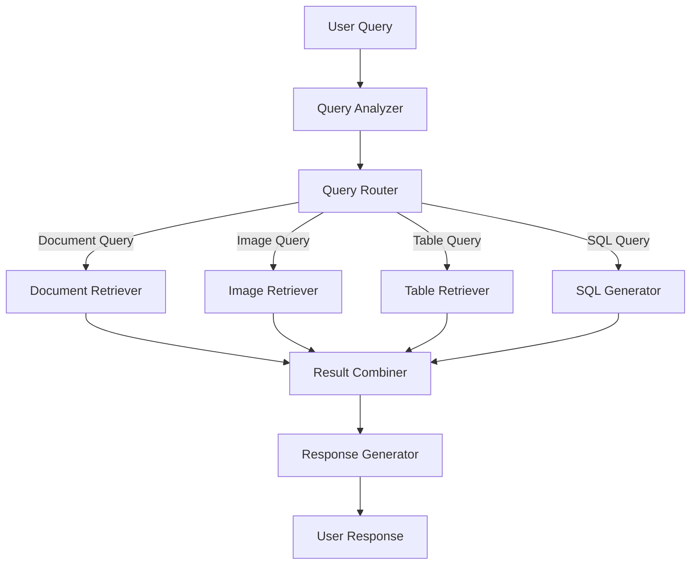

# Implementing Multimodal Search: Specialized Retrieval Techniques

!!! abstract "Chapter Overview"

    This part explores the practical implementation of specialized retrieval techniques:

    - Implementing strategies for document, image, and table retrieval
    - Building effective SQL generation capabilities
    - Creating rich descriptions for non-text content
    - Combining specialized retrievers into a cohesive system

## Specialized Approaches for Different Modalities

Different types of content demand different retrieval strategies. Let's explore approaches for three common modalities: documents, images, and tables.

### Document Search: Beyond Basic Chunking

For document retrieval, the foundation remains chunking documents with appropriate metadata and applying both lexical and semantic search techniques. However, several refinements can dramatically improve performance:

!!! info "Advanced Document Retrieval Techniques" 
    - **Contextual Retrieval**: Rather than using fixed chunks, dynamically rewrite or expand chunks based on the query context. This creates "query-aware" text representations that better match user intent.

    - **Hybrid Retrieval Signals**: Combine semantic similarity with other signals like recency, authority, and citation frequency to create a more nuanced ranking function.

    - **Multi-stage Retrieval**: Implement a cascade of increasingly sophisticated (and computationally expensive) retrieval and ranking steps, filtering out irrelevant content at each stage.


The result is a document retrieval system that might return different types of content depending on the query:

- For some queries, concise summaries of key information
- For others, entire documents leveraging long-context models
- For yet others, specific text chunks or structured data extracts

This flexibility allows the system to balance precision, recall, and presentation based on what best serves each query.

!!! example "Document Processor with Contextual Retrieval"

    ```python
    from typing import List, Dict, Any
    import re

    def process_document_for_retrieval(document: str) -> Dict[str, Any]:
        """
        Process a document for enhanced retrieval capabilities.

        Args:
            document: The raw document text

        Returns:
            Dictionary with processed document components
        """
        # Extract structured metadata
        metadata = extract_document_metadata(document)

        # Create standard chunks with overlap
        chunks = chunk_document(document, chunk_size=800, overlap=0.5)

        # Generate summaries at different levels
        document_summary = summarize_document(document)
        section_summaries = [summarize_section(section) for section in extract_sections(document)]

        # Extract any structured data tables
        tables = extract_tables(document)

        return {
            "metadata": metadata,
            "chunks": chunks,
            "document_summary": document_summary,
            "section_summaries": section_summaries,
            "tables": tables,
            "full_document": document  # Keep original for potential long-context processing
        }

    def contextual_retrieval(query: str, document_store: List[Dict[str, Any]]) -> List[str]:
        """
        Perform contextual retrieval that adapts based on query type.

        Args:
            query: User query
            document_store: Processed document store

        Returns:
            List of most relevant text chunks for the query
        """
        # Analyze query to determine retrieval strategy
        query_analysis = analyze_query(query)

        if query_analysis["requires_specific_detail"]:
            # Use chunk-level retrieval for specific information
            return retrieve_relevant_chunks(query, document_store)

        elif query_analysis["requires_overview"]:
            # Use summary-level retrieval for broader questions
            return retrieve_relevant_summaries(query, document_store)

        elif query_analysis["requires_structured_data"]:
            # Use table retrieval for data-oriented questions
            return retrieve_relevant_tables(query, document_store)

        else:
            # Fall back to hybrid approach
            chunks = retrieve_relevant_chunks(query, document_store)
            summaries = retrieve_relevant_summaries(query, document_store)
            return rerank_combined_results(query, chunks + summaries)
    ```

### Image Search: Bridging Visual and Textual Understanding

Image search presents unique challenges. Visual language models were trained primarily on captioning data, creating a potential mismatch between how queries are phrased and how images are represented.

!!! warning "Embedding Spaces Mismatch"
    The naive approach—applying the same embedding strategy used for text—often fails because question embeddings and image caption embeddings exist in fundamentally different semantic spaces. Simply embedding captions like "two people" will not retrieve well when users search for "business meeting" or "team collaboration."

To bridge this gap, more sophisticated image summarization techniques are essential:

!!! example "Advanced Image Description Techniques"
    **Rich Prompting**: Move beyond simple "what's in this image?" prompts to detailed instructions that anticipate likely queries. Compare:

    *Basic*: "Describe this image."
    → Result: "Two people at a table."

    *Better*: "Describe this image in detail, noting the number of people, their apparent relationship, the setting, lighting conditions, objects present, and any text visible in the image."
    → Result: "Two people arguing across a dinner table in a dimly lit room. One person appears agitated while the other looks defensive. A knife is visible on the table."

    *Optimal*: "Analyze this image comprehensively as if you were making it searchable in a database. Include details about the people, their emotions, the environment, lighting, objects, potential context, and any visible text. Consider how someone might search for this specific image."
    → Result: "This dramatic image shows two business professionals in a tense negotiation across a polished conference table in a corporate boardroom with floor-to-ceiling windows overlooking a city skyline. The older man in a gray suit appears frustrated, gesturing emphatically with papers in hand, while the younger woman in a black blazer maintains a composed but firm expression. Multiple financial reports and what appears to be a contract are spread across the table. The scene is captured in natural lighting with dramatic shadows, suggesting a high-stakes discussion or disagreement over business terms."

!!! quote "From Industry Experience" 
    "We found that the difference between basic image descriptions and optimized ones led to a 40% increase in successful retrievals. The key was training our team to create prompts that anticipated the vocabulary users would actually employ in their searches."

!!! info "Additional Image Enhancement Approaches"
    - **Contextual Enrichment**: Incorporate surrounding text, OCR results from the image, and metadata about the image's source and purpose. For example, if an image appears in a product manual, include the product name and function in the description.

    - **Visual Reasoning**: Use chain-of-thought prompting to guide the model through a reasoning process about the image content, resulting in more comprehensive descriptions. For example: "First identify all objects in the image. Then consider how they relate to each other. Finally, determine what activity or process is being depicted."

    - **Bounding Boxes and Visual Grounding**: For applications where precise location or counting is important, supplement descriptions with information about the spatial arrangement of elements. This is particularly valuable in construction, manufacturing, and retail contexts where users often need to locate or count specific items.

!!! example "Construction Site Image Analysis"
    For a construction company's image database, users frequently needed to count specific items ("How many support beams are installed?") or locate defects ("Show me images of cracked foundations"). By implementing bounding box detection alongside rich descriptions, retrieval accuracy for these queries improved by 65% compared to using only semantic descriptions.

!!! example "Rich Image Description Prompt"
    ```python
    def generate_rich_image_description(image, ocr_text=None, surrounding_text=None):
    """
    Generate a comprehensive description optimized for retrieval.

        Args:
            image: Image data or path
            ocr_text: Optional text extracted from the image
            surrounding_text: Optional text surrounding the image in its original context

        Returns:
            Detailed description of the image
        """
        prompt = f"""
        # Image Analysis Task

        ## Context Information
        {"OCR Text from image: " + ocr_text if ocr_text else "No OCR text available."}
        {"Surrounding context: " + surrounding_text if surrounding_text else "No surrounding context available."}

        ## Analysis Instructions
        Analyze the following image in extreme detail:

        1. First, describe the visual scene, setting, and overall composition
        2. List all people visible, their approximate positions, actions, and expressions
        3. Enumerate all objects visible in the image
        4. Note any text visible in the image
        5. Describe colors, lighting, and visual style
        6. If applicable, identify the type of image (photograph, diagram, screenshot, etc.)
        7. Use chain-of-thought reasoning: think about what is happening and why
        8. Generate 5-7 potential questions someone might ask when searching for this image
        9. Suggest 5-10 relevant tags for this image

        ## Final Description
        Based on your analysis, provide a comprehensive 3-5 sentence description that would
        help people find this image when searching with natural language queries.
        """

        # Use this prompt with your vision model implementation
        # ...
    ```

The enhanced description dramatically improves retrieval capability when troubleshooting specific defects or components.

### Table Search: Structured Data in Context

Tables present a dual challenge: they contain structured data but exist within unstructured contexts. Two main approaches prove effective:

!!! info "Table Retrieval Approaches"
    **Approach 1: Table as Document**

    For finding specific rows or comparing data across tables, chunk the table (preserving headers) and apply semantic search techniques. Generate summaries that capture the table's purpose and key insights to improve retrieval.

    This works well for questions like "Which product had the highest Q3 sales?" or "Show me all tables with warranty information."

    **Approach 2: Table as Database**

    For detailed data analysis, treat tables as queryable databases. The key challenge becomes identifying which table(s) to query for a given question.

    Standardize schemas using CREATE TABLE statements or table descriptions, then build semantic search against these table representations. Include sample data when possible to help clarify the table's contents.

!!! example "Table Processor Implementation"
    ```python
    from typing import List, Dict, Any, Optional
    import pandas as pd

    class TableProcessor:
        """Process tables for enhanced retrievability and querying."""

        def process_table(self, table_data: pd.DataFrame, table_name: str,
                        source_doc: Optional[str] = None) -> Dict[str, Any]:
            """
            Process a table for both document-like and database-like retrieval.

            Args:
                table_data: The table as a pandas DataFrame
                table_name: Name of the table
                source_doc: Optional source document information

            Returns:
                Dictionary with processed table components
            """
            # Generate schema representation
            schema = self._generate_schema_representation(table_data)

            # Generate natural language summary
            summary = self._generate_table_summary(table_data, table_name)

            # Generate sample queries this table could answer
            sample_queries = self._generate_sample_queries(table_data, table_name)

            # Convert to text chunks for semantic search
            text_chunks = self._table_to_text_chunks(table_data)

            return {
                "table_name": table_name,
                "schema": schema,
                "summary": summary,
                "sample_queries": sample_queries,
                "text_chunks": text_chunks,
                "raw_data": table_data,
                "source_document": source_doc
            }

        def _generate_schema_representation(self, df: pd.DataFrame) -> str:
            """Generate a SQL-like schema representation."""
            types = []
            for col in df.columns:
                dtype = df[col].dtype
                if pd.api.types.is_numeric_dtype(dtype):
                    sql_type = "NUMERIC"
                elif pd.api.types.is_datetime64_dtype(dtype):
                    sql_type = "TIMESTAMP"
                else:
                    sql_type = "TEXT"

                # Add sample values for better understanding
                sample_values = df[col].dropna().unique()[:3]
                sample_str = f"Sample values: {', '.join(str(x) for x in sample_values)}"

                types.append(f"{col} {sql_type} -- {sample_str}")

            return f"CREATE TABLE table (\n  " + ",\n  ".join(types) + "\n);"

        def _generate_table_summary(self, df: pd.DataFrame, table_name: str) -> str:
            """Generate a natural language summary of the table."""
            # Use an LLM to summarize the table contents
            # Implementation depends on your LLM framework
            # ...

        def _generate_sample_queries(self, df: pd.DataFrame, table_name: str) -> List[str]:
            """Generate sample natural language queries this table could answer."""
            # Use an LLM to generate sample queries
            # ...

        def _table_to_text_chunks(self, df: pd.DataFrame) -> List[str]:
            """Convert table to text chunks for semantic search."""
            # Implementation for chunking table content
            # ...
    ```

Once the right table is identified, either:

- Place the table directly into the context for simple analysis
- Generate SQL queries or pandas code for more complex analysis

## SQL Query Generation: A Case Study in Capability Building

SQL query generation exemplifies many of the principles we've discussed. It involves both an inventory challenge (finding the right tables) and a capability challenge (writing effective queries).

!!! warning "Limitations of Direct Translation"
    The classical approach—training a model to translate natural language directly to SQL—often struggles with complex schemas and business-specific query patterns. The limitations become especially apparent with:
    
    - Complex schemas with dozens or hundreds of tables
    - Business-specific definitions of common terms like "active user" or "revenue"
    - SQL patterns that require specific business rules like fiscal calendars
    - Performance considerations that require specific optimization techniques

!!! quote "Data Science Experience"
    "We spent months trying to fine-tune models for SQL generation with limited success. Once we switched to retrieving exemplar queries from our analytics repository, accuracy jumped by 30% overnight."

!!! tip "RAG Playbook for SQL Generation"
    A more effective strategy applies our RAG playbook:

    1. **Build an inventory of tables and their descriptions** - Create detailed schema documentation including sample data
    2. **Create synthetic questions targeting this inventory** - Generate diverse questions that test different joining patterns
    3. **Measure retrieval performance for table selection** - Evaluate if the right tables are being identified
    4. **Collect exemplar SQL queries demonstrating important capabilities** - Curate a library of well-written, optimized queries
    5. **Include these exemplars when generating new queries** - Dynamically retrieve and include relevant examples

This approach addresses a fundamental challenge in SQL generation: the same question can be interpreted in multiple valid ways. Consider "Show me month-over-month revenue growth":

- Does "month" mean calendar month or a 28-day period?
- Should weekends be excluded for B2B applications?
- Is "growth" absolute or percentage?
- Should the calculation include or exclude certain revenue types?
- Should the comparison use the same day of month or the last day of each month?
- How should partial months be handled when the current month isn't complete?

!!! example "Subjective Query Interpretations"
    | Question | Possible Interpretation 1 | Possible Interpretation 2 | Possible Interpretation 3 |
    |----------|---------------------------|---------------------------|---------------------------|
    | "Monthly active users" | Users who logged in during calendar month | Users who performed an action in last 30 days | Users who made a purchase in billing cycle |
    | "Revenue by region" | Geographic sales regions | Product categories | Customer segments |
    | "Top performing products" | Highest revenue | Highest profit margin | Highest growth rate |

Without business context, even the most advanced models can only guess. By including relevant exemplars that demonstrate how your organization typically answers such questions, you guide the model toward your preferred interpretations.

## Bringing It All Together

As we prepare for our final session on routing and unified systems, let's solidify the key insights from today's exploration of multimodal RAG:

!!! abstract "Key Takeaways" 
    1. **The power of specialization**: Building dedicated retrieval mechanisms for different content types and query patterns consistently outperforms monolithic approaches. Specialized models solving specific problems will outperform general-purpose solutions.

    2. **Two complementary strategies**: Extract structured data from unstructured content, or create synthetic text chunks that point to source data—both serve as AI-powered materialized views that optimize retrievability.

    3. **Measurement drives improvement**: Use precision and recall at both the router and retriever levels to identify your system's limiting factors using the formula: P(finding correct data) = P(selecting correct retriever) × P(finding correct data | correct retriever).

    4. **Modality-specific optimizations**: Each content type requires tailored approaches, from contextual retrieval for documents to rich descriptions for images to exemplar-based generation for SQL.
    
    5. **Organizational benefits**: Beyond performance, specialized indices enable division of labor, incremental improvement, and targeted innovation without disrupting the entire system.



The beauty of this framework is its recursive nature. The same playbook—synthetic data generation, segmentation, capability identification—applies whether you're building your first retrieval system or your fifth specialized index.

!!! tip "Implementation Strategy" 
    1. **Start small**: Begin with one or two specialized retrievers for your highest-impact query types 
    2. **Measure relentlessly**: Track performance metrics for each retriever and overall system 
    3. **Expand incrementally**: Add new retrievers as you identify segments that would benefit 
    4. **Refine continuously**: Use user feedback to improve both routing and retrieval quality
    5. **Optimize alignment**: Ensure that your synthetic text and metadata extraction aligns with actual user query patterns

!!! quote "Engineering Insight"
    "No matter how much better AI gets, you'll always be responsible for retrieval. Understanding what to retrieve and how to retrieve it remains the core challenge even as models become more capable."

!!! tip "Cross-Reference"
In [Chapter 6](chapter6.md), we'll explore how to bring these specialized components together through effective routing strategies, creating a unified system that seamlessly directs users to the appropriate retrievers based on their queries.