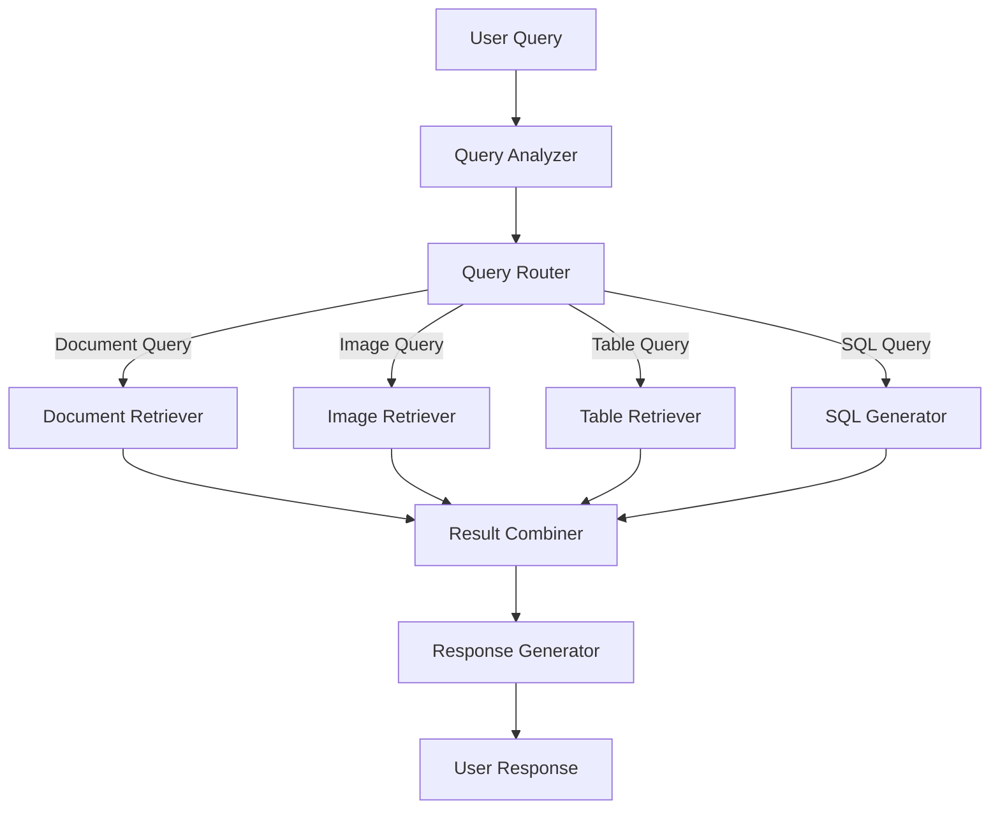

# Implementing Multimodal Search: Specialized Retrieval Techniques


## Handling Different Content Types

Let's get into the specifics of how to handle documents, images, and tables. Each needs its own approach.

### Document Search: Beyond Basic Chunking

Document retrieval still relies on chunking and search, but here are some tweaks that actually help:

**Page-Level Chunking**

For documentation, respect the original page boundaries. The authors already organized the content logically—don't break it up arbitrarily.

```python
# Instead of arbitrary chunking:
chunks = chunk_by_tokens(doc, size=800)

# Use page-aware chunking:
chunks = chunk_by_pages(doc,
                      respect_sections=True,
                      min_size=200,
                      max_size=2000)
```

This works especially well for documentation sites, user manuals, legal documents, and academic papers where context matters.

Some other document retrieval techniques that work:

- **Contextual Retrieval**: Rewrite chunks to include context from the full document. Makes isolated chunks understandable.
- **Hybrid Signals**: Mix semantic similarity with recency, authority, citation counts. Don't rely on embeddings alone.
- **Multi-stage Retrieval**: Start cheap and fast, then get more sophisticated. Filter garbage early.

!!! example "Contextual Retrieval Implementation"
**The Power of Context-Aware Chunks:**

    Original chunk: "Jason the doctor is unhappy with Patient X"

    Without context, this is ambiguous:
    - Is Jason a medical doctor unhappy with a patient?
    - Is a doctor named Jason unhappy?
    - Is someone consulting Dr. Jason about Patient X?

    **Solution: Rewrite chunks with full document context:**

    ```python
    def create_contextual_chunk(chunk, document):
        """Rewrite chunk with document context."""
        prompt = f"""
        Document context: {document.title}
        Section: {chunk.section}

        Original chunk: {chunk.text}

        Rewrite this chunk to include necessary context
        so it can be understood in isolation.
        """

        return llm.complete(prompt)
    ```

    Result: "In this employee feedback document, Jason (the medical doctor
    on our staff) expressed dissatisfaction with the Patient X project
    management software due to frequent crashes."

    **Key Decision: Compute at write-time vs read-time**
    - Write-time: Higher storage cost, faster retrieval
    - Read-time: Lower storage cost, slower retrieval
    - Most teams should compute at write-time for production


Your document retrieval ends up returning different things for different queries:
- Quick summaries for overview questions
- Full documents when context matters
- Specific chunks for precise information

The system adapts to what the query actually needs.

!!! example "Document Processor with Contextual Retrieval"

````
```python
from typing import List, Dict, Any
import re

def process_document_for_retrieval(document: str) -> Dict[str, Any]:
    """
    Process a document for enhanced retrieval capabilities.

    Args:
        document: The raw document text

    Returns:
        Dictionary with processed document components
    """
    # Extract structured metadata
    metadata = extract_document_metadata(document)

    # Create standard chunks with overlap
    chunks = chunk_document(document, chunk_size=800, overlap=0.5)

    # Generate summaries at different levels
    document_summary = summarize_document(document)
    section_summaries = [summarize_section(section) for section in extract_sections(document)]

    # Extract any structured data tables
    tables = extract_tables(document)

    return {
        "metadata": metadata,
        "chunks": chunks,
        "document_summary": document_summary,
        "section_summaries": section_summaries,
        "tables": tables,
        "full_document": document  # Keep original for potential long-context processing
    }

def contextual_retrieval(query: str, document_store: List[Dict[str, Any]]) -> List[str]:
    """
    Perform contextual retrieval that adapts based on query type.

    Args:
        query: User query
        document_store: Processed document store

    Returns:
        List of most relevant text chunks for the query
    """
    # Analyze query to determine retrieval strategy
    query_analysis = analyze_query(query)

    if query_analysis["requires_specific_detail"]:
        # Use chunk-level retrieval for specific information
        return retrieve_relevant_chunks(query, document_store)

    elif query_analysis["requires_overview"]:
        # Use summary-level retrieval for broader questions
        return retrieve_relevant_summaries(query, document_store)

    elif query_analysis["requires_structured_data"]:
        # Use table retrieval for data-oriented questions
        return retrieve_relevant_tables(query, document_store)

    else:
        # Fall back to hybrid approach
        chunks = retrieve_relevant_chunks(query, document_store)
        summaries = retrieve_relevant_summaries(query, document_store)
        return rerank_combined_results(query, chunks + summaries)
```
````

### Image Search: Bridging Visual and Textual Understanding

Image search is tricky because vision models were trained on captions, but people don't search using caption-style language.

!!! warning "Embedding Spaces Mismatch"
The naive approach—applying the same embedding strategy used for text—often fails because question embeddings and image caption embeddings exist in fundamentally different semantic spaces. Simply embedding captions like "two people" will not retrieve well when users search for "business meeting" or "team collaboration."

!!! tip "When to Use Vision Language Models"
According to Adit from Reducto, VLMs excel at "things that traditional OCR has always been horrible at" - handwriting, charts, figures, and diagrams. However, for clean structured information, traditional CV provides better precision and token efficiency. [Learn about their hybrid approach →](../talks/reducto-docs-adit.md)

Here's how to make image search actually work:

!!! example "Advanced Image Description Techniques"
**Rich Prompting**: Move beyond simple "what's in this image?" prompts to detailed instructions that anticipate likely queries. Compare:

```
*Basic*: "Describe this image."
→ Result: "Two people at a table."

*Better*: "Describe this image in detail, noting the number of people, their apparent relationship, the setting, lighting conditions, objects present, and any text visible in the image."
→ Result: "Two people arguing across a dinner table in a dimly lit room. One person appears agitated while the other looks defensive. A knife is visible on the table."

*Optimal*: "Analyze this image comprehensively as if you were making it searchable in a database. Include details about the people, their emotions, the environment, lighting, objects, potential context, and any visible text. Consider how someone might search for this specific image."
→ Result: "This dramatic image shows two business professionals in a tense negotiation across a polished conference table in a corporate boardroom with floor-to-ceiling windows overlooking a city skyline. The older man in a gray suit appears frustrated, gesturing emphatically with papers in hand, while the younger woman in a black blazer maintains a composed but firm expression. Multiple financial reports and what appears to be a contract are spread across the table. The scene is captured in natural lighting with dramatic shadows, suggesting a high-stakes discussion or disagreement over business terms."
```

In practice, the difference between basic and good image descriptions meant 40% better retrieval rates. The trick was figuring out how users actually describe what they're looking for.

!!! info "Additional Image Enhancement Approaches"
\- **Contextual Enrichment**: Incorporate surrounding text, OCR results from the image, and metadata about the image's source and purpose. For example, if an image appears in a product manual, include the product name and function in the description.

```
- **Visual Reasoning**: Use chain-of-thought prompting to guide the model through a reasoning process about the image content, resulting in more comprehensive descriptions. For example: "First identify all objects in the image. Then consider how they relate to each other. Finally, determine what activity or process is being depicted."

- **Bounding Boxes and Visual Grounding**: For applications where precise location or counting is important, supplement descriptions with information about the spatial arrangement of elements. This is particularly valuable in construction, manufacturing, and retail contexts where users often need to locate or count specific items.
```

!!! example "Construction Site Image Analysis"
For a construction company's image database, users frequently needed to count specific items ("How many support beams are installed?") or locate defects ("Show me images of cracked foundations"). By implementing bounding box detection alongside rich descriptions, retrieval accuracy for these queries improved by 65% compared to using only semantic descriptions.

!!! example "Rich Image Description Prompt"
\`\`\`python
def generate_rich_image_description(image, ocr_text=None, surrounding_text=None):
"""
Generate a comprehensive description optimized for retrieval.

````
    Args:
        image: Image data or path
        ocr_text: Optional text extracted from the image
        surrounding_text: Optional text surrounding the image in its original context

    Returns:
        Detailed description of the image
    """
    prompt = f"""
    # Image Analysis Task

    ## Context Information
    {"OCR Text from image: " + ocr_text if ocr_text else "No OCR text available."}
    {"Surrounding context: " + surrounding_text if surrounding_text else "No surrounding context available."}

    ## Analysis Instructions
    Analyze the following image in extreme detail:

    1. First, describe the visual scene, setting, and overall composition
    2. List all people visible, their approximate positions, actions, and expressions
    3. Enumerate all objects visible in the image
    4. Note any text visible in the image
    5. Describe colors, lighting, and visual style
    6. If applicable, identify the type of image (photograph, diagram, screenshot, etc.)
    7. Use chain-of-thought reasoning: think about what is happening and why
    8. Generate 5-7 potential questions someone might ask when searching for this image
    9. Suggest 5-10 relevant tags for this image

    ## Final Description
    Based on your analysis, provide a comprehensive 3-5 sentence description that would
    help people find this image when searching with natural language queries.
    """

    # Use this prompt with your vision model implementation
    # ...
```
````

The enhanced description dramatically improves retrieval capability when troubleshooting specific defects or components.

### Table Search: Structured Data in Context

Tables are weird—they're structured data living in unstructured documents. Here's what works:

!!! quote "Expert Insight: Document Parsing Challenges"
Adit from Reducto emphasizes that tables are particularly challenging: "Tables are particularly challenging because they represent two-dimensional associations of data that can be formatted in countless ways. The failures are often subtle - a model might extract what appears to be a valid table but silently drop rows, columns, or individual values."

    For production-ready table extraction, consider specialized tools. [Learn more about document ingestion best practices →](../talks/reducto-docs-adit.md)

Turns out markdown tables work best for LLM lookup:
- Markdown: 85% accuracy
- CSV: 73% accuracy  
- JSON: 71% accuracy
- YAML: 69% accuracy

Why? The visual structure helps LLMs understand relationships better than nested JSON.

```markdown
| Product ID | Name           | Price  | Stock |
|------------|----------------|--------|-------|
| SKU-001    | Widget Pro     | $29.99 | 150   |
| SKU-002    | Widget Basic   | $19.99 | 0     |
| SKU-003    | Widget Premium | $49.99 | 75    |
```

Watch out for number formatting: `1 234 567` tokenizes as three separate numbers. Use `1234567` or `1,234,567` instead.

    !!! info "Production Table Extraction"
        Reducto's approach to complex tables includes:
        - Using HTML for tables with 3+ merged cells
        - Traditional CV for initial extraction, VLMs for correction
        - Creating natural language summaries for better retrieval

        See their [complete document parsing methodology](../talks/reducto-docs-adit.md) for handling PDFs, Excel files, and complex layouts.

Two ways to handle table retrieval:

**Approach 1: Table as Document**
Chunk the table (keep headers!) and use semantic search. Add summaries about what the table contains. Good for questions like "Which product had the highest Q3 sales?"

**Approach 2: Table as Database**  
Treat tables as mini-databases. The challenge is figuring out which table has the answer. Create schema descriptions and sample queries, then search against those.

!!! example "Table Processor Implementation"
\`\`\`python
from typing import List, Dict, Any, Optional
import pandas as pd

````
class TableProcessor:
    """Process tables for enhanced retrievability and querying."""

    def process_table(self, table_data: pd.DataFrame, table_name: str,
                    source_doc: Optional[str] = None) -> Dict[str, Any]:
        """
        Process a table for both document-like and database-like retrieval.

        Args:
            table_data: The table as a pandas DataFrame
            table_name: Name of the table
            source_doc: Optional source document information

        Returns:
            Dictionary with processed table components
        """
        # Generate schema representation
        schema = self._generate_schema_representation(table_data)

        # Generate natural language summary
        summary = self._generate_table_summary(table_data, table_name)

        # Generate sample queries this table could answer
        sample_queries = self._generate_sample_queries(table_data, table_name)

        # Convert to text chunks for semantic search
        text_chunks = self._table_to_text_chunks(table_data)

        return {
            "table_name": table_name,
            "schema": schema,
            "summary": summary,
            "sample_queries": sample_queries,
            "text_chunks": text_chunks,
            "raw_data": table_data,
            "source_document": source_doc
        }

    def _generate_schema_representation(self, df: pd.DataFrame) -> str:
        """Generate a SQL-like schema representation."""
        types = []
        for col in df.columns:
            dtype = df[col].dtype
            if pd.api.types.is_numeric_dtype(dtype):
                sql_type = "NUMERIC"
            elif pd.api.types.is_datetime64_dtype(dtype):
                sql_type = "TIMESTAMP"
            else:
                sql_type = "TEXT"

            # Add sample values for better understanding
            sample_values = df[col].dropna().unique()[:3]
            sample_str = f"Sample values: {', '.join(str(x) for x in sample_values)}"

            types.append(f"{col} {sql_type} -- {sample_str}")

        return f"CREATE TABLE table (\n  " + ",\n  ".join(types) + "\n);"

    def _generate_table_summary(self, df: pd.DataFrame, table_name: str) -> str:
        """Generate a natural language summary of the table."""
        # Use an LLM to summarize the table contents
        # Implementation depends on your LLM framework
        # ...

    def _generate_sample_queries(self, df: pd.DataFrame, table_name: str) -> List[str]:
        """Generate sample natural language queries this table could answer."""
        # Use an LLM to generate sample queries
        # ...

    def _table_to_text_chunks(self, df: pd.DataFrame) -> List[str]:
        """Convert table to text chunks for semantic search."""
        # Implementation for chunking table content
        # ...
```
````

Once the right table is identified, either:

- Place the table directly into the context for simple analysis
- Generate SQL queries or pandas code for more complex analysis

## SQL Query Generation: A Case Study in Capability Building

SQL generation shows all these principles in action. You need to find the right tables AND write good queries.

The old approach of "just translate natural language to SQL" breaks down fast when you have:
- Schemas with hundreds of tables
- Business-specific definitions (what's an "active user" anyway?)
- Custom business rules (fiscal calendars, revenue recognition)
- Performance requirements that need specific query patterns

We wasted months trying to fine-tune SQL generation models. Then we started retrieving similar queries from our analytics repository instead. Accuracy jumped 30% immediately.

!!! example "RAPTOR: Recursive Summarization for Long Documents"
**The RAPTOR Approach:**

    When dealing with concepts that span multiple pages or sections:

    1. **Cluster Related Chunks:**
       ```python
       # Embed all chunks
       embeddings = [embed(chunk) for chunk in chunks]

       # Cluster similar chunks
       clusters = cluster_embeddings(embeddings,
                                   method='hierarchical',
                                   threshold=0.8)
       ```

    2. **Summarize Each Cluster:**
       ```python
       for cluster in clusters:
           summary = summarize_chunks(cluster.chunks)
           cluster.summary = summary
       ```

    3. **Build Hierarchical Index:**
       - Leaf nodes: Original chunks
       - Internal nodes: Cluster summaries
       - Root node: Document summary

    4. **Multi-Level Retrieval:**
       - Start with high-level summaries
       - Drill down to specific chunks as needed

    **Use Cases:**
    - Academic papers (methodology across sections)
    - Legal documents (related clauses)
    - Technical documentation (feature descriptions)
    - Books and long-form content

    This approach handles the "information spread" problem where relevant content is distributed across multiple non-contiguous sections.

!!! info "When Simple Tools Beat Embeddings"
Colin Flaherty's experience building top-performing coding agents reveals that sometimes simple tools like grep and find can outperform embedding-based retrieval: "The agent's persistence compensated for less sophisticated tools." However, he notes this works best for: - Highly structured content like code - Small to medium-sized repositories - When distinctive keywords exist

    For larger codebases or unstructured content, embeddings become essential. [Explore agentic retrieval patterns →](../talks/colin-rag-agents.md)

Here's what actually works for SQL generation:

1. Document all your tables with good descriptions and sample data
2. Generate test questions for different query patterns
3. Check if you're finding the right tables
4. Build a library of good SQL queries that work
5. Retrieve and include relevant examples when generating new queries

The same question can mean different things. Take "Show me month-over-month revenue growth":
- Calendar month or 28-day period?
- Include weekends or not?
- Absolute dollars or percentage?
- All revenue or just recurring?
- Same day comparison or month-end?
- What about partial months?

!!! example "Subjective Query Interpretations"
| Question | Possible Interpretation 1 | Possible Interpretation 2 | Possible Interpretation 3 |
|\----------|---------------------------|---------------------------|---------------------------|
| "Monthly active users" | Users who logged in during calendar month | Users who performed an action in last 30 days | Users who made a purchase in billing cycle |
| "Revenue by region" | Geographic sales regions | Product categories | Customer segments |
| "Top performing products" | Highest revenue | Highest profit margin | Highest growth rate |

Models can't read your mind about business logic. But if you show them examples of how your company calculates these things, they'll follow that pattern.

## Bringing It All Together

## Key Points

1. **Specialized beats general**: Different content types need different retrieval approaches. One-size-fits-all doesn't work.

2. **Two main strategies**: Extract structure from text, or create searchable text from structured data. Both are just AI-processed views of your data.

3. **Measure both levels**: Track if you're picking the right retriever AND if that retriever works well. The formula helps debug problems.

4. **Each type is different**: Documents need context, images need rich descriptions, tables need schema understanding, SQL needs examples.

5. **It's also about org structure**: Specialized indices let teams work independently and improve their piece without breaking everything.

!!! tip "Combining Lexical and Semantic Search"
**The Power of Hybrid Search:**

    Don't abandon lexical search! It excels at:
    - Exact matches (product codes, names)
    - Technical terms and abbreviations
    - Queries with specific keywords

    **Implementation Strategy:**
    ```python
    def hybrid_search(query, k=10):
        # Get results from both systems
        semantic_results = semantic_search(query, k=k*2)
        lexical_results = bm25_search(query, k=k*2)

        # Combine with weighted scores
        combined = merge_results(
            semantic_results,
            lexical_results,
            semantic_weight=0.7,
            lexical_weight=0.3
        )

        return combined[:k]
    ```

    **Pro Tip:** Adjust weights based on query type:
    - Technical queries: Increase lexical weight
    - Conceptual queries: Increase semantic weight
    - Let user behavior guide the optimization



The nice thing is this approach scales. The same process—generate test data, segment queries, identify capabilities—works whether you're building your first retriever or your tenth.

**How to actually do this:**
1. Start with one or two specialized retrievers for your most common queries
2. Measure everything—individual retriever performance and overall success
3. Add new retrievers when you find query types that aren't working well
4. Keep improving based on what users actually search for
5. Make sure your synthetic text matches how people really ask questions

Remember: even as AI gets better, you're still responsible for retrieval. Knowing what to retrieve and how to find it is the hard part, not generating the final answer.

!!! tip "Cross-Reference"
In [Chapter 6](chapter6-1.md), we'll explore how to bring these specialized components together through effective routing strategies, creating a unified system that seamlessly directs users to the appropriate retrievers based on their queries.

---

IF you want to get discounts and 6 day email source on the topic make sure to subscribe to

[Enroll in the Free 6-Day Email Course](https://improvingrag.com/){ .md-button .md-button--primary }

---

IF you want to get discounts and 6 day email source on the topic make sure to subscribe to

[Enroll in the Free 6-Day Email Course](https://improvingrag.com/){ .md-button .md-button--primary }

---

IF you want to get discounts and 6 day email source on the topic make sure to subscribe to

[Enroll in the Free 6-Day Email Course](https://improvingrag.com/){ .md-button .md-button--primary }

---

IF you want to get discounts and 6 day email source on the topic make sure to subscribe to

[Enroll in the Free 6-Day Email Course](https://improvingrag.com/){ .md-button .md-button--primary }

---

IF you want to get discounts and 6 day email source on the topic make sure to subscribe to

[Enroll in the Free 6-Day Email Course](https://improvingrag.com/){ .md-button .md-button--primary }

---

IF you want to get discounts and 6 day email source on the topic make sure to subscribe to

<script async data-uid="010fd9b52b" src="https://fivesixseven.kit.com/010fd9b52b/index.js"></script>
