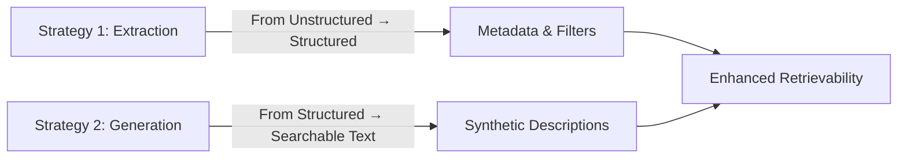
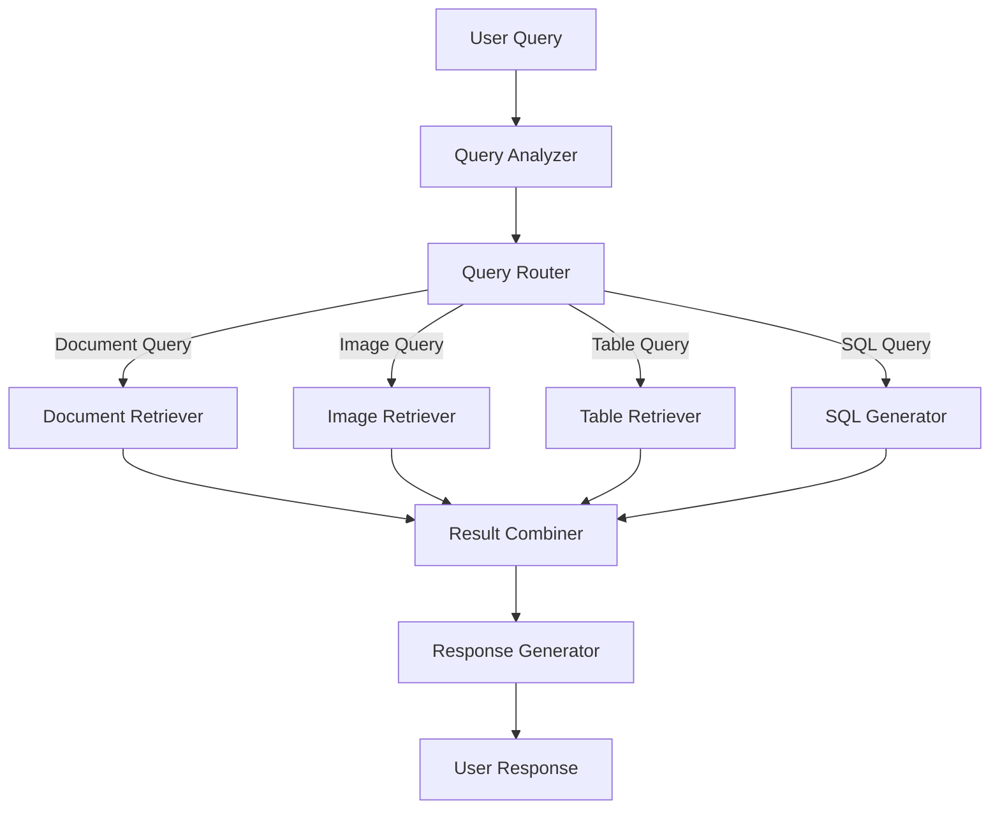

# Multimodal RAG: Building Specialized Search Indices

!!! abstract "Chapter Overview"
    This chapter explores how to move beyond basic retrieval to create specialized indices for different content types:
    
    - Understanding why specialized retrievers outperform general-purpose solutions
    - Implementing strategies for document, image, and table retrieval
    - Measuring performance at both router and retriever levels
    - Building a comprehensive multimodal RAG architecture
    - Applying specialized techniques to enhance retrieval precision

## Introduction

In our journey through systematically improving RAG applications, we've reached a pivotal moment. The previous sessions have equipped us with the fundamental building blocks: the RAG playbook, synthetic data generation, fine-tuning approaches, user experience design for data collection, and segmentation techniques. Now, in Session 5, we turn our attention to a concept that often separates basic implementations from truly exceptional ones—multimodal RAG and specialized search indices.

!!! quote "Key Insight"
    The fundamental insight that drives this session is deceptively simple yet profound: *not all queries are created equal*. Different types of information require different approaches to retrieval. Just as you wouldn't use a hammer for every home repair task, you shouldn't rely on a single retrieval mechanism for every type of query your users might have.

Today, we'll explore how to identify distinct capabilities through segmentation and address each with tailored approaches. We'll see why specialized models solving specific problems consistently outperform general-purpose solutions, and how this paradigm shift can transform your RAG implementation from adequate to exceptional.

## The Power of Specialization

### Beyond the Monolithic Approach

Traditional RAG implementations often begin with a single, monolithic index—a one-size-fits-all approach that attempts to handle every query with the same retrieval mechanism. While this approach can work for simple use cases, it quickly reaches its limits when confronted with the rich diversity of real-world queries.

!!! example "Diverse Query Needs"
    Consider a hardware store's knowledge base. A customer searching for a specific product by model number requires a fundamentally different search approach than someone asking about the durability of various power tools, or another customer trying to find items within a specific weight range. The first query is best served by lexical search matching exact strings, the second by semantic search understanding concepts and opinions, and the third by structured data queries.

This diversity of information needs is why major search engines like Google have developed specialized tools—Maps for location-based queries, Photos for visual search, YouTube for video content, and classic web search for text-based information. While these began as separate products, the true innovation came when Google learned to seamlessly route users to the appropriate tool based on the nature of their query.

!!! quote "From Previous Cohort"
    "I've been building separate indices for years without realizing that's what I was doing. This framework just helps me do it more systematically."

### The Mathematics of Specialization

The superiority of specialized approaches isn't just theoretical—it's mathematically demonstrable. When distinct segments exist within a population of queries, a collection of local decision models will consistently outperform a global model trying to handle all cases.

This principle manifests in modern machine learning in multiple ways. We see it in the evolution from monolithic models to mixtures of experts, where specialized sub-models handle different types of inputs. We see it in the trend toward decomposing complex tasks into simpler subtasks that can be solved independently before being recombined.


!!! info "Organizational Benefits"
    Beyond the performance benefits, specialized indices offer practical organizational advantages:
    
    1. **Division of labor**: Teams can work on isolated, well-defined problems rather than tangling with the entire system
    2. **Incremental improvement**: Adding a new specialized index is less disruptive than rebuilding an entire system
    3. **Targeted innovation**: Teams can innovate within their specific domain without risking the stability of the whole

!!! quote "Industry Perspective"
    "Building specialized indices isn't just about performance—it's about creating a sustainable path for continuous improvement."

## Two Paths to Better Retrieval

When improving retrieval capabilities for RAG applications, two complementary strategies emerge. Think of them as opposite sides of the same coin—one extracting structure from the unstructured, the other creating retrieval-optimized representations of structured data.

### Strategy 1: Extracting Metadata

The first approach involves defining and extracting more metadata from your text chunks. Instead of viewing your content as an undifferentiated mass of text, you identify valuable structured information that can be exposed to search engines.

!!! example "Metadata Extraction Examples"
    - In finance applications, distinguishing between fiscal years and calendar years
    - For legal document systems, classifying contracts as signed or unsigned
    - When processing call transcripts, categorizing them by type (job interviews, stand-ups, design reviews)

This approach essentially asks: "What structured information is hiding within our unstructured content that would make it easier to search?"

!!! example "Financial Metadata Model"
    ```python
    from pydantic import BaseModel
    from datetime import date
    from typing import Optional, List

    class FinancialStatement(BaseModel):
        """Structured representation of a financial statement document."""
        company: str
        period_ending: date
        revenue: float
        net_income: float
        earnings_per_share: float
        fiscal_year: bool = True  # Is this fiscal year (vs calendar year)?
        
    def extract_financial_data(document_text: str) -> FinancialStatement:
        """
        Extract structured financial data from document text using LLM.
        
        Args:
            document_text: Raw text from financial document
            
        Returns:
            Structured FinancialStatement object with extracted data
        """
        # Use LLM to extract the structured information
        # Implementation depends on your LLM framework
        # ...
    ```

By extracting these structured elements from quarterly reports, organizations can enable precise filtering and comparison that would have been impossible with text-only search.

### Strategy 2: Building Synthetic Text Chunks

The second approach reverses the flow: taking structured data (or even unstructured data) and producing synthetic text chunks optimized for retrieval. These chunks serve as semantic pointers to the original content, enabling more effective recall.

!!! tip "Synthetic Text Applications"
    - For image collections: Generate detailed descriptions capturing searchable aspects
    - For research interviews: Extract common questions and answers to form an easily searchable FAQ
    - For numerical data: Create natural language descriptions of key trends and outliers

These synthetic chunks become intermediaries—easier to search than the original content, but pointing back to that source material when needed for the final response.

!!! example "Image Description Generator"
    ```python
    def generate_enhanced_image_description(image_path: str) -> str:
        """
        Generate a detailed, searchable description of an image.
        
        Args:
            image_path: Path to the image file
            
        Returns:
            Detailed description optimized for semantic search
        """
        # Prompt for rich image description
        system_prompt = """
        Analyze this image in detail, including:
        1. All people, objects, and text visible
        2. The setting and environment
        3. Actions being performed
        4. Visual qualities (colors, lighting, composition)
        5. Emotional tone or mood
        6. Any unique or distinctive elements
        
        Format your response as a detailed paragraph that would help 
        someone find this image when searching with natural language.
        """
        
        # Implementation using your preferred vision LLM
        # ...
    ```

Both strategies essentially create materialized views of your existing data, processed by AI through either structuring or rewriting. The appropriate strategy depends on your data and the types of queries you need to support—and many systems benefit from applying both approaches to different parts of their content.



## Measuring What Matters

As we introduce specialized indices, our measurement framework expands to assess performance at two levels:

!!! info "Two-Level Measurement Framework"
    1. Are we selecting the right retrieval method for each query?
    2. Is each retrieval method finding the right information?

The overall probability of finding the correct information becomes a product of these two probabilities:

!!! example "Performance Formula"
    ```
    P(finding correct data) = P(selecting correct retriever) × P(finding correct data | correct retriever)
    ```

This formula provides a powerful diagnostic tool. When your system underperforms, it helps identify whether the issue lies with retriever selection or with the individual retrievers themselves.

!!! tip "Diagnostic Example"
    If you find that your system correctly routes 95% of queries to the appropriate retriever, but those retrievers only find relevant information 60% of the time, your priority should be improving retrieval quality rather than router accuracy.

This two-level evaluation framework ensures you invest your improvement efforts where they'll have the greatest impact.

!!! example "Performance Evaluation Code"
    ```python
    def evaluate_system_performance(test_queries: List[dict]) -> dict:
        """
        Evaluate the overall system performance across components.
        
        Args:
            test_queries: List of test queries with ground truth
            
        Returns:
            Dictionary with performance metrics at each level
        """
        results = {
            "overall_success_rate": 0,
            "router_accuracy": 0,
            "retriever_performance": {}
        }
        
        correct_router_selections = 0
        retriever_successes = {retriever_type: 0 for retriever_type in RETRIEVER_TYPES}
        retriever_attempts = {retriever_type: 0 for retriever_type in RETRIEVER_TYPES}
        
        for query in test_queries:
            # Check if router selected correct retriever
            selected_retriever = route_query(query["text"])
            correct_retriever = query["expected_retriever"]
            
            if selected_retriever == correct_retriever:
                correct_router_selections += 1
            
            # Check if selected retriever found relevant content
            retrieval_result = retrieve_with_method(query["text"], selected_retriever)
            retriever_attempts[selected_retriever] += 1
            
            if is_relevant(retrieval_result, query["expected_content"]):
                retriever_successes[selected_retriever] += 1
                
                # Only count as overall success if both router and retriever worked
                if selected_retriever == correct_retriever:
                    results["overall_success_rate"] += 1
        
        # Calculate final metrics
        total_queries = len(test_queries)
        results["router_accuracy"] = correct_router_selections / total_queries
        
        for retriever_type in RETRIEVER_TYPES:
            if retriever_attempts[retriever_type] > 0:
                results["retriever_performance"][retriever_type] = {
                    "success_rate": retriever_successes[retriever_type] / retriever_attempts[retriever_type],
                    "sample_size": retriever_attempts[retriever_type]
                }
        
        results["overall_success_rate"] /= total_queries
        
        return results
    ```

## Specialized Approaches for Different Modalities

Different types of content demand different retrieval strategies. Let's explore approaches for three common modalities: documents, images, and tables.

### Document Search: Beyond Basic Chunking

For document retrieval, the foundation remains chunking documents with appropriate metadata and applying both lexical and semantic search techniques. However, several refinements can dramatically improve performance:

!!! info "Advanced Document Retrieval Techniques"
    - **Contextual Retrieval**: Rather than using fixed chunks, dynamically rewrite or expand chunks based on the query context. This creates "query-aware" text representations that better match user intent.
    
    - **Hybrid Retrieval Signals**: Combine semantic similarity with other signals like recency, authority, and citation frequency to create a more nuanced ranking function.
    
    - **Multi-stage Retrieval**: Implement a cascade of increasingly sophisticated (and computationally expensive) retrieval and ranking steps, filtering out irrelevant content at each stage.


The result is a document retrieval system that might return different types of content depending on the query:

- For some queries, concise summaries of key information
- For others, entire documents leveraging long-context models
- For yet others, specific text chunks or structured data extracts

This flexibility allows the system to balance precision, recall, and presentation based on what best serves each query.

!!! example "Document Processor with Contextual Retrieval"
    ```python
    from typing import List, Dict, Any
    import re

    def process_document_for_retrieval(document: str) -> Dict[str, Any]:
        """
        Process a document for enhanced retrieval capabilities.
        
        Args:
            document: The raw document text
            
        Returns:
            Dictionary with processed document components
        """
        # Extract structured metadata
        metadata = extract_document_metadata(document)
        
        # Create standard chunks with overlap
        chunks = chunk_document(document, chunk_size=800, overlap=0.5)
        
        # Generate summaries at different levels
        document_summary = summarize_document(document)
        section_summaries = [summarize_section(section) for section in extract_sections(document)]
        
        # Extract any structured data tables
        tables = extract_tables(document)
        
        return {
            "metadata": metadata,
            "chunks": chunks,
            "document_summary": document_summary,
            "section_summaries": section_summaries,
            "tables": tables,
            "full_document": document  # Keep original for potential long-context processing
        }
        
    def contextual_retrieval(query: str, document_store: List[Dict[str, Any]]) -> List[str]:
        """
        Perform contextual retrieval that adapts based on query type.
        
        Args:
            query: User query
            document_store: Processed document store
            
        Returns:
            List of most relevant text chunks for the query
        """
        # Analyze query to determine retrieval strategy
        query_analysis = analyze_query(query)
        
        if query_analysis["requires_specific_detail"]:
            # Use chunk-level retrieval for specific information
            return retrieve_relevant_chunks(query, document_store)
            
        elif query_analysis["requires_overview"]:
            # Use summary-level retrieval for broader questions
            return retrieve_relevant_summaries(query, document_store)
            
        elif query_analysis["requires_structured_data"]:
            # Use table retrieval for data-oriented questions
            return retrieve_relevant_tables(query, document_store)
            
        else:
            # Fall back to hybrid approach
            chunks = retrieve_relevant_chunks(query, document_store)
            summaries = retrieve_relevant_summaries(query, document_store)
            return rerank_combined_results(query, chunks + summaries)
    ```

### Image Search: Bridging Visual and Textual Understanding

Image search presents unique challenges. Visual language models were trained primarily on captioning data, creating a potential mismatch between how queries are phrased and how images are represented.

!!! warning "Embedding Spaces Mismatch"
    The naive approach—applying the same embedding strategy used for text—often fails because question embeddings and image caption embeddings exist in fundamentally different semantic spaces.

To bridge this gap, more sophisticated image summarization techniques are essential:

!!! example "Advanced Image Description Techniques"
    **Rich Prompting**: Move beyond simple "what's in this image?" prompts to detailed instructions that anticipate likely queries. Compare:
    
    *Basic*: "Describe this image."
    
    *Enhanced*: "Describe this image in detail, noting the number of people, their apparent relationship, the setting, lighting conditions, objects present, and any text visible in the image."

!!! info "Additional Image Enhancement Approaches"
    - **Contextual Enrichment**: Incorporate surrounding text, OCR results from the image, and metadata about the image's source and purpose.
    
    - **Visual Reasoning**: Use chain-of-thought prompting to guide the model through a reasoning process about the image content, resulting in more comprehensive descriptions.
    
    - **Bounding Boxes and Visual Grounding**: For applications where precise location or counting is important, supplement descriptions with information about the spatial arrangement of elements.

!!! example "Rich Image Description Prompt"
    ```python
    def generate_rich_image_description(image, ocr_text=None, surrounding_text=None):
        """
        Generate a comprehensive description optimized for retrieval.
        
        Args:
            image: Image data or path
            ocr_text: Optional text extracted from the image
            surrounding_text: Optional text surrounding the image in its original context
            
        Returns:
            Detailed description of the image
        """
        prompt = f"""
        # Image Analysis Task
        
        ## Context Information
        {"OCR Text from image: " + ocr_text if ocr_text else "No OCR text available."}
        {"Surrounding context: " + surrounding_text if surrounding_text else "No surrounding context available."}
        
        ## Analysis Instructions
        Analyze the following image in extreme detail:
        
        1. First, describe the visual scene, setting, and overall composition
        2. List all people visible, their approximate positions, actions, and expressions
        3. Enumerate all objects visible in the image
        4. Note any text visible in the image
        5. Describe colors, lighting, and visual style
        6. If applicable, identify the type of image (photograph, diagram, screenshot, etc.)
        7. Use chain-of-thought reasoning: think about what is happening and why
        8. Generate 5-7 potential questions someone might ask when searching for this image
        9. Suggest 5-10 relevant tags for this image
        
        ## Final Description
        Based on your analysis, provide a comprehensive 3-5 sentence description that would 
        help people find this image when searching with natural language queries.
        """
        
        # Use this prompt with your vision model implementation
        # ...
    ```

The enhanced description dramatically improves retrieval capability when troubleshooting specific defects or components.

### Table Search: Structured Data in Context

Tables present a dual challenge: they contain structured data but exist within unstructured contexts. Two main approaches prove effective:

!!! info "Table Retrieval Approaches"
    **Approach 1: Table as Document**
    
    For finding specific rows or comparing data across tables, chunk the table (preserving headers) and apply semantic search techniques. Generate summaries that capture the table's purpose and key insights to improve retrieval.
    
    This works well for questions like "Which product had the highest Q3 sales?" or "Show me all tables with warranty information."
    
    **Approach 2: Table as Database**
    
    For detailed data analysis, treat tables as queryable databases. The key challenge becomes identifying which table(s) to query for a given question.
    
    Standardize schemas using CREATE TABLE statements or table descriptions, then build semantic search against these table representations. Include sample data when possible to help clarify the table's contents.

!!! example "Table Processor Implementation"
    ```python
    from typing import List, Dict, Any, Optional
    import pandas as pd

    class TableProcessor:
        """Process tables for enhanced retrievability and querying."""
        
        def process_table(self, table_data: pd.DataFrame, table_name: str, 
                        source_doc: Optional[str] = None) -> Dict[str, Any]:
            """
            Process a table for both document-like and database-like retrieval.
            
            Args:
                table_data: The table as a pandas DataFrame
                table_name: Name of the table
                source_doc: Optional source document information
                
            Returns:
                Dictionary with processed table components
            """
            # Generate schema representation
            schema = self._generate_schema_representation(table_data)
            
            # Generate natural language summary
            summary = self._generate_table_summary(table_data, table_name)
            
            # Generate sample queries this table could answer
            sample_queries = self._generate_sample_queries(table_data, table_name)
            
            # Convert to text chunks for semantic search
            text_chunks = self._table_to_text_chunks(table_data)
            
            return {
                "table_name": table_name,
                "schema": schema,
                "summary": summary,
                "sample_queries": sample_queries,
                "text_chunks": text_chunks,
                "raw_data": table_data,
                "source_document": source_doc
            }
            
        def _generate_schema_representation(self, df: pd.DataFrame) -> str:
            """Generate a SQL-like schema representation."""
            types = []
            for col in df.columns:
                dtype = df[col].dtype
                if pd.api.types.is_numeric_dtype(dtype):
                    sql_type = "NUMERIC"
                elif pd.api.types.is_datetime64_dtype(dtype):
                    sql_type = "TIMESTAMP"
                else:
                    sql_type = "TEXT"
                    
                # Add sample values for better understanding
                sample_values = df[col].dropna().unique()[:3]
                sample_str = f"Sample values: {', '.join(str(x) for x in sample_values)}"
                
                types.append(f"{col} {sql_type} -- {sample_str}")
                
            return f"CREATE TABLE table (\n  " + ",\n  ".join(types) + "\n);"
            
        def _generate_table_summary(self, df: pd.DataFrame, table_name: str) -> str:
            """Generate a natural language summary of the table."""
            # Use an LLM to summarize the table contents
            # Implementation depends on your LLM framework
            # ...
            
        def _generate_sample_queries(self, df: pd.DataFrame, table_name: str) -> List[str]:
            """Generate sample natural language queries this table could answer."""
            # Use an LLM to generate sample queries
            # ...
            
        def _table_to_text_chunks(self, df: pd.DataFrame) -> List[str]:
            """Convert table to text chunks for semantic search."""
            # Implementation for chunking table content
            # ...
    ```

Once the right table is identified, either:
- Place the table directly into the context for simple analysis
- Generate SQL queries or pandas code for more complex analysis

## SQL Query Generation: A Case Study in Capability Building

SQL query generation exemplifies many of the principles we've discussed. It involves both an inventory challenge (finding the right tables) and a capability challenge (writing effective queries).

!!! warning "Limitations of Direct Translation"
    The classical approach—training a model to translate natural language directly to SQL—often struggles with complex schemas and business-specific query patterns.

!!! tip "RAG Playbook for SQL Generation"
    A more effective strategy applies our RAG playbook:
    
    1. **Build an inventory of tables and their descriptions**
    2. **Create synthetic questions targeting this inventory**
    3. **Measure retrieval performance for table selection**
    4. **Collect exemplar SQL queries demonstrating important capabilities**
    5. **Include these exemplars when generating new queries**

This approach addresses a fundamental challenge in SQL generation: the same question can be interpreted in multiple valid ways. Consider "Show me month-over-month revenue growth":

* Does "month" mean calendar month or a 28-day period?
* Should weekends be excluded for B2B applications?
* Is "growth" absolute or percentage?
* Should the calculation include or exclude certain revenue types?

Without business context, even the most advanced models can only guess. By including relevant exemplars that demonstrate how your organization typically answers such questions, you guide the model toward your preferred interpretations.

!!! example "SQL Query Generator with Examples"
    ```python
    from typing import List, Dict, Any, Optional
    
    class SQLQueryGenerator:
        """Generate SQL queries based on natural language using RAG with examples."""
        
        def __init__(self, db_schema_store, query_example_store):
            """
            Initialize the SQL query generator.
            
            Args:
                db_schema_store: Repository of table schemas
                query_example_store: Repository of example queries
            """
            self.db_schema_store = db_schema_store
            self.query_example_store = query_example_store
            
        def generate_query(self, user_question: str) -> str:
            """
            Generate a SQL query based on a natural language question.
            
            Args:
                user_question: Natural language question
                
            Returns:
                SQL query string
            """
            # Step 1: Identify relevant tables
            relevant_tables = self._retrieve_relevant_tables(user_question)
            
            # Step 2: Retrieve relevant query examples
            relevant_examples = self._retrieve_relevant_examples(user_question)
            
            # Step 3: Generate SQL using context
            sql_query = self._generate_sql_with_context(
                user_question, 
                relevant_tables, 
                relevant_examples
            )
            
            return sql_query
            
        def _retrieve_relevant_tables(self, question: str) -> List[Dict[str, Any]]:
            """Find tables relevant to the question using semantic search."""
            # Implementation using db_schema_store
            # ...
            
        def _retrieve_relevant_examples(self, question: str) -> List[Dict[str, Any]]:
            """Find query examples relevant to the question."""
            # Implementation using query_example_store
            # ...
            
        def _generate_sql_with_context(self, question: str, 
                                      tables: List[Dict[str, Any]], 
                                      examples: List[Dict[str, Any]]) -> str:
            """
            Generate SQL using the question, tables, and examples as context.
            
            This is where we'd use an LLM with a carefully crafted prompt that:
            1. Shows the table schemas
            2. Provides relevant query examples
            3. Asks for a query answering the user's question
            """
            # LLM implementation
            # ...
    
    # Example usage
    def process_user_query(question: str) -> Dict[str, Any]:
        """Process a natural language query to SQL and execute it."""
        # Step 1: Generate SQL
        sql_query = sql_generator.generate_query(question)
        
        # Step 2: Execute query (with safety checks)
        if is_safe_query(sql_query):
            results = execute_query(sql_query)
            return {
                "question": question,
                "sql_query": sql_query,
                "results": results
            }
        else:
            return {"error": "Generated query failed safety checks"}
    ```

!!! quote "Data Science Success Story"
    "We spent months trying to fine-tune models for SQL generation with limited success. Once we switched to retrieving exemplar queries from our analytics repository, accuracy jumped by 30% overnight."

## Bringing It All Together

As we prepare for our final session on routing and unified systems, let's solidify the key insights from today's exploration of multimodal RAG:

!!! abstract "Key Takeaways"
    1. **The power of specialization**: Building dedicated retrieval mechanisms for different content types and query patterns consistently outperforms monolithic approaches.
    
    2. **Two complementary strategies**: Extract structured data from unstructured content, or create synthetic text chunks that point to source data—both serve as AI-powered materialized views.
    
    3. **Measurement drives improvement**: Use precision and recall at both the router and retriever levels to identify your system's limiting factors.
    
    4. **Modality-specific optimizations**: Each content type requires tailored approaches, from contextual retrieval for documents to rich descriptions for images to exemplar-based generation for SQL.



The beauty of this framework is its recursive nature. The same playbook—synthetic data generation, segmentation, capability identification—applies whether you're building your first retrieval system or your fifth specialized index.

!!! tip "Implementation Strategy"
    1. **Start small**: Begin with one or two specialized retrievers for your highest-impact query types
    2. **Measure relentlessly**: Track performance metrics for each retriever and overall system
    3. **Expand incrementally**: Add new retrievers as you identify segments that would benefit
    4. **Refine continuously**: Use user feedback to improve both routing and retrieval quality

!!! quote "Engineering Insight"
    "No matter how much better AI gets, you'll always be responsible for retrieval. Understanding what to retrieve and how to retrieve it remains the core challenge even as models become more capable."

!!! tip "Cross-Reference"
    In [Chapter 6](chapter6.md), we'll explore how to bring these specialized components together through effective routing strategies, creating a unified system that seamlessly directs users to the appropriate retrievers based on their queries.

## Reflection Questions

As you prepare for our final session, consider these questions about your own RAG implementation:

!!! question "Self-Assessment"
    1. Which query segments in your application might benefit from specialized retrieval approaches?
    
    2. What structured metadata could you extract from your content to enable more precise filtering?
    
    3. For which content types might synthetic summaries improve retrieval performance?
    
    4. How would you measure whether your performance bottleneck is in retriever selection or in the retrievers themselves?
    
    5. What exemplars from your domain could help guide generation tasks like SQL queries or code snippets?

By systematically addressing these questions, you'll be well-positioned to transform your RAG system from adequate to exceptional—one specialized index at a time.

## Summary

This chapter has shown that the path to advanced RAG implementations involves moving from monolithic retrieval to specialized indices tailored to different content types and query patterns. We've explored strategies for document, image, and tabular data, and seen how the same fundamental principles of measurement and improvement apply across modalities.

The specialized approach offers not just better performance but also organizational advantages: teams can work independently on different retrievers, new capabilities can be added incrementally, and the system becomes more maintainable and extensible over time.

As we move toward our final chapter on unified retrieval systems, remember that this specialization pattern reflects the broader evolution of machine learning systems: from monolithic models to mixtures of experts and back again as capabilities advance. By building specialized retrievers today, you're not just improving current performance—you're creating a foundation that will continue to evolve with the field.
