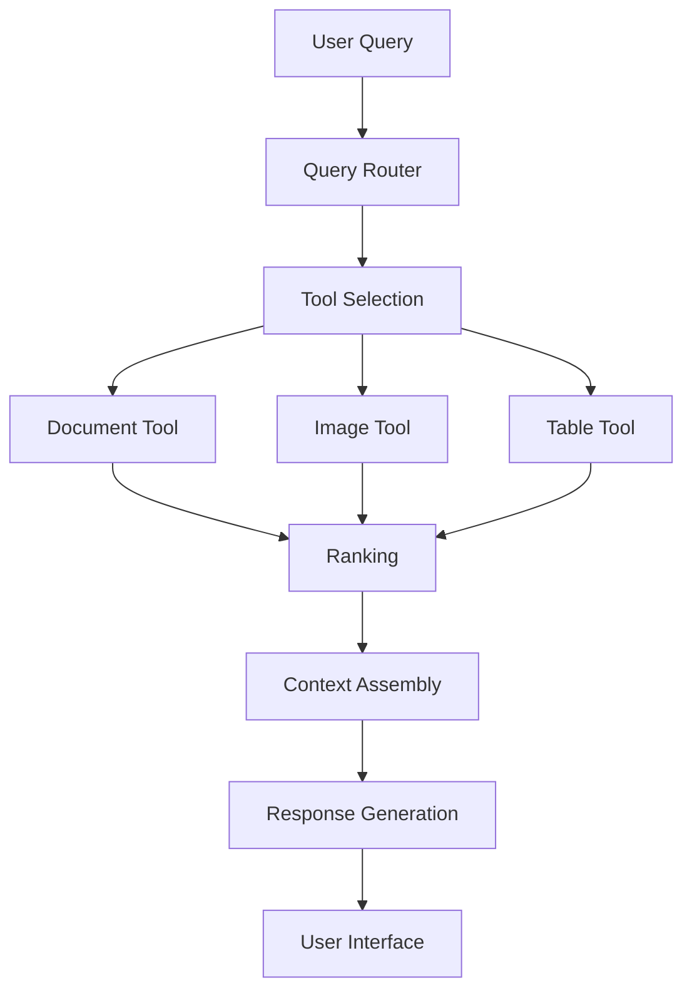

# Query Routing Foundations: Building a Cohesive RAG System

!!! abstract "Chapter Overview"

    This part explores the fundamental principles of unified RAG architecture:

    - Understanding why unified architecture is essential for advanced RAG systems
    - Designing tool interfaces that bridge language models and specialized indices
    - Learning key principles of effective query routing
    - Measuring performance at the system level

## Introduction: Beyond Specialized Retrievers

In the previous chapter, we explored how to build specialized retrievers for different content types. We discussed strategies for handling documents, images, tables, and other specialized data formats. While these specialized components improve retrieval quality dramatically, they create a new challenge: how do we build a cohesive system that knows when to use each specialized component?

This is the challenge of **query routing**—the process of understanding what a user is asking for and directing their query to the most appropriate retrieval tool or combination of tools. Effective query routing is what transforms a collection of specialized capabilities into a unified, seamless product experience.

!!! quote "Key Insight"

    "The quality of your RAG system isn't just determined by how well each individual retriever performs, but by how effectively your system routes queries to the right retrievers at the right time. Even perfect retrievers fail if they're used for the wrong queries."

The unified architecture approach we'll explore in this chapter completes our improvement flywheel by:

1. Using the specialized capabilities we built based on user segmentation
2. Implementing intelligent routing between these components
3. Creating interfaces that help users understand system capabilities
4. Building feedback loops that continuously improve both routing and retrieval

Let's begin by examining the architectural patterns that enable effective query routing in RAG systems.

## The API Mindset: Tools as Interfaces Between Models and Data

At the heart of unified RAG architecture is a simple but powerful pattern: treating each specialized retriever as an API that language models can call. This "tools as APIs" approach creates a clear separation of concerns between:

1. **Tool Interfaces**: The definitions that describe what each tool does and what parameters it accepts
2. **Tool Implementations**: The specialized code that performs retrieval against specific indices
3. **Routing Logic**: The system that determines which tools to call for a given query

!!! quote "Framework Development Perspective"
    "You're effectively a framework developer for the language model. I spent many years developing multiple microservices to do retrieval for other teams, and moving forward it's going to feel a lot like building distributed microservices."

!!! info "History of Tool Interfaces"
    The tool interface pattern has evolved rapidly in AI systems. What began as simple "function calling" in APIs like OpenAI's functions or Anthropic's tools has now developed into more sophisticated frameworks with multiple tool selection strategies. This pattern mimics the development of web API frameworks like REST and GraphQL, but with language models as the primary "clients" of these APIs.

### Why the API Approach Works

Treating specialized retrievers as APIs offers several key advantages:

1. **Clear Boundaries**: Teams can work independently on different tools
2. **Testability**: Each component can be tested in isolation
3. **Reusability**: Tools can be used by both language models and developers
4. **Scalability**: New capabilities can be added without changing existing components
5. **Performance**: Parallel execution becomes easier to implement
6. **Organizational Alignment**: Different teams can own different aspects of the system

!!! example "Organizational Structure"
    One effective team structure:
    - **Interface Team**: Designs the API contracts and tool specifications based on user needs
    - **Implementation Team**: Builds and optimizes individual retrievers for specific content types
    - **Router Team**: Creates and optimizes the query routing system
    - **Evaluation Team**: Tests the performance of the entire system and identifies bottlenecks

This architecture resembles modern microservice patterns where specialized services handle specific tasks. The difference is that the "client" making API calls is often a language model rather than another service.

### From Monolithic to Modular: The Evolution of RAG Architecture

Many RAG implementations start with a monolithic approach: a single vector database containing all content types, a unified chunking strategy, and a single retrieval mechanism. While simple to implement, this approach quickly reaches its limits as content diversity grows.

The transition to a modular, API-based architecture typically follows these stages:

1. **Recognition Phase**: Identifying that different query types need different retrieval approaches
2. **Separation Phase**: Breaking the monolithic system into specialized components
3. **Interface Phase**: Defining clear boundaries and contracts between components
4. **Orchestration Phase**: Building a routing layer that knows when to use each component

!!! example "Real-World Transition"
    A client in the financial services sector initially implemented RAG with a single vector database containing everything from market reports to customer communications. When they transitioned to specialized retrieval components with clear API boundaries, they saw:
    
    - **Development Velocity**: 40% increase in feature delivery speed
    - **Retrieval Quality**: 25-35% improvement across different query types
    - **Team Coordination**: Reduced cross-team dependencies and bottlenecks
    - **Scaling**: Ability to add new content types without disrupting existing functionality

The key insight was treating each specialized retriever not just as an implementation detail, but as a well-defined service with a clear contract.