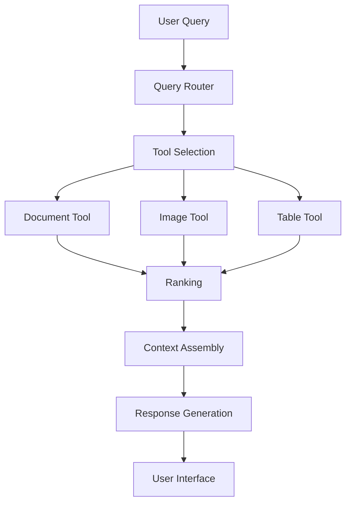

# Query Routing Foundations: Building a Cohesive RAG System

### Key Insight

**The best retriever is multiple retrievers—success = P(selecting right retriever) × P(retriever finding data).** Query routing isn't about choosing one perfect system. It's about building a portfolio of specialized tools and letting a smart router decide. Start simple with few-shot classification, then evolve to fine-tuned models as you collect routing decisions.

!!! info "Learn the Complete RAG Playbook"
    All of this content comes from my [Systematically Improving RAG Applications](https://maven.com/applied-llms/rag-playbook?promoCode=EBOOK) course. Readers get **20% off** with code EBOOK. Join 500+ engineers who've transformed their RAG systems from demos to production-ready applications.

## Introduction

## What This Chapter Covers

- Building unified RAG architectures with query routing
- Designing tool interfaces for specialized retrievers
- Implementing effective routing between components
- Measuring system-level performance

## The Query Routing Problem

In Chapter 5, we built specialized retrievers for different content types. Now we need to decide when to use each one.

**Query routing** means directing user queries to the right retrieval components. Without it, even excellent specialized retrievers become useless if they're never called for the right queries.

The architecture we'll build:

1. Uses specialized retrievers built from user segmentation data
2. Routes queries to appropriate components
3. Provides clear interfaces for both models and users
4. Collects feedback to improve routing accuracy

## Tools as APIs Pattern

Treat each specialized retriever as an API that language models can call. This creates separation between:

1. **Tool Interfaces**: Definitions of what each tool does and its parameters
2. **Tool Implementations**: The actual retrieval code
3. **Routing Logic**: Code that selects which tools to call

This is similar to building microservices, except the primary client is a language model rather than another service. The pattern evolved from simple function calling in LLM APIs to more sophisticated tool selection frameworks.

### Benefits of the API Approach

- **Clear Boundaries**: Teams work independently on different tools
- **Testability**: Components can be tested in isolation
- **Reusability**: Tools work for both LLMs and direct API calls
- **Scalability**: Add new capabilities without changing existing code
- **Performance**: Enable parallel execution
- **Team Structure**: Different teams own different components

!!! example "Organizational Structure"
One effective team structure:
\- **Interface Team**: Designs the API contracts and tool specifications based on user needs
\- **Implementation Team**: Builds and optimizes individual retrievers for specific content types
\- **Router Team**: Creates and optimizes the query routing system
\- **Evaluation Team**: Tests the performance of the entire system and identifies bottlenecks

This architecture resembles modern microservice patterns where specialized services handle specific tasks. The difference is that the "client" making API calls is often a language model rather than another service.

### Moving from Monolithic to Modular

Most RAG systems start monolithic: one vector database, one chunking strategy, one retrieval method. This breaks down as content types diversify.

Typical migration path:

1. **Recognition**: Different queries need different retrieval
2. **Separation**: Break into specialized components
3. **Interface**: Define clear contracts between components
4. **Orchestration**: Build routing layer

**Example**: A financial services client migrated from a single vector database to specialized components:

- Development velocity: 40% faster feature delivery
- Retrieval quality: 25-35% improvement by query type
- Team coordination: Fewer cross-team dependencies
- Scaling: New content types added without disrupting existing features

The key was treating each retriever as a service with a clear API contract.
