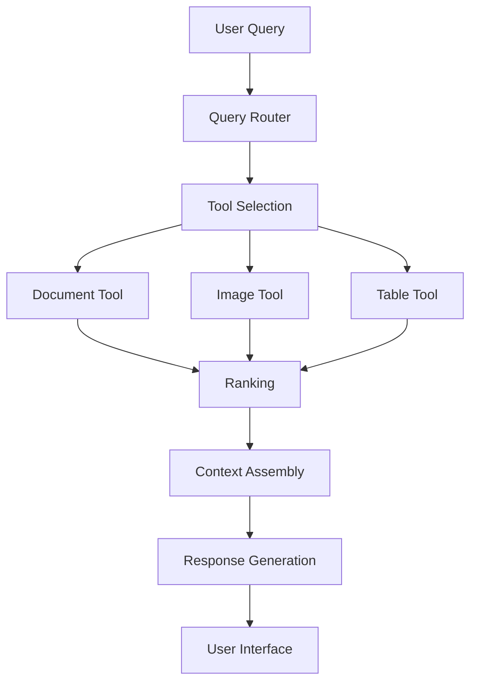

# Unified Product Architecture: Building a Cohesive RAG System

!!! abstract "Chapter Overview"

    This chapter explores how to build a coherent system that intelligently combines specialized retrieval components:

    - Designing tool interfaces that bridge language models and specialized indices
    - Implementing effective query routing to direct requests to appropriate tools
    - Testing and measuring performance of both retrieval and routing components
    - Creating user interfaces that leverage both AI and direct tool access
    - Building systems that scale across teams and complexity levels

## Introduction: Beyond Specialized Retrievers

In the previous chapter, we explored how to build specialized retrievers for different content types. We discussed strategies for handling documents, images, tables, and other specialized data formats. While these specialized components improve retrieval quality dramatically, they create a new challenge: how do we build a cohesive system that knows when to use each specialized component?

This is the challenge of **query routing**—the process of understanding what a user is asking for and directing their query to the most appropriate retrieval tool or combination of tools. Effective query routing is what transforms a collection of specialized capabilities into a unified, seamless product experience.

!!! quote "Key Insight"

    "The quality of your RAG system isn't just determined by how well each individual retriever performs, but by how effectively your system routes queries to the right retrievers at the right time. Even perfect retrievers fail if they're used for the wrong queries."

The unified architecture approach we'll explore in this chapter completes our improvement flywheel by:

1. Using the specialized capabilities we built based on user segmentation
2. Implementing intelligent routing between these components
3. Creating interfaces that help users understand system capabilities
4. Building feedback loops that continuously improve both routing and retrieval

Let's begin by examining the architectural patterns that enable effective query routing in RAG systems.

## The API Mindset: Tools as Interfaces Between Models and Data

At the heart of unified RAG architecture is a simple but powerful pattern: treating each specialized retriever as an API that language models can call. This "tools as APIs" approach creates a clear separation of concerns between:

1. **Tool Interfaces**: The definitions that describe what each tool does and what parameters it accepts
2. **Tool Implementations**: The specialized code that performs retrieval against specific indices
3. **Routing Logic**: The system that determines which tools to call for a given query

!!! info "History of Tool Interfaces"

    The tool interface pattern has evolved rapidly in AI systems. What began as simple "function calling" in APIs like OpenAI's functions or Anthropic's tools has now developed into more sophisticated frameworks with multiple tool selection strategies. This pattern mimics the development of web API frameworks like REST and GraphQL, but with language models as the primary "clients" of these APIs.

### Why the API Approach Works

Treating specialized retrievers as APIs offers several key advantages:

1. **Clear Boundaries**: Teams can work independently on different tools
2. **Testability**: Each component can be tested in isolation
3. **Reusability**: Tools can be used by both language models and developers
4. **Scalability**: New capabilities can be added without changing existing components
5. **Performance**: Parallel execution becomes easier to implement



This architecture resembles modern microservice patterns where specialized services handle specific tasks. The difference is that the "client" making API calls is often a language model rather than another service.

## Implementing Tool Interfaces for Retrieval

Let's look at how to implement this pattern with a concrete example. Imagine we're building a construction information system that includes blueprints, text documents, and project schedules.

### Building a Blueprint Search Tool

Based on our analysis in Chapter 5, we've determined that users often search for blueprints by description and date range. We'll define a tool interface that captures this functionality:

```python
from pydantic import BaseModel

class SearchBlueprint(BaseModel):
    description: str
    start_date: str | None = None
    end_date: str | None = None

    def execute(
        self,
    ) -> List[BlueprintResult]:
        """
        Search for blueprints matching the description and date range.

        Args:
            description: Text to search for in blueprint descriptions
            start_date: Optional start date in YYYY-MM-DD format
            end_date: Optional end date in YYYY-MM-DD format

        Returns:
            List of matching blueprint documents
        """
        # Implementation details would depend on your database
        query = self._build_query(
            query=self.description,
            start_date=self.start_date,
            end_date=self.end_date)
        results = self._execute_query(query)
        return self._format_results(results)

        ...
```

### Building a Document Search Tool

Similarly, we can define a tool for searching text documents:

```python
from pydantic import BaseModel

class SearchText(BaseModel):
    query: str
    document_type: Literal["contract", "proposal", "bid"] | None = None

    def execute(
        self,
    ) -> List[DocumentResult]:
        if self.document_type:
            filter_params["type"] = self.document_type

        results = self._search_database(
            query=self.query,
            filters=filter_params)
        return self._format_results(results)
```

### The Power of Tool Documentation

Notice the detailed docstrings and examples in these tool definitions. These aren't just for human developers—they're critical for language models to understand how and when to use each tool. The examples in particular help models recognize the patterns of queries that should trigger each tool.

### Aside on MCP 

The Model Context Protocol (MCP) is an open standard developed by Anthropic that standardizes how applications provide context to large language models. Conceptually similar to the tool interface pattern we've discussed, MCP creates a universal protocol for connecting AI systems to various data sources and tools.

Think of MCP like a "USB-C port for AI applications" – just as USB-C provides a standardized way to connect devices to various peripherals, MCP provides a standardized way for AI models to interact with different data sources and tools.

Key benefits of MCP include:

1. **Standardization**: Developers can build against a single protocol instead of maintaining separate connectors for each data source
2. **Interoperability**: AI systems can maintain context as they move between different tools and datasets
3. **Ecosystem**: Pre-built connectors for popular systems like GitHub, Slack, and databases can be shared and reused
4. **Security**: The protocol is designed with security considerations for connecting AI to sensitive data sources

MCP represents an important step toward the unified architecture vision we've discussed in this chapter, offering a standardized way to implement the "tools as APIs" pattern across different AI systems and data sources.

!!! warning "MCP is Still Emerging"

    While MCP represents a promising approach to standardizing AI tool interfaces, it's important to note that it's still very new. As of now, there aren't many production-ready MCP implementations available, and the ecosystem of useful MCPs is still in its early stages of development. Organizations adopting MCP should be prepared for an evolving standard and limited availability of pre-built connectors. As with any emerging technology, early adopters will need to invest in building custom implementations and should expect the standard to evolve over time.


## Building the Routing Layer

Once we have defined our specialized retrieval tools, we need a system that can route queries to the appropriate tools. This routing layer is responsible for:

1. Understanding the user's query
2. Determining which tool(s) to call
3. Extracting the necessary parameters from the query
4. Calling the appropriate tools with those parameters
5. Combining results when multiple tools are used

Modern language models excel at this kind of task, especially when provided with clear tool definitions and examples.

### Implementing a Simple Router

Here's a basic implementation of a query router:

```python
import instructor
from instructor import Mode
from openai import OpenAI

client = OpenAI()
client = instructor.from_openai(client)

class ClarifyQuestion(BaseModel):
    question: str

class AnswerQuestion(BaseModel):
    content: str
    follow_ups: List[str] | None = None

class SearchBlueprint(BaseModel):
    blueprint_description: str
    start_date: str | None = None
    end_date: str | None = None

class SearchText(BaseModel):
    query: str
    document_type: Literal["contract", "proposal", "bid"] | None = None

def route_query(query: str) -> SearchBlueprint:
    return client.chat.completions.create(
        model="gpt-4o-mini",
        messages=[
            {
                "role": "system",
                "content": """
                You are a helpful assistant that creates search blueprints for building plans.
                Use the SearchBlueprint model to structure your responses. Here are some examples:

                <examples>
                ...
                </examples>
                """
            },
            {
                "role": "user",
                "content": "Can you find me the plans for a the 123 main st building?"
            }
    ],
    response_model=Iterable[SearchBlueprint | SearchText | AnswerQuestion | ClarifyQuestion]
)
```

### Using Few-Shot Examples to Improve Routing

The effectiveness of the router depends significantly on providing good examples of when to use each tool. These few-shot examples help the model understand the patterns that should trigger different tools.

For instance, a system prompt for routing might include examples like:

```
- "Find blueprints for the city hall built in 2010."
{
    "blueprint_description": "city hall blueprints",
    "start_date": "2010-01-01",
    "end_date": "2010-12-31"
}
- "I need plans for residential buildings constructed after 2015."
{
    "blueprint_description": "residential building plans",
    "start_date": "2015-01-01",
    "end_date": null
}
- "Can you find me the plans for a the 123 main st building?"
{
    "blueprint_description": "123 main st building",
    "start_date": null,
    "end_date": null
}
- "Show me blueprints for schools built between 2018 and 2020."
{
    "blueprint_description": "school blueprints",
    "start_date": "2018-01-01",
    "end_date": "2020-12-31"
}
- "I need the contract for the Johnson project."
{
    "query": "Johnson project contract",
    "document_type": "contract"
}
- "What's the difference between a blueprint and a floor plan?"
{
    "content": "Blueprints are technical architectural drawings that include detailed specifications for construction, while floor plans focus primarily on the layout and dimensions of rooms and spaces within a building.",
    "follow_ups": ["How do I read a blueprint?", "Can you show me examples of floor plans?"]
}
- "Can you explain what a load-bearing wall is?"
{
    "content": "A load-bearing wall is a structural element that supports the weight of the building above it, helping to transfer the load to the foundation. Removing or modifying load-bearing walls requires careful engineering considerations.",
    "follow_ups": ["How can I identify a load-bearing wall?", "What happens if you remove a load-bearing wall?"]
}
- "I'm not sure what kind of building plans I need for my renovation."
{
    "question": "Could you tell me more about your renovation project? What type of building is it, what changes are you planning to make, and do you need plans for permits or for construction guidance?"
}
</examples>
```

As your system collects more data about successful interactions, these examples can be dynamically updated with the most relevant ones for each tool.

## Testing Query Routing Effectiveness

Just as we need metrics for retrieval quality, we need metrics for routing quality. The fundamental question is: are we selecting the right tools for each query?

### Tool Selection Metrics

To evaluate tool selection, we need a test dataset with queries annotated with the correct tool(s) to use. From there, we can calculate:

1. **Tool Precision**: When we select a tool, how often is it actually the right one?
2. **Tool Recall**: How often do we select all the tools that should be selected?
3. **Tool F1 Score**: The harmonic mean of precision and recall

| Query ID | Query Text                                                          | Expected Tools                                            | Realised Tools                              | Precision | Recall |
| -------- | ------------------------------------------------------------------- | --------------------------------------------------------- | ------------------------------------------- | --------- | ------ |
| 1        | Retrieve blueprints for the museum expansion                        | SearchBlueprint                                           | SearchBlueprint                             | 100%      | 1/1    |
| 2        | Find schedule and documents for the library renovation              | SearchSchedule, SearchText                                | SearchSchedule                              | 100%      | 1/2    |
| 3        | Get both blueprints and schedule for campus construction            | SearchBlueprint, SearchSchedule                           | SearchBlueprint, SearchSchedule             | 100%      | 2/2    |
| 4        | Show me contract details and permit requirements for the new office | SearchText, SearchBlueprint                               | SearchText, SearchBlueprint, SearchSchedule | 67%       | 2/2    |
| 5        | Identify materials and design specs for the downtown skyscraper     | SearchText, SearchBlueprint                               | SearchBlueprint, SearchText                 | 100%      | 2/2    |
| 6        | Get full details on industrial park planning                        | SearchBlueprint, SearchText, SearchSchedule               | SearchText, SearchInvoice, SearchPermit     | 33%       | 1/3    |
| 7        | Find emergency repair guidelines for the abandoned warehouse        | SearchRepair, SearchBlueprint                             |                                             |           |        |
| 8        | Obtain comprehensive analysis for the urban redevelopment project   | SearchBlueprint, SearchText, SearchSchedule, SearchPermit | SearchBlueprint                             | 100%      | 1/4    |
| 9        | Explain zoning regulations for the new industrial area              | SearchZoning                                              | SearchBlueprint, SearchText                 | 0%        | 0/1    |

### Analyzing Tool Selection Failures

When tool selection fails, we need to understand why. A confusion matrix is particularly useful here, showing which tools are being confused with one another.

For example, if we find that the `SearchBlueprint` tool is never being selected even when it should be, we might need to improve its description or add more examples to the system prompt.

!!! example "Confusion Matrix Analysis"

    Imagine our evaluation produces this confusion matrix:

    | Expected\Selected | SearchText | SearchBlueprint | SearchSchedule |
    | ----------------- | ---------- | --------------- | -------------- |
    | SearchText        | 85         | 5               | 10             |
    | SearchBlueprint   | 40         | 50              | 10             |
    | SearchSchedule    | 15         | 5               | 80             |

    This shows that SearchBlueprint is frequently mistaken for SearchText, indicating that we need to better differentiate these tools.

## Balancing Example Diversity vs. Relevance in Tool Selection

When selecting few-shot examples for tool routing, there's an inherent tension between choosing examples that are highly relevant to the current query and maintaining diversity to cover a wide range of use cases. This balance is critical for effective tool selection.

### The Diversity-Relevance Tradeoff

Finding the right balance between relevance and diversity requires thoughtful strategies:

#### Clustering-Based Selection
Rather than simply selecting the k-most similar examples to the current query:
- Cluster your historical examples based on semantic similarity
- Select representatives from multiple clusters, prioritizing those closer to the current query
- This ensures both relevance and coverage of different query patterns

#### Tool Coverage Guarantees
Ensure representation of all important tools in your few-shot examples:
- Start by allocating a minimum number of slots for each tool
- Fill these slots with the most relevant examples for each tool
- Use remaining slots for the most relevant examples overall
- This prevents underrepresented tools from being "forgotten"

#### Diversity Sampling Techniques
Implement algorithmic approaches to balance diversity and relevance:
- Use Maximum Marginal Relevance (MMR) to select examples that balance similarity to the query with diversity from already-selected examples
- Apply determinantal point processes (DPPs) to select a diverse yet relevant subset
- Incorporate exploration-exploitation techniques from recommendation systems

#### Dynamic Lambda Adjustment
Adapt the diversity-relevance balance based on query characteristics:
- For unusual or ambiguous queries, increase diversity to cover more possibilities
- For clear, common queries, emphasize relevance
- Use metrics like perplexity or entropy of tool probability distribution to gauge query clarity

#### Temporal Diversity
Consider the temporal dimension in example selection:
- Include both recent and historical examples
- Recent examples capture evolving user behaviors and data patterns
- Historical examples maintain stability for core functionality
- Weight by both relevance and recency with a tunable decay factor

!!! example "Example: Balanced Tool Selection"

    Imagine you have these tools: `SearchBlueprint`, `SearchText`, `SearchSchedule`, and `SearchPermit`. When a user asks about "construction timeline for the new office building", an optimal set of examples might include:
    
    - 2 examples of `SearchSchedule` for construction timelines (highest relevance)
    - 1 example of `SearchBlueprint` for buildings (related domain)
    - 1 example of `SearchText` for office specifications (related entity)
    - 1 recent example showing how these tools can be used together (temporal freshness)
    
    This combination ensures the model understands the primary intent (schedules) while maintaining awareness of other potentially relevant tools.

## The System Architecture Perspective

Stepping back, our unified RAG architecture consists of three main layers:

1. **Interface Layer**: Defines the tools/APIs that can be used
2. **Implementation Layer**: Builds the actual retrieval capabilities
3. **Routing Layer**: Directs queries to the appropriate tools

This separation of concerns enables different teams to work on different aspects of the system:

- One team can focus on defining and refining tool interfaces
- Another can implement and optimize each specialized retriever
- A third can improve the routing logic and evaluation

This architecture scales well as your system grows, allowing for:

1. Adding new tools without changing existing ones
2. Improving individual retrievers independently
3. Enhancing routing logic without affecting tool implementations

## The Combined Success Formula

Throughout this book, we've focused on a data-driven approach to systematic improvement. In the context of unified architecture, we can express the overall success probability of our system with a simple formula:

$$
P(\text{success}) = P(\text{find right document} \mid \text{right tool}) \times P(\text{right tool})
$$

This formula highlights that our system's performance depends on both:

1. How well each retriever works when used correctly
2. How often we select the right retriever for the query

### A Diagnostic Framework for Improvement

This seemingly simple formula provides a powerful diagnostic framework. When your RAG system isn't performing well, it helps pinpoint exactly where the problem lies and what type of solution to pursue:

- If tool selection recall is low, focus on improving the routing layer
- If retrieval recall is low (given the right tool), focus on improving that specific retriever

**Example:** Imagine users report that when asking about blueprints, they only get satisfactory answers 40% of the time. There are two very different scenarios that could cause this:

**Scenario 1:** The router correctly selects the blueprint search tool 95% of the time, but the blueprint search itself only finds the right blueprints 42% of the time.

- P(right tool) = 0.95
- P(find right document | right tool) = 0.42
- P(success) = 0.95 × 0.42 = 0.40 (40%)

**Scenario 2:** The blueprint search is excellent at finding the right blueprints 80% of the time when used, but the router only selects it 50% of the time (often choosing document search instead).

- P(right tool) = 0.50
- P(find right document | right tool) = 0.80
- P(success) = 0.50 × 0.80 = 0.40 (40%)

Same 40% success rate, but completely different problems requiring different solution strategies:

**For Scenario 1 (retrieval problem):**

- Generate synthetic data to improve the blueprint search capability
- Fine-tune embedding models specifically for blueprint content
- Improve the extraction and structuring of blueprint metadata
- Experiment with different chunking strategies for blueprints

**For Scenario 2 (routing problem):**

- Add more few-shot examples showing when to use the blueprint tool
- Improve the blueprint tool description to make it more distinctive
- Add user feedback from successful interactions into your examples
- Consider UI changes to help users explicitly request blueprints

### Measuring Components Independently

To apply this framework effectively, you need to measure both components independently:

1. **Per-tool recall:** How often each retriever finds the right information when used
2. **Tool selection accuracy:** How often the router selects the right tool(s) for each query

A simple dashboard showing these metrics gives you immediate insight into where to focus your improvement efforts.

### Expanding the Formula

The formula can be expanded further to account for the user experience:

$$
P(\text{success}) = P(\text{success} \mid \text{right tool}) \times P(\text{right tool} \mid \text{query}) \times P(\text{query})
$$

Where:

- $P(\text{success} \mid \text{right tool})$ is the retriever quality
- $P(\text{right tool} \mid \text{query})$ is the router quality
- $P(\text{query})$ represents the distribution of queries users actually make

This expanded formula reveals a third dimension for improvement: you can increase overall success by influencing which queries users make. If certain query types have higher success rates, you can design your UI to encourage those queries or educate users on the most effective ways to interact with your system.

### From Metrics to Roadmap

This formula provides a clear framework for planning both product and research efforts:

| P(success \| right tool) | P(right tool \| query) | Strategy |
|-------------------------|------------------------|----------|
| **High** | **High** | These are strengths to highlight in your product |
| **Low** | **High** | Research focus needed on specific retrievers |
| **High** | **Low** | Focus on improving router or exposing tools directly |
| **Low** | **Low** | Consider whether this query type is worth supporting |

By systematically measuring and improving these components, you create a continuous improvement flywheel for your unified RAG architecture.

## User Interfaces: Direct Tool Access

One powerful insight from the routing architecture is that tools designed for language models can often be exposed directly to users as well. Just as Google offers specialized interfaces like Google Maps, YouTube, and Google Images alongside its main search, your RAG application can offer both:

1. A natural language interface using the router
2. Direct access to specialized tools for specific needs

!!! example "Dual-Mode UI"

    Imagine a construction information system that offers:

    - A chat interface for general questions
    - A blueprint search interface with date filters
    - A document search interface with type filters
    - A schedule search with timeline visualization

This dual-mode interface has several advantages:

1. **Expert users** can go directly to the tool they need
2. **New users** can use natural language until they learn the system
3. **User interactions** with direct tools provide training data for routing
4. **Clear capabilities** help users understand what the system can do

The key insight is that RAG isn't just about adding chat to your product—it's about building a comprehensive information discovery system where chat is just one interface option.

## User Feedback as Training Data

A particularly valuable aspect of direct tool access is that user interactions can provide high-quality training data for improving both retrieval and routing:

1. When users select a specific tool, that's a signal about their intent
2. When users click on search results, that's a signal about relevance
3. When users refine their search, that's a signal about what was missing

These interactions can be logged and used to:

- Fine-tune embedding models with user-confirmed relevant documents
- Improve router accuracy by learning from user tool selections
- Create better few-shot examples based on successful interactions

This creates another improvement flywheel: as users interact with the system, it collects data that makes both retrieval and routing better, which leads to higher user satisfaction and more interactions.

## Common Challenges and Solutions

As you implement a unified RAG architecture, you'll likely encounter several common challenges. Here are practical solutions to address them:

### Low Recall for Specific Tools

**Challenge**: Some specialized tools are rarely selected by the router, even when they should be.

**Solution**:

1. Analyze examples where the tool should have been selected
2. Enhance the tool description to be more distinctive
3. Add more few-shot examples focused on this tool
4. Consider whether the tool's purpose overlaps with others and needs clearer boundaries

### Slow Response Times

**Challenge**: Using multiple tools in sequence creates high latency.

**Solution**:

1. Implement parallel execution of tool calls
2. Use streaming responses to show partial results while others are loading
3. Prioritize high-confidence tool calls and execute others asynchronously
4. Cache common query results for faster responses

### Data Leakage in Testing

**Challenge**: Testing results appear artificially high because test queries are similar to few-shot examples.

**Solution**:

1. Maintain separate test and development sets
2. Use unique identifiers for each test case to prevent overlap
3. Regularly refresh test data with new examples
4. Test with variations of the same query to verify robustness

### Confusing User Experience

**Challenge**: Users don't understand when to use chat versus direct tools.

**Solution**:

1. Provide clear affordances for each interface option
2. Use onboarding to explain when each approach is most effective
3. Show suggested direct tools alongside chat responses
4. Collect user feedback on interface preferences

## Building a Roadmap for Continuous Improvement

The unified architecture approach isn't implemented in a single sprint—it's built incrementally based on user needs and system performance. Here's a roadmap for implementing this approach:

### Phase 1: Foundation

1. Define clear interfaces for 2-3 core retrieval tools
2. Implement basic routing between these tools
3. Establish baseline metrics for both routing and retrieval
4. Deploy a simple chat interface with direct links to specialized tools

### Phase 2: Optimization

1. Analyze routing errors and improve tool descriptions and examples
2. Implement parallel execution for better performance
3. Add instrumentation to collect user feedback and interactions
4. Enhance direct tool interfaces based on usage patterns

### Phase 3: Expansion

1. Add more specialized tools based on user needs
2. Implement more sophisticated routing with multi-tool execution
3. Build a feedback loop that automatically improves routing based on usage
4. Develop a unified search experience that intelligently combines results

### Phase 4: Personalization

1. Track individual user preferences and interaction patterns
2. Develop personalized routing based on user history
3. Create user-specific fine-tuning datasets
4. Build adaptive interfaces that highlight the most relevant tools for each user

This phased approach allows you to deliver value quickly while continuously improving based on real-world usage.

## Conclusion: The End of the Beginning

Throughout this book, we've explored how to systematically improve RAG applications by treating them as continuously evolving products rather than static implementations. We've covered:

1. Starting the flywheel with synthetic data
2. Converting evaluations into training data
3. Building feedback collection mechanisms
4. Understanding users through segmentation
5. Creating specialized retrieval capabilities
6. Unifying these capabilities into a cohesive architecture

This unified architecture approach represents the culmination of our improvement flywheel—a system that not only retrieves the right information but knows which specialized capability to use for each user need.

But this isn't the end of the journey—it's just the end of the beginning. The true value of the product mindset is that it creates systems that continuously improve based on user interactions. As your users engage with your unified RAG application, you'll collect more data, refine your understanding of their needs, enhance your specialized capabilities, and improve your routing logic.

The result isn't just a more capable technical system—it's a product that delivers increasingly valuable experiences to your users over time. And that, ultimately, is what separates successful AI products from those that launch with fanfare but quickly fade into irrelevance.

## Reflection Questions

1. How clear are the boundaries between tool interfaces and implementations in your current system? Could different teams work on them independently?

2. What metrics do you currently use to evaluate routing quality separate from retrieval quality?

3. Have you considered exposing specialized search capabilities directly to users alongside chat?

4. How are you collecting user feedback that could help improve both routing and retrieval?

5. What's your biggest current limitation—routing quality or retrieval quality? How do you know?

## Additional Resources

1. [The Model Context Protocol (MCP)](https://modelcontextprotocol.ai/) - A standard for defining tool interfaces that work across different LLMs