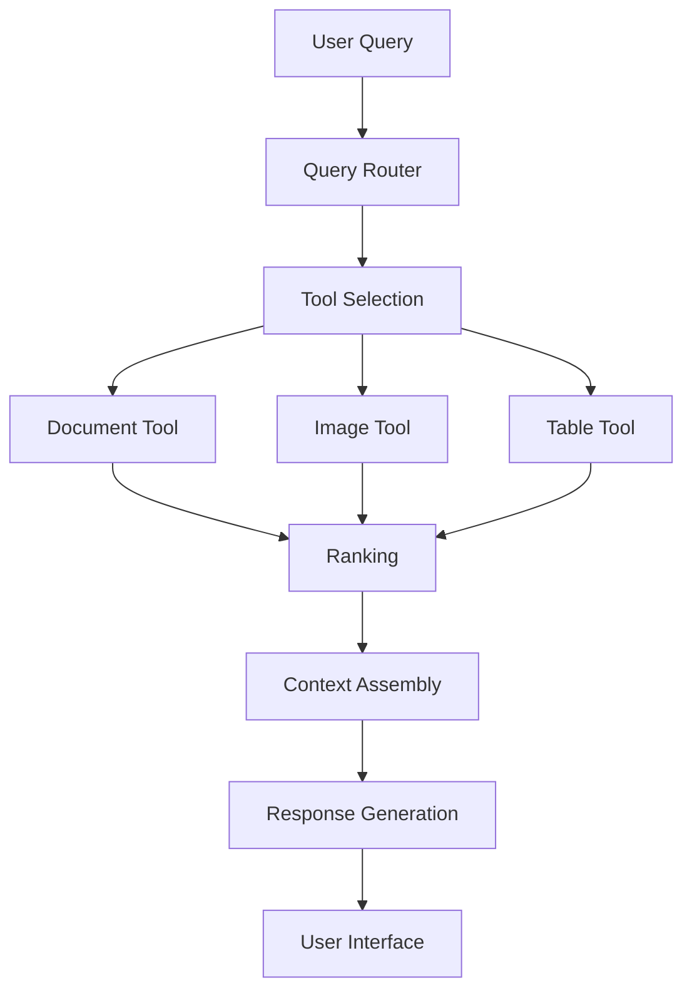

# Unified Product Architecture: Building a Cohesive RAG System

!!! abstract "Chapter Overview"

    This chapter explores how to build a coherent system that intelligently combines specialized retrieval components:

    - Designing tool interfaces that bridge language models and specialized indices
    - Implementing effective query routing to direct requests to appropriate tools
    - Testing and measuring performance of both retrieval and routing components
    - Creating user interfaces that leverage both AI and direct tool access
    - Building systems that scale across teams and complexity levels

## Introduction: Beyond Specialized Retrievers

In the previous chapter, we explored how to build specialized retrievers for different content types. We discussed strategies for handling documents, images, tables, and other specialized data formats. While these specialized components improve retrieval quality dramatically, they create a new challenge: how do we build a cohesive system that knows when to use each specialized component?

This is the challenge of **query routing**—the process of understanding what a user is asking for and directing their query to the most appropriate retrieval tool or combination of tools. Effective query routing is what transforms a collection of specialized capabilities into a unified, seamless product experience.

!!! quote "Key Insight"

    "The quality of your RAG system isn't just determined by how well each individual retriever performs, but by how effectively your system routes queries to the right retrievers at the right time. Even perfect retrievers fail if they're used for the wrong queries."

The unified architecture approach we'll explore in this chapter completes our improvement flywheel by:

1. Using the specialized capabilities we built based on user segmentation
2. Implementing intelligent routing between these components
3. Creating interfaces that help users understand system capabilities
4. Building feedback loops that continuously improve both routing and retrieval

Let's begin by examining the architectural patterns that enable effective query routing in RAG systems.

## The API Mindset: Tools as Interfaces Between Models and Data

At the heart of unified RAG architecture is a simple but powerful pattern: treating each specialized retriever as an API that language models can call. This "tools as APIs" approach creates a clear separation of concerns between:

1. **Tool Interfaces**: The definitions that describe what each tool does and what parameters it accepts
2. **Tool Implementations**: The specialized code that performs retrieval against specific indices
3. **Routing Logic**: The system that determines which tools to call for a given query

!!! quote "Framework Development Perspective"
    "You're effectively a framework developer for the language model. I spent many years developing multiple microservices to do retrieval for other teams, and moving forward it's going to feel a lot like building distributed microservices."

!!! info "History of Tool Interfaces"
    The tool interface pattern has evolved rapidly in AI systems. What began as simple "function calling" in APIs like OpenAI's functions or Anthropic's tools has now developed into more sophisticated frameworks with multiple tool selection strategies. This pattern mimics the development of web API frameworks like REST and GraphQL, but with language models as the primary "clients" of these APIs.

### Why the API Approach Works

Treating specialized retrievers as APIs offers several key advantages:

1. **Clear Boundaries**: Teams can work independently on different tools
2. **Testability**: Each component can be tested in isolation
3. **Reusability**: Tools can be used by both language models and developers
4. **Scalability**: New capabilities can be added without changing existing components
5. **Performance**: Parallel execution becomes easier to implement
6. **Organizational Alignment**: Different teams can own different aspects of the system

!!! example "Organizational Structure"
    One effective team structure:
    - **Interface Team**: Designs the API contracts and tool specifications based on user needs
    - **Implementation Team**: Builds and optimizes individual retrievers for specific content types
    - **Router Team**: Creates and optimizes the query routing system
    - **Evaluation Team**: Tests the performance of the entire system and identifies bottlenecks



This architecture resembles modern microservice patterns where specialized services handle specific tasks. The difference is that the "client" making API calls is often a language model rather than another service.

### From Monolithic to Modular: The Evolution of RAG Architecture

Many RAG implementations start with a monolithic approach: a single vector database containing all content types, a unified chunking strategy, and a single retrieval mechanism. While simple to implement, this approach quickly reaches its limits as content diversity grows.

The transition to a modular, API-based architecture typically follows these stages:

1. **Recognition Phase**: Identifying that different query types need different retrieval approaches
2. **Separation Phase**: Breaking the monolithic system into specialized components
3. **Interface Phase**: Defining clear boundaries and contracts between components
4. **Orchestration Phase**: Building a routing layer that knows when to use each component

!!! example "Real-World Transition"
    A client in the financial services sector initially implemented RAG with a single vector database containing everything from market reports to customer communications. When they transitioned to specialized retrieval components with clear API boundaries, they saw:
    
    - **Development Velocity**: 40% increase in feature delivery speed
    - **Retrieval Quality**: 25-35% improvement across different query types
    - **Team Coordination**: Reduced cross-team dependencies and bottlenecks
    - **Scaling**: Ability to add new content types without disrupting existing functionality

The key insight was treating each specialized retriever not just as an implementation detail, but as a well-defined service with a clear contract.

## Implementing Tool Interfaces for Retrieval

Let's look at how to implement this pattern with a concrete example. Imagine we're building a construction information system that includes blueprints, text documents, and project schedules.

### Building a Blueprint Search Tool

Based on our analysis in Chapter 5, we've determined that users often search for blueprints by description and date range. We'll define a tool interface that captures this functionality:

```python
from pydantic import BaseModel

class SearchBlueprint(BaseModel):
    description: str
    start_date: str | None = None
    end_date: str | None = None

    def execute(
        self,
    ) -> List[BlueprintResult]:
        """
        Search for blueprints matching the description and date range.

        Args:
            description: Text to search for in blueprint descriptions
            start_date: Optional start date in YYYY-MM-DD format
            end_date: Optional end date in YYYY-MM-DD format

        Returns:
            List of matching blueprint documents
        """
        # Implementation details would depend on your database
        query = self._build_query(
            query=self.description,
            start_date=self.start_date,
            end_date=self.end_date)
        results = self._execute_query(query)
        return self._format_results(results)

        ...
```

### Building a Document Search Tool

Similarly, we can define a tool for searching text documents:

```python
from pydantic import BaseModel

class SearchText(BaseModel):
    query: str
    document_type: Literal["contract", "proposal", "bid"] | None = None

    def execute(
        self,
    ) -> List[DocumentResult]:
        if self.document_type:
            filter_params["type"] = self.document_type

        results = self._search_database(
            query=self.query,
            filters=filter_params)
        return self._format_results(results)
```

### The Power of Tool Documentation

Notice the detailed docstrings and examples in these tool definitions. These aren't just for human developers—they're critical for language models to understand how and when to use each tool. The examples in particular help models recognize the patterns of queries that should trigger each tool.

### Aside on MCP 

The Model Context Protocol (MCP) is an open standard developed by Anthropic that standardizes how applications provide context to large language models. Conceptually similar to the tool interface pattern we've discussed, MCP creates a universal protocol for connecting AI systems to various data sources and tools.

Think of MCP like a "USB-C port for AI applications" – just as USB-C provides a standardized way to connect devices to various peripherals, MCP provides a standardized way for AI models to interact with different data sources and tools.

Key benefits of MCP include:

1. **Standardization**: Developers can build against a single protocol instead of maintaining separate connectors for each data source
2. **Interoperability**: AI systems can maintain context as they move between different tools and datasets
3. **Ecosystem**: Pre-built connectors for popular systems like GitHub, Slack, and databases can be shared and reused
4. **Security**: The protocol is designed with security considerations for connecting AI to sensitive data sources

MCP represents an important step toward the unified architecture vision we've discussed in this chapter, offering a standardized way to implement the "tools as APIs" pattern across different AI systems and data sources.

!!! warning "MCP is Still Emerging"

    While MCP represents a promising approach to standardizing AI tool interfaces, it's important to note that it's still very new. As of now, there aren't many production-ready MCP implementations available, and the ecosystem of useful MCPs is still in its early stages of development. Organizations adopting MCP should be prepared for an evolving standard and limited availability of pre-built connectors. As with any emerging technology, early adopters will need to invest in building custom implementations and should expect the standard to evolve over time.


## Building the Routing Layer

Once we have defined our specialized retrieval tools, we need a system that can route queries to the appropriate tools. This routing layer is responsible for:

1. Understanding the user's query
2. Determining which tool(s) to call
3. Extracting the necessary parameters from the query
4. Calling the appropriate tools with those parameters
5. Combining results when multiple tools are used

Modern language models excel at this kind of task, especially when provided with clear tool definitions and examples.

!!! warning "Router vs. Individual Retrievers"
    It's critical to distinguish between the performance of your router (selecting the right tools) and the performance of each individual retriever (finding relevant information). A perfect router with mediocre retrievers will still yield mediocre results, while a mediocre router with perfect retrievers might miss capabilities entirely.

### Implementing a Simple Router

Here's a basic implementation of a query router using the Instructor library for structured outputs:

```python
import instructor
from typing import List, Literal, Iterable
from pydantic import BaseModel
from openai import OpenAI

client = OpenAI()
client = instructor.from_openai(client)

class ClarifyQuestion(BaseModel):
    """Use this when you need more information from the user to understand their request."""
    question: str

class AnswerQuestion(BaseModel):
    """Use this when you can answer directly without retrieving documents."""
    content: str
    follow_ups: List[str] | None = None

class SearchBlueprint(BaseModel):
    """Use this to search for building plans and blueprints."""
    blueprint_description: str
    start_date: str | None = None
    end_date: str | None = None

class SearchText(BaseModel):
    """Use this to search for text documents like contracts, proposals, and bids."""
    query: str
    document_type: Literal["contract", "proposal", "bid"] | None = None

def route_query(query: str) -> Iterable[SearchBlueprint | SearchText | AnswerQuestion | ClarifyQuestion]:
    """
    Routes a user query to the appropriate tool(s) based on the query content.
    
    This function analyzes the user's query and determines which tool or tools 
    would be most appropriate to handle it. Multiple tools can be returned if needed.
    
    Args:
        query: The user's natural language query
        
    Returns:
        An iterable of tool objects that should be used to process this query
    """
    return client.chat.completions.create(
        model="gpt-4o-mini",
        messages=[
            {
                "role": "system",
                "content": """
                You are a query router for a construction information system.
                
                Your job is to analyze the user's query and decide which tool(s) should handle it.
                You can return multiple tools if the query requires different types of information.
                
                Available tools:
                - SearchBlueprint: For finding building plans and blueprints
                - SearchText: For finding text documents like contracts and proposals
                - AnswerQuestion: For directly answering conceptual questions without retrieval
                - ClarifyQuestion: For asking follow-up questions when the query is unclear
                
                Here are examples of how to route different types of queries:
                
                <examples>
                ...
                </examples>
                """
            },
            {
                "role": "user",
                "content": query
            }
        ],
        response_model=Iterable[SearchBlueprint | SearchText | AnswerQuestion | ClarifyQuestion]
    )

# Example usage
def process_user_query(query: str):
    """Process a user query by routing it to the appropriate tools and executing them."""
    # Step 1: Route the query to appropriate tools
    tools = route_query(query)
    
    # Step 2: Execute each tool and collect results
    results = []
    for tool in tools:
        if isinstance(tool, SearchBlueprint):
            # Execute blueprint search
            blueprints = search_blueprints(
                description=tool.blueprint_description,
                start_date=tool.start_date,
                end_date=tool.end_date
            )
            results.append({"type": "blueprints", "data": blueprints})
            
        elif isinstance(tool, SearchText):
            # Execute text search
            documents = search_documents(
                query=tool.query,
                document_type=tool.document_type
            )
            results.append({"type": "documents", "data": documents})
            
        elif isinstance(tool, AnswerQuestion):
            # Direct answer without retrieval
            results.append({"type": "answer", "data": tool.content})
            
        elif isinstance(tool, ClarifyQuestion):
            # Return clarification question to user
            return {"action": "clarify", "question": tool.question}
    
    # Step 3: Generate a response using the collected results
    return {"action": "respond", "results": results}
```

### Using Few-Shot Examples to Improve Routing

The effectiveness of the router depends significantly on providing good examples of when to use each tool. These few-shot examples help the model understand the patterns that should trigger different tools.

!!! tip "Effective Few-Shot Examples"
    When creating few-shot examples for query routing:
    
    1. **Cover edge cases**: Include examples of ambiguous queries that could be interpreted multiple ways
    2. **Include multi-tool examples**: Show when multiple tools should be used together
    3. **Demonstrate hard decisions**: Show when similar-sounding queries should route to different tools
    4. **Use real user queries**: Whenever possible, use actual queries from your users
    5. **Maintain diversity**: Ensure examples cover all tools and important parameter combinations

For instance, a system prompt for routing might include examples like:

```
<examples>
- "Find blueprints for the city hall built in 2010."
{
    "blueprint_description": "city hall blueprints",
    "start_date": "2010-01-01",
    "end_date": "2010-12-31"
}
- "I need plans for residential buildings constructed after 2015."
{
    "blueprint_description": "residential building plans",
    "start_date": "2015-01-01",
    "end_date": null
}
- "Can you find me the plans for a the 123 main st building?"
{
    "blueprint_description": "123 main st building",
    "start_date": null,
    "end_date": null
}
- "Show me blueprints for schools built between 2018 and 2020."
{
    "blueprint_description": "school blueprints",
    "start_date": "2018-01-01",
    "end_date": "2020-12-31"
}
- "I need the contract for the Johnson project."
{
    "query": "Johnson project contract",
    "document_type": "contract"
}
- "What's the difference between a blueprint and a floor plan?"
{
    "content": "Blueprints are technical architectural drawings that include detailed specifications for construction, while floor plans focus primarily on the layout and dimensions of rooms and spaces within a building.",
    "follow_ups": ["How do I read a blueprint?", "Can you show me examples of floor plans?"]
}
- "Can you explain what a load-bearing wall is?"
{
    "content": "A load-bearing wall is a structural element that supports the weight of the building above it, helping to transfer the load to the foundation. Removing or modifying load-bearing walls requires careful engineering considerations.",
    "follow_ups": ["How can I identify a load-bearing wall?", "What happens if you remove a load-bearing wall?"]
}
- "I'm not sure what kind of building plans I need for my renovation."
{
    "question": "Could you tell me more about your renovation project? What type of building is it, what changes are you planning to make, and do you need plans for permits or for construction guidance?"
}
- "Find me school building plans from 2018-2020 and any related bid documents."
[
    {
        "blueprint_description": "school building plans",
        "start_date": "2018-01-01",
        "end_date": "2020-12-31"
    },
    {
        "query": "school building bids",
        "document_type": "bid"
    }
]
</examples>
```

### Dynamic Few-Shot Example Selection

As your system collects more data about successful interactions, you can move beyond static examples to a dynamic approach that selects the most relevant few-shot examples for each query:

```python
def get_dynamic_examples(query: str, example_database: List[dict], num_examples: int = 5) -> List[dict]:
    """
    Select the most relevant examples for a given query from an example database.
    
    Args:
        query: The user's query
        example_database: Database of previous successful interactions
        num_examples: Number of examples to return
        
    Returns:
        List of the most relevant examples for this query
    """
    # Embed the query
    query_embedding = get_embedding(query)
    
    # Calculate similarity with all examples in database
    similarities = []
    for example in example_database:
        example_embedding = example["embedding"]
        similarity = cosine_similarity(query_embedding, example_embedding)
        similarities.append((similarity, example))
    
    # Sort by similarity and return top examples
    similarities.sort(reverse=True)
    return [example for _, example in similarities[:num_examples]]

def route_query_with_dynamic_examples(query: str) -> Iterable[Tool]:
    """Route query using dynamically selected examples."""
    # Get relevant examples for this query
    relevant_examples = get_dynamic_examples(query, example_database)
    
    # Format examples for inclusion in prompt
    examples_text = format_examples(relevant_examples)
    
    # Create prompt with dynamic examples
    system_prompt = f"""
    You are a query router for a construction information system.
    Your job is to analyze the user's query and decide which tool(s) should handle it.
    
    Available tools:
    - SearchBlueprint: For finding building plans and blueprints
    - SearchText: For finding text documents like contracts and proposals
    - AnswerQuestion: For directly answering conceptual questions without retrieval
    - ClarifyQuestion: For asking follow-up questions when the query is unclear
    
    Here are examples of how to route different types of queries:
    
    {examples_text}
    """
    
    # Perform routing with dynamic prompt
    return client.chat.completions.create(
        model="gpt-4o-mini",
        messages=[
            {"role": "system", "content": system_prompt},
            {"role": "user", "content": query}
        ],
        response_model=Iterable[SearchBlueprint | SearchText | AnswerQuestion | ClarifyQuestion]
    )
```

This approach ensures that your routing layer continuously improves as you collect more examples of successful interactions, creating a learning system that adapts to your users' query patterns.

## Testing Query Routing Effectiveness

Just as we need metrics for retrieval quality, we need metrics for routing quality. The fundamental question is: are we selecting the right tools for each query?

### Tool Selection Metrics

To evaluate tool selection, we need a test dataset with queries annotated with the correct tool(s) to use. From there, we can calculate:

1. **Tool Precision**: When we select a tool, how often is it actually the right one?
2. **Tool Recall**: How often do we select all the tools that should be selected?
3. **Tool F1 Score**: The harmonic mean of precision and recall
4. **Per-Tool Recall**: How often each specific tool is correctly selected when it should be

!!! warning "Data Leakage Risk"
    When creating test datasets for router evaluation, be vigilant about data leakage. If your few-shot examples appear in your test set, you'll get artificially high performance that won't generalize to real queries. Always maintain separate development and test sets with distinct query patterns.

Here's a sample evaluation for a construction information system's query router:

| Query ID | Query Text                                                          | Expected Tools                                            | Realized Tools                               | Precision | Recall |
| -------- | ------------------------------------------------------------------- | --------------------------------------------------------- | ------------------------------------------- | --------- | ------ |
| 1        | Retrieve blueprints for the museum expansion                        | SearchBlueprint                                           | SearchBlueprint                             | 100%      | 1/1    |
| 2        | Find schedule and documents for the library renovation              | SearchSchedule, SearchText                                | SearchSchedule                              | 100%      | 1/2    |
| 3        | Get both blueprints and schedule for campus construction            | SearchBlueprint, SearchSchedule                           | SearchBlueprint, SearchSchedule             | 100%      | 2/2    |
| 4        | Show me contract details and permit requirements for the new office | SearchText, SearchBlueprint                               | SearchText, SearchBlueprint, SearchSchedule | 67%       | 2/2    |
| 5        | Identify materials and design specs for the downtown skyscraper     | SearchText, SearchBlueprint                               | SearchBlueprint, SearchText                 | 100%      | 2/2    |
| 6        | Get full details on industrial park planning                        | SearchBlueprint, SearchText, SearchSchedule               | SearchText, SearchInvoice, SearchPermit     | 33%       | 1/3    |
| 7        | Find emergency repair guidelines for the abandoned warehouse        | SearchRepair, SearchBlueprint                             | SearchText                                  | 0%        | 0/2    |
| 8        | Obtain comprehensive analysis for the urban redevelopment project   | SearchBlueprint, SearchText, SearchSchedule, SearchPermit | SearchBlueprint                             | 100%      | 1/4    |
| 9        | Explain zoning regulations for the new industrial area              | SearchZoning                                              | SearchBlueprint, SearchText                 | 0%        | 0/1    |

Looking at overall metrics, this system achieves:
- Average Precision: 67%
- Average Recall: 56%
- Average F1 Score: 61%

These aggregate metrics are useful, but they don't tell the complete story. What's often more revealing is the per-tool recall:

| Tool            | Times Expected | Times Selected Correctly | Per-Tool Recall |
|-----------------|----------------|--------------------------|-----------------|
| SearchBlueprint | 6              | 4                        | 67%             |
| SearchText      | 5              | 3                        | 60%             |
| SearchSchedule  | 4              | 2                        | 50%             |
| SearchPermit    | 1              | 0                        | 0%              |
| SearchZoning    | 1              | 0                        | 0%              |
| SearchRepair    | 1              | 0                        | 0%              |

This breakdown shows that less common tools (Permit, Zoning, Repair) have extremely low recall, suggesting that our router doesn't have enough examples of these tools to recognize when they should be used.

### Automating Router Evaluation

Here's a code example for evaluating router performance:

```python
def evaluate_router(router_function, test_dataset):
    """
    Evaluate a routing function against a test dataset.
    
    Args:
        router_function: Function that takes a query and returns tool selections
        test_dataset: List of {query, expected_tools} pairs
        
    Returns:
        Dictionary of evaluation metrics
    """
    results = []
    tool_expected_count = {}
    tool_selected_count = {}
    tool_correct_count = {}
    
    for test_case in test_dataset:
        query = test_case["query"]
        expected_tools = set(test_case["expected_tools"])
        
        # Track expected tools
        for tool in expected_tools:
            tool_expected_count[tool] = tool_expected_count.get(tool, 0) + 1
        
        # Get router predictions
        selected_tools = set(router_function(query))
        
        # Track selected tools
        for tool in selected_tools:
            tool_selected_count[tool] = tool_selected_count.get(tool, 0) + 1
        
        # Calculate precision and recall for this query
        correct_tools = expected_tools.intersection(selected_tools)
        for tool in correct_tools:
            tool_correct_count[tool] = tool_correct_count.get(tool, 0) + 1
            
        precision = len(correct_tools) / len(selected_tools) if selected_tools else 1.0
        recall = len(correct_tools) / len(expected_tools) if expected_tools else 1.0
        f1 = 2 * (precision * recall) / (precision + recall) if (precision + recall) > 0 else 0
        
        results.append({
            "query": query,
            "expected_tools": expected_tools,
            "selected_tools": selected_tools,
            "precision": precision,
            "recall": recall,
            "f1": f1
        })
    
    # Calculate overall metrics
    avg_precision = sum(r["precision"] for r in results) / len(results)
    avg_recall = sum(r["recall"] for r in results) / len(results)
    avg_f1 = sum(r["f1"] for r in results) / len(results)
    
    # Calculate per-tool recall
    per_tool_recall = {}
    for tool in tool_expected_count:
        if tool_expected_count[tool] > 0:
            per_tool_recall[tool] = tool_correct_count.get(tool, 0) / tool_expected_count[tool]
        else:
            per_tool_recall[tool] = 0
    
    return {
        "detailed_results": results,
        "avg_precision": avg_precision,
        "avg_recall": avg_recall,
        "avg_f1": avg_f1,
        "per_tool_recall": per_tool_recall,
        "tool_expected_count": tool_expected_count,
        "tool_selected_count": tool_selected_count,
        "tool_correct_count": tool_correct_count
    }
```

### Analyzing Tool Selection Failures

When tool selection fails, we need to understand why. A confusion matrix is particularly useful here, showing which tools are being confused with one another.

For example, if we find that the `SearchBlueprint` tool is never being selected even when it should be, we might need to improve its description or add more examples to the system prompt.

!!! example "Confusion Matrix Analysis"

    Imagine our evaluation produces this confusion matrix:

    | Expected\Selected | SearchText | SearchBlueprint | SearchSchedule |
    | ----------------- | ---------- | --------------- | -------------- |
    | SearchText        | 85         | 5               | 10             |
    | SearchBlueprint   | 40         | 50              | 10             |
    | SearchSchedule    | 15         | 5               | 80             |

    This shows that SearchBlueprint is frequently mistaken for SearchText, indicating that we need to better differentiate these tools.

### Targeted Improvement Strategy

Once you've identified specific weaknesses in your router, you can implement targeted improvements:

1. **For low-recall tools**:
   - Add more few-shot examples for these tools
   - Improve tool descriptions to more clearly differentiate them
   - Consider whether these tools are truly distinct or should be merged

2. **For commonly confused tools**:
   - Analyze failure cases to understand what's causing the confusion
   - Create "contrast examples" that explicitly show why similar queries go to different tools
   - Refine tool interfaces to have clearer boundaries

3. **For overall improvement**:
   - Balance your few-shot examples across all tools
   - Include edge cases that test the boundaries between tools
   - Add multi-tool examples that show when multiple tools should be used together

!!! tip "Synthetic Data Generation for Router Testing"
    You can use synthetic data techniques to create comprehensive test cases for your router:
    
    1. Start with clear definitions of each tool's purpose
    2. Use an LLM to generate diverse queries that should trigger each tool
    3. Include variants of each query with slightly different wording
    4. Generate ambiguous queries that could reasonably go to multiple tools
    5. Create a balanced dataset that covers all tools proportionally
    
    This approach ensures comprehensive coverage of your router's decision space without requiring extensive manual labeling.

## Balancing Example Diversity vs. Relevance in Tool Selection

When selecting few-shot examples for tool routing, there's an inherent tension between choosing examples that are highly relevant to the current query and maintaining diversity to cover a wide range of use cases. This balance is critical for effective tool selection.

### The Diversity-Relevance Tradeoff

Finding the right balance between relevance and diversity requires thoughtful strategies:

#### Clustering-Based Selection
Rather than simply selecting the k-most similar examples to the current query:
- Cluster your historical examples based on semantic similarity
- Select representatives from multiple clusters, prioritizing those closer to the current query
- This ensures both relevance and coverage of different query patterns

#### Tool Coverage Guarantees
Ensure representation of all important tools in your few-shot examples:
- Start by allocating a minimum number of slots for each tool
- Fill these slots with the most relevant examples for each tool
- Use remaining slots for the most relevant examples overall
- This prevents underrepresented tools from being "forgotten"

#### Diversity Sampling Techniques
Implement algorithmic approaches to balance diversity and relevance:
- Use Maximum Marginal Relevance (MMR) to select examples that balance similarity to the query with diversity from already-selected examples
- Apply determinantal point processes (DPPs) to select a diverse yet relevant subset
- Incorporate exploration-exploitation techniques from recommendation systems

#### Dynamic Lambda Adjustment
Adapt the diversity-relevance balance based on query characteristics:
- For unusual or ambiguous queries, increase diversity to cover more possibilities
- For clear, common queries, emphasize relevance
- Use metrics like perplexity or entropy of tool probability distribution to gauge query clarity

#### Temporal Diversity
Consider the temporal dimension in example selection:
- Include both recent and historical examples
- Recent examples capture evolving user behaviors and data patterns
- Historical examples maintain stability for core functionality
- Weight by both relevance and recency with a tunable decay factor

!!! example "Example: Balanced Tool Selection"

    Imagine you have these tools: `SearchBlueprint`, `SearchText`, `SearchSchedule`, and `SearchPermit`. When a user asks about "construction timeline for the new office building", an optimal set of examples might include:
    
    - 2 examples of `SearchSchedule` for construction timelines (highest relevance)
    - 1 example of `SearchBlueprint` for buildings (related domain)
    - 1 example of `SearchText` for office specifications (related entity)
    - 1 recent example showing how these tools can be used together (temporal freshness)
    
    This combination ensures the model understands the primary intent (schedules) while maintaining awareness of other potentially relevant tools.

## The System Architecture Perspective

Stepping back, our unified RAG architecture consists of three main layers:

1. **Interface Layer**: Defines the tools/APIs that can be used
2. **Implementation Layer**: Builds the actual retrieval capabilities
3. **Routing Layer**: Directs queries to the appropriate tools

This separation of concerns enables different teams to work on different aspects of the system:

- One team can focus on defining and refining tool interfaces
- Another can implement and optimize each specialized retriever
- A third can improve the routing logic and evaluation

This architecture scales well as your system grows, allowing for:

1. Adding new tools without changing existing ones
2. Improving individual retrievers independently
3. Enhancing routing logic without affecting tool implementations

## The Combined Success Formula

Throughout this book, we've focused on a data-driven approach to systematic improvement. In the context of unified architecture, we can express the overall success probability of our system with a simple formula:

$$
P(\text{success}) = P(\text{find right document} \mid \text{right tool}) \times P(\text{right tool})
$$

This formula highlights that our system's performance depends on both:

1. How well each retriever works when used correctly
2. How often we select the right retriever for the query

### A Diagnostic Framework for Improvement

This seemingly simple formula provides a powerful diagnostic framework. When your RAG system isn't performing well, it helps pinpoint exactly where the problem lies and what type of solution to pursue:

- If tool selection recall is low, focus on improving the routing layer
- If retrieval recall is low (given the right tool), focus on improving that specific retriever

**Example:** Imagine users report that when asking about blueprints, they only get satisfactory answers 40% of the time. There are two very different scenarios that could cause this:

**Scenario 1:** The router correctly selects the blueprint search tool 95% of the time, but the blueprint search itself only finds the right blueprints 42% of the time.

- P(right tool) = 0.95
- P(find right document | right tool) = 0.42
- P(success) = 0.95 × 0.42 = 0.40 (40%)

**Scenario 2:** The blueprint search is excellent at finding the right blueprints 80% of the time when used, but the router only selects it 50% of the time (often choosing document search instead).

- P(right tool) = 0.50
- P(find right document | right tool) = 0.80
- P(success) = 0.50 × 0.80 = 0.40 (40%)

Same 40% success rate, but completely different problems requiring different solution strategies:

**For Scenario 1 (retrieval problem):**

- Generate synthetic data to improve the blueprint search capability
- Fine-tune embedding models specifically for blueprint content
- Improve the extraction and structuring of blueprint metadata
- Experiment with different chunking strategies for blueprints

**For Scenario 2 (routing problem):**

- Add more few-shot examples showing when to use the blueprint tool
- Improve the blueprint tool description to make it more distinctive
- Add user feedback from successful interactions into your examples
- Consider UI changes to help users explicitly request blueprints

### Measuring Components Independently

To apply this framework effectively, you need to measure both components independently:

1. **Per-tool recall:** How often each retriever finds the right information when used
2. **Tool selection accuracy:** How often the router selects the right tool(s) for each query

A simple dashboard showing these metrics gives you immediate insight into where to focus your improvement efforts.

### Expanding the Formula

The formula can be expanded further to account for the user experience:

$$
P(\text{success}) = P(\text{success} \mid \text{right tool}) \times P(\text{right tool} \mid \text{query}) \times P(\text{query})
$$

Where:

- $P(\text{success} \mid \text{right tool})$ is the retriever quality
- $P(\text{right tool} \mid \text{query})$ is the router quality
- $P(\text{query})$ represents the distribution of queries users actually make

This expanded formula reveals a third dimension for improvement: you can increase overall success by influencing which queries users make. If certain query types have higher success rates, you can design your UI to encourage those queries or educate users on the most effective ways to interact with your system.

### From Metrics to Roadmap

This formula provides a clear framework for planning both product and research efforts:

| P(success \| right tool) | P(right tool \| query) | Strategy |
|-------------------------|------------------------|----------|
| **High** | **High** | These are strengths to highlight in your product |
| **Low** | **High** | Research focus needed on specific retrievers |
| **High** | **Low** | Focus on improving router or exposing tools directly |
| **Low** | **Low** | Consider whether this query type is worth supporting |

By systematically measuring and improving these components, you create a continuous improvement flywheel for your unified RAG architecture.

## User Interfaces: Direct Tool Access

One powerful insight from the routing architecture is that tools designed for language models can often be exposed directly to users as well. Just as Google offers specialized interfaces like Google Maps, YouTube, and Google Images alongside its main search, your RAG application can offer both:

1. A natural language interface using the router
2. Direct access to specialized tools for specific needs

!!! quote "Expert User Perspective"
    "When I know exactly what I need, a specialized tool is much faster than explaining it to a chatbot. But when I'm exploring new areas or have complex needs, the chat interface helps me discover what's possible."

!!! example "Dual-Mode UI"
    Imagine a construction information system that offers:

    - A chat interface for general questions
    - A blueprint search interface with date filters
    - A document search interface with type filters
    - A schedule search with timeline visualization
    - A permit lookup tool with status tracking
    
    These specialized interfaces map directly to the specialized retrievers we've built.

This dual-mode interface has several advantages:

1. **Expert users** can go directly to the tool they need
2. **New users** can use natural language until they learn the system
3. **User interactions** with direct tools provide training data for routing
4. **Clear capabilities** help users understand what the system can do
5. **Control and transparency** give users confidence in the results
6. **Performance optimization** for common, well-defined tasks

!!! tip "UI Implementation Strategy"
    When implementing a dual-mode interface:
    
    1. Design specialized interfaces that match your existing tools' parameters
    2. Create a unified entry point that offers both chat and specialized tool options
    3. Add suggestions in chat responses that link to relevant specialized tools
    4. Maintain consistent terminology between chat responses and tool interfaces
    5. Track which interface users prefer for different query types

### Specialized Interface Examples

Here's how specialized interfaces might look for our construction information system:

#### Blueprint Search Interface
```html
<form action="/search/blueprints" method="GET">
  <h2>Blueprint Search</h2>
  
  <div class="form-group">
    <label for="description">Description:</label>
    <input type="text" id="description" name="description" 
           placeholder="e.g., residential building, hospital, school">
  </div>
  
  <div class="form-group">
    <label for="start-date">Start Date:</label>
    <input type="date" id="start-date" name="start_date">
  </div>
  
  <div class="form-group">
    <label for="end-date">End Date:</label>
    <input type="date" id="end-date" name="end_date">
  </div>
  
  <button type="submit">Search Blueprints</button>
</form>
```

#### Document Search Interface
```html
<form action="/search/documents" method="GET">
  <h2>Document Search</h2>
  
  <div class="form-group">
    <label for="query">Search Terms:</label>
    <input type="text" id="query" name="query" 
           placeholder="e.g., Johnson project, HVAC specifications">
  </div>
  
  <div class="form-group">
    <label for="document-type">Document Type:</label>
    <select id="document-type" name="document_type">
      <option value="">All Documents</option>
      <option value="contract">Contracts</option>
      <option value="proposal">Proposals</option>
      <option value="bid">Bids</option>
    </select>
  </div>
  
  <button type="submit">Search Documents</button>
</form>
```

These interfaces directly map to the tool interfaces we defined earlier, providing users with a clear, structured way to access the same capabilities available to the language model.

The key insight is that RAG isn't just about adding chat to your product—it's about building a comprehensive information discovery system where chat is just one interface option among many specialized tools that help users access information efficiently.

!!! note "Beyond Simple Forms"
    These specialized interfaces don't have to be simple forms. They can include rich visualizations, interactive elements, and specialized displays for different content types. For example, a blueprint search might display results on a timeline or a map, while a document search might offer faceted filters and previews. The key is that they map directly to your underlying retrieval tools.

## User Feedback as Training Data

A particularly valuable aspect of direct tool access is that user interactions can provide high-quality training data for improving both retrieval and routing:

1. When users select a specific tool, that's a signal about their intent
2. When users click on search results, that's a signal about relevance
3. When users refine their search, that's a signal about what was missing
4. When users explicitly rate or save results, that's direct feedback on quality

!!! example "User Feedback Collection Mechanisms"
    To maximize the value of user feedback, consider implementing:
    
    - **Tool Selection Tracking**: Record which specialized tool a user chooses for each query
    - **Click Tracking**: Monitor which search results users engage with
    - **Query Refinement Analysis**: Capture how users modify queries that didn't yield useful results
    - **Explicit Feedback Buttons**: Add "Was this helpful?" buttons to results
    - **Result Saving**: Allow users to save or bookmark useful results
    - **Session Analysis**: Examine session patterns to identify successful vs. unsuccessful paths

These interactions can be logged and used to:

- Fine-tune embedding models with user-confirmed relevant documents
- Improve router accuracy by learning from user tool selections
- Create better few-shot examples based on successful interactions
- Prioritize development efforts based on usage patterns
- Identify gaps in your retrieval capabilities

### Implementing a Feedback Loop

Here's how you might implement a feedback collection and utilization system:

```python
def record_user_feedback(user_id, query, selected_tool, results, clicked_result_ids, explicit_rating=None):
    """
    Record user feedback for future training data collection.
    
    Args:
        user_id: Identifier for the user
        query: The user's original query
        selected_tool: Which tool they used (or 'chat' if they used the chat interface)
        results: The results returned to the user
        clicked_result_ids: Which result IDs the user clicked on
        explicit_rating: Optional explicit rating (1-5) provided by the user
    """
    feedback_entry = {
        "user_id": user_id,
        "timestamp": datetime.now().isoformat(),
        "query": query,
        "selected_tool": selected_tool,
        "results": results,
        "clicked_result_ids": clicked_result_ids,
        "explicit_rating": explicit_rating,
    }
    
    # Store feedback in database
    feedback_collection.insert_one(feedback_entry)
    
    # If this was a highly-rated interaction, consider adding it to examples
    if explicit_rating and explicit_rating >= 4:
        consider_adding_to_examples(feedback_entry)

def generate_training_data_from_feedback(min_clicks=1, min_rating=None, date_range=None):
    """
    Generate training data from collected user feedback.
    
    Args:
        min_clicks: Minimum number of clicks a result must have received
        min_rating: Minimum explicit rating (if available)
        date_range: Optional date range to filter feedback
        
    Returns:
        Dictionary with router_training_data and retrieval_training_data
    """
    # Query conditions
    conditions = {}
    if min_rating:
        conditions["explicit_rating"] = {"$gte": min_rating}
    if date_range:
        conditions["timestamp"] = {"$gte": date_range[0], "$lte": date_range[1]}
    
    # Retrieve feedback entries
    feedback_entries = feedback_collection.find(conditions)
    
    router_examples = []
    retrieval_examples = []
    
    for entry in feedback_entries:
        # Generate router training examples
        if entry["selected_tool"] != "chat":
            router_examples.append({
                "query": entry["query"],
                "tool": entry["selected_tool"]
            })
        
        # Generate retrieval training examples
        for result_id in entry["clicked_result_ids"]:
            if len(entry["clicked_result_ids"]) >= min_clicks:
                retrieval_examples.append({
                    "query": entry["query"],
                    "relevant_doc_id": result_id
                })
    
    return {
        "router_training_data": router_examples,
        "retrieval_training_data": retrieval_examples
    }

def update_few_shot_examples(router_examples, max_examples_per_tool=5):
    """
    Update the few-shot examples used in the router based on user feedback.
    
    Args:
        router_examples: Router examples generated from feedback
        max_examples_per_tool: Maximum number of examples to keep per tool
    """
    # Group examples by tool
    examples_by_tool = {}
    for example in router_examples:
        tool = example["tool"]
        if tool not in examples_by_tool:
            examples_by_tool[tool] = []
        examples_by_tool[tool].append(example)
    
    # Select the best examples for each tool
    selected_examples = []
    for tool, examples in examples_by_tool.items():
        # Sort by frequency or other quality metric
        sorted_examples = sort_examples_by_quality(examples)
        selected_examples.extend(sorted_examples[:max_examples_per_tool])
    
    # Update the router's few-shot examples
    update_router_prompt(selected_examples)
```

This creates another improvement flywheel: as users interact with the system, it collects data that makes both retrieval and routing better, which leads to higher user satisfaction and more interactions.

!!! warning "Feedback Biases"
    Be aware of potential biases in user feedback:
    
    1. **Position bias**: Users tend to click on top results regardless of relevance
    2. **Interface bias**: Different interfaces encourage different interaction patterns
    3. **User expertise bias**: Expert users interact differently than novices
    4. **Success bias**: Successful interactions generate more feedback than failures
    
    To mitigate these biases:
    - Occasionally randomize result ordering for evaluation
    - Analyze feedback separately across user expertise levels
    - Specifically seek feedback on unsuccessful interactions
    - Complement implicit feedback with explicit ratings

## Common Challenges and Solutions

As you implement a unified RAG architecture, you'll likely encounter several common challenges. Here are practical solutions to address them:

### Low Recall for Specific Tools

**Challenge**: Some specialized tools are rarely selected by the router, even when they should be.

**Solution**:

1. Analyze examples where the tool should have been selected
2. Enhance the tool description to be more distinctive
3. Add more few-shot examples focused on this tool
4. Consider whether the tool's purpose overlaps with others and needs clearer boundaries

### Slow Response Times

**Challenge**: Using multiple tools in sequence creates high latency.

**Solution**:

1. Implement parallel execution of tool calls
2. Use streaming responses to show partial results while others are loading
3. Prioritize high-confidence tool calls and execute others asynchronously
4. Cache common query results for faster responses

### Data Leakage in Testing

**Challenge**: Testing results appear artificially high because test queries are similar to few-shot examples.

**Solution**:

1. Maintain separate test and development sets
2. Use unique identifiers for each test case to prevent overlap
3. Regularly refresh test data with new examples
4. Test with variations of the same query to verify robustness

### Confusing User Experience

**Challenge**: Users don't understand when to use chat versus direct tools.

**Solution**:

1. Provide clear affordances for each interface option
2. Use onboarding to explain when each approach is most effective
3. Show suggested direct tools alongside chat responses
4. Collect user feedback on interface preferences

## Building a Roadmap for Continuous Improvement

The unified architecture approach isn't implemented in a single sprint—it's built incrementally based on user needs and system performance. Here's a roadmap for implementing this approach:

### Phase 1: Foundation

1. Define clear interfaces for 2-3 core retrieval tools
2. Implement basic routing between these tools
3. Establish baseline metrics for both routing and retrieval
4. Deploy a simple chat interface with direct links to specialized tools

### Phase 2: Optimization

1. Analyze routing errors and improve tool descriptions and examples
2. Implement parallel execution for better performance
3. Add instrumentation to collect user feedback and interactions
4. Enhance direct tool interfaces based on usage patterns

### Phase 3: Expansion

1. Add more specialized tools based on user needs
2. Implement more sophisticated routing with multi-tool execution
3. Build a feedback loop that automatically improves routing based on usage
4. Develop a unified search experience that intelligently combines results

### Phase 4: Personalization

1. Track individual user preferences and interaction patterns
2. Develop personalized routing based on user history
3. Create user-specific fine-tuning datasets
4. Build adaptive interfaces that highlight the most relevant tools for each user

This phased approach allows you to deliver value quickly while continuously improving based on real-world usage.

## Conclusion: The End of the Beginning

Throughout this book, we've explored how to systematically improve RAG applications by treating them as continuously evolving products rather than static implementations. We've covered:

1. Starting the flywheel with synthetic data generation for evaluation
2. Converting evaluations into training data for improvement
3. Building feedback collection mechanisms through user experience design
4. Understanding users through segmentation and capability analysis
5. Creating specialized retrieval capabilities for different content types
6. Unifying these capabilities into a cohesive architecture with intelligent routing

This unified architecture approach represents the culmination of our improvement flywheel—a system that not only retrieves the right information but knows which specialized capability to use for each user need.

!!! quote "Framework Development Perspective"
    "The fundamental building blocks of creating good and successful machine learning products are synthetic data and customer feedback. This is the bedrock—everything else is implementation details that will change as technology evolves."

### The Systematic Improvement Process

The core insight that runs through every chapter of this book is that RAG improvement follows a repeatable pattern:

1. **Measure current performance** with precise metrics that separate different system components
2. **Identify limiting factors** by distinguishing between router accuracy and retriever quality
3. **Generate synthetic data** to test hypotheses and establish baselines
4. **Implement targeted improvements** to the specific components that need enhancement
5. **Collect user feedback** that serves as training data for the next iteration
6. **Repeat** with increasingly sophisticated capabilities

This process applies equally well whether you're building your first RAG application or enhancing your tenth specialized retriever. The tools and models will change, but the systematic approach remains constant.

### Beyond Technical Capabilities

What truly separates exceptional RAG implementations from mediocre ones isn't just technical sophistication—it's organizational alignment with this process:

- **Teams structured around capabilities** rather than technologies
- **Metrics that diagnose** rather than just measure
- **User interfaces that both serve and collect**
- **Continuous learning cycles** rather than one-time deployments

!!! tip "Evolving Your Meetings"
    Transform your team discussions from "How do we make the AI better?" to "How do we move specific metrics?" This simple reframing makes improvement concrete, measurable, and accountable.

### The Next Horizon

But this isn't the end of the journey—it's just the end of the beginning. The true value of the product mindset is that it creates systems that continuously improve based on user interactions. As your users engage with your unified RAG application, you'll collect more data, refine your understanding of their needs, enhance your specialized capabilities, and improve your routing logic.

!!! example "Future Directions"
    As your RAG system matures, you might explore:
    
    1. **Personalized routing** that adapts to individual user preferences and expertise
    2. **Multi-step retrieval** that combines multiple tools in sequence
    3. **Proactive information delivery** that anticipates user needs
    4. **Cross-modal synthesis** that connects insights across different content types
    5. **User-specific fine-tuning** that optimizes for different usage patterns

The result isn't just a more capable technical system—it's a product that delivers increasingly valuable experiences to your users over time. And that, ultimately, is what separates successful AI products from those that launch with fanfare but quickly fade into irrelevance.

Remember: even as AI models become more capable, your responsibility to understand your data, your users, and the connections between them remains central. The frameworks you've learned in this book will serve you well regardless of how the underlying technologies evolve.

## Reflection Questions

As you consider applying these unified architecture principles to your own RAG system, reflect on these questions:

!!! question "Self-Assessment"
    1. How clear are the boundaries between tool interfaces and implementations in your current system? Could different teams work on them independently?

    2. What metrics do you currently use to evaluate routing quality separate from retrieval quality? Do you analyze per-tool recall?

    3. Have you considered exposing specialized search capabilities directly to users alongside chat? Which capabilities would benefit most from dedicated interfaces?

    4. How are you collecting user feedback that could help improve both routing and retrieval? Is this feedback systematically incorporated into improvements?

    5. What's your biggest current limitation—routing quality or retrieval quality? How do you know?
    
    6. Does your current evaluation framework help you distinguish between router performance and individual retriever performance?
    
    7. Are your team structures and workflows aligned with the modular architecture of your system?
    
    8. What synthetic data could you generate to test and improve your routing layer?

### Action Plan Exercise

Take one query type where your current RAG system underperforms and apply the unified architecture approach:

1. Define the specific tools/retrievers this query should use
2. Create clear interfaces for these tools
3. Design a router that can select between them
4. Implement evaluation metrics for both routing and retrieval
5. Build a feedback collection mechanism
6. Outline how you would create a dashboard that shows:
   - Overall system performance
   - Router accuracy
   - Per-tool retrieval quality

By working through this exercise with a concrete example, you'll develop a practical understanding of how to apply the unified architecture approach to your specific domain.

## Additional Resources

1. [The Model Context Protocol (MCP)](https://modelcontextprotocol.ai/) - A standard for defining tool interfaces that work across different LLMs

2. [Function Calling with Anthropic Claude](https://docs.anthropic.com/claude/docs/function-calling) - Documentation on implementing function calls with Claude

3. [Instructor Library](https://github.com/jxnl/instructor) - A popular library for structured outputs with LLMs, useful for implementing routing systems

4. [Tools, Agents, and Routing Models: A New Era for LLM Applications](https://huyenchip.com/2023/10/10/agent.html) - Chip Huyen's overview of tool use and routing

5. [Retrieval Augmented Generation: Streamlining the Creation of Intelligent Natural Language Processing Models](https://arxiv.org/abs/2005.11401) - Original RAG paper

6. [LlamaIndex Router Documentation](https://docs.llamaindex.ai/en/stable/module_guides/querying/router/) - Example of a production router implementation